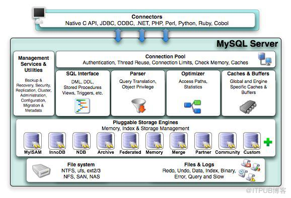
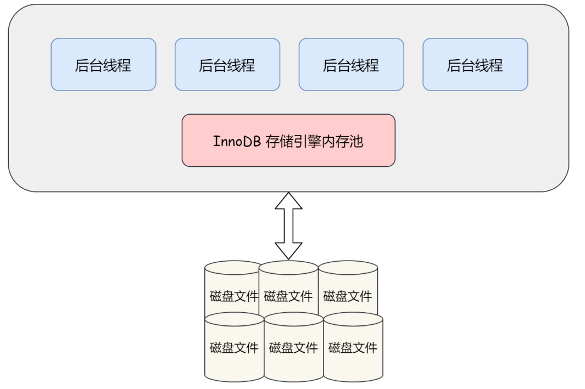
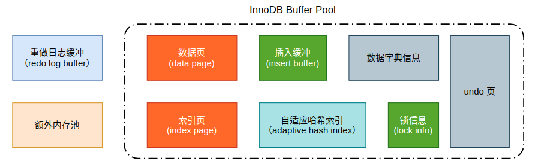
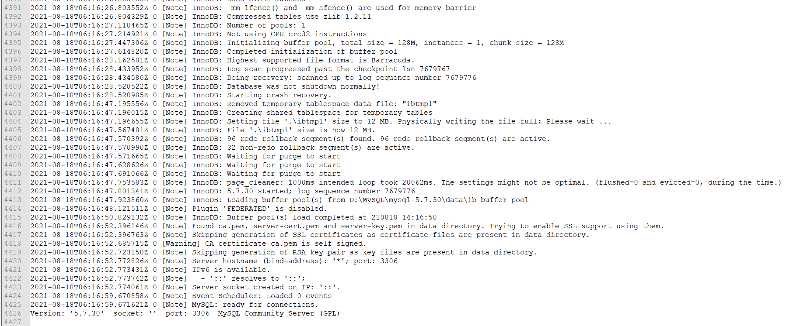
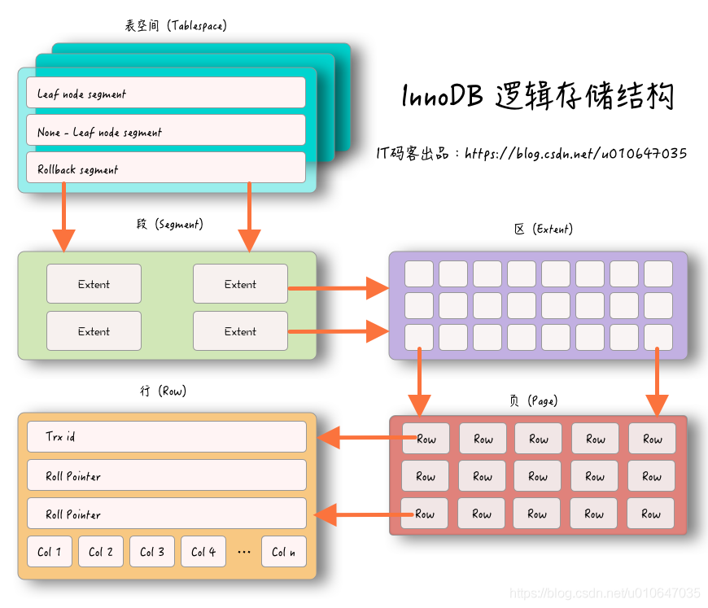
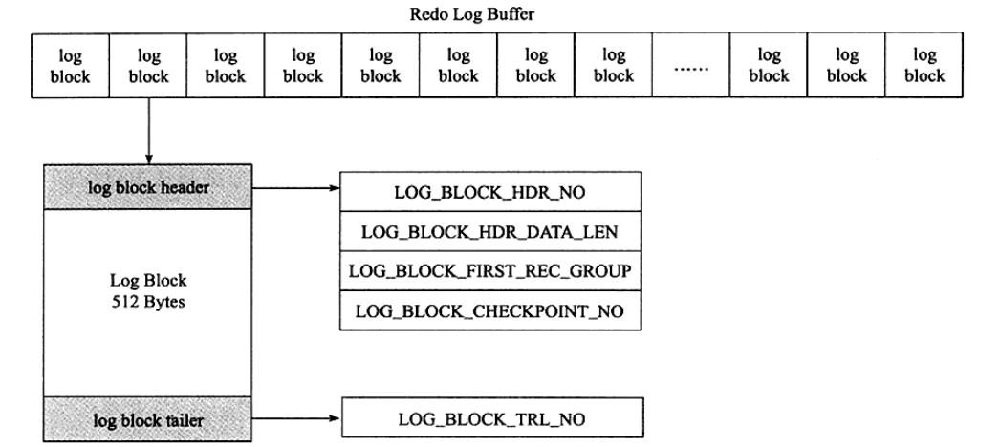

# Overview

> 数据库和实例：
>
> 数据库：物理操作系统文件或其他形式文件类型的集合。在MySQL数据库中，数据库文件可以是`frm`、MYD、MYI、`ibd`结尾的文件。当使用NDB引擎时，数据库的文件可能不是操作系统的文件，而是内存中的文件。
>
> 实例：MySQL数据库实例由后台线程以及一个共享内存区组成，数据库实例才是真正用于操作数据库文件的。

在MySQL数据库中，实例和数据库通常一一对应，但是，在集群情况下，可能存在一个数据库被多个实例使用的情况。

MySQL实例在系统上的表现是一个进程。

MySQL体系结构：



MySQL的存储引擎是插件式的，每个存储引擎开发者可以按照自己的意愿来进行开发。

## `InnoDB`存储引擎

`InnoDB`存储引擎支持事务，其设计目标主要面向 OLTP(on-line transaction processing) 的应用。其特点是行锁设计、支持外键，并支持非锁定读。

InnoDB 存储引擎将数据放在一个逻辑的表空间中，它使用多版本并发控制（MVCC）来提高并发性，并实现了SQL标准的四种隔离级别。同时，使用next-key locking策略来避免幻读现象。

InnoDB采用了聚簇索引来存储表中的数据，每张表按照主键顺序进行存储，如果没有显式为一张表指定主键，InnoDB存储引擎会为每一行生成一个6字节的ROWID作为主键。

## `MyISAM`存储引擎

MyISAM存储引擎不支持事务、表锁设计，支持全文索引，主要面向一些 OLAP(On-Line Analytical Processing) 数据库应用。

MyISAM存储引擎表由MYD和MYI组成，前者存放数据文件，后者存放索引。


# `InnoDB`存储引擎

## InnoDB体系架构

InnoDB存储引擎有多个内存块，共同组成了一个大的内存池，负责：

- 维护所有进程/线程需要访问的多个内部数据结构
- 缓存磁盘上的数据，同时对磁盘文件的数据修改之前在这里缓存
- 重做日志缓冲
- ….



后台线程的主要作用是负责刷新内存池中的数据，保证缓冲池中的内存缓存的是最新的数据，此外，将已修改的数据文件刷新到磁盘文件，同时保证在数据库发生异常时InnoDB能恢复到正常运行状态。

### 后台线程

1. Master Thread

   Master Thread是核心后台线程，负责将缓冲池的数据异步刷新到磁盘，保证数据的一致性，包括脏页的刷新、合并插入缓冲、undo页的回收等。

2. IO Thread

   `InnoDB`大量使用了AIO来处理写请求，IO Thread的工作主要是负责这些IO请求的回调，IO Thread包括read、write、insert buffer和log。一般来说，包括4个read thread，4个write thread，1个insert buffer thread和1个log thread。

3. Purge Thread

   事务提交后，其undo log可能不再需要，Purge Thread回收已经使用并分配的undo页，减轻Master Thread的压力。

4. Page Cleaner Thread

   回收脏页，减轻Master Thread的压力。

### 内存

1. 缓冲池

   `InnoDB` 存储引擎是基于磁盘存储的，由于磁盘速度和 CPU 速度的差距，采用了缓冲池技术来提高数据库的性能。

   当修改缓冲池中页的数据时，首先将数据写入缓冲池，然后通过 Checkpoint 机制刷新回磁盘。

   

   查看缓冲池大小：

   ```mysql
   mysql> show variables like 'innodb_buffer_pool_size';
   +-------------------------+-----------+
   | Variable_name           | Value     |
   +-------------------------+-----------+
   | innodb_buffer_pool_size | 134217728 |
   +-------------------------+-----------+
   1 row in set, 1 warning (0.01 sec)
   ```

   从`InnoDB` 1.0.x开始，允许有多个缓冲池实例，每个页根据哈希值平均分配到不同的缓冲池实例中，减少数据库内部的资源竞争，增加数据库的并发处理能力。

   查看缓冲池实例数：

   ```mysql
   mysql> show variables like 'innodb_buffer_pool_instances';
   +------------------------------+-------+
   | Variable_name                | Value |
   +------------------------------+-------+
   | innodb_buffer_pool_instances | 1     |
   +------------------------------+-------+
   1 row in set, 1 warning (0.00 sec)
   ```

   可以在配置文件中修改该值。

2. LRU List，Free List 和 Flush List

   `InnoDB` 引擎的缓冲池采用了优化的 LRU 算法进行管理，将新读取到的页放到 LRU 列表的 midpoint 位置。

   

   传统LRU链表的问题：

   - 进行全表扫描时，可能会将访问频率很低的数据页装入缓存，扫描结束后导致命中率明显降低。
   - 触发MySQL的预读机制时，会将可能使用的其他页加载到内存，此时可能会淘汰访问比较频繁的数据页，降低命中率。

   优化后，缓冲池中5/8的空间用于存放热数据，称为 young 区，3/8的空间用于存放冷数据，称为 old 区。

   ```mysql
   mysql> show variables like 'innodb_old_blocks_pct';
   +-----------------------+-------+
   | Variable_name         | Value |
   +-----------------------+-------+
   | innodb_old_blocks_pct | 37    |
   +-----------------------+-------+
   1 row in set, 1 warning (0.00 sec)
   ```

   

   当数据页第一次被加载到缓冲池时，会放到 old 区的首部，当这个数据页再次被访问到时，如果该页在old区存在的时间超过了1秒，就把它移动到 young 区的首部（这会导致young区和old区的其他数据页全部后移一位）。

   用户可以通过`innodb_old_blocks_time`参数控制数据页在冷数据区停留多久后转移到热数据区。

   改进的LRU算法解决了之前提到的两个问题。

   **针对全表扫描的问题：**

   1. 扫描过程中，需要新插入的数据页，都放到old区
   2. 一个数据页有多条记录，因此一个数据页会被访问多次
   3. 由于是顺序扫描，因此一个页的连续的两次访问间隔时间会小于1s，不会转移到 young 区。
   4. 该页扫描完后，不会再访问该页，因此该页很快就会被淘汰。

   **针对预读机制：**预读到的页位于 old 区，如果它不是热点页，会很快被淘汰。

   可以通过`show engine innnodb status\G`监控冷热数据，pages made young表示页从old 区转移到young区的数量，pages not made young表示在old区被淘汰的页个数。

   Free List 存放缓冲池中可以使用的页，LRU List 存放使用 LRU 算法管理的数据页。

   LRU List中的页被修改后，称该页为脏页，即缓冲池中的页和磁盘中的页的数据产生了不一致。这是数据库会通过CHECKPOINT机制将脏页刷新回磁盘，Flush List 中的页即为脏页列表（脏页同时存在于LRU List和Flush List）。

3. Redo Log Buffer

   `InnoDB`存储引擎首先把Redo Log 存入到该缓冲中，然后以一定频率将其刷新到Redo Log文件。

   - Master Thread 每隔1s将Redo Log缓冲刷新到Redo Log文件。
   - 每个事务提交时会将Redo Log缓冲刷新到Redo Log文件。
   - Redo Log缓冲剩余空间小于1/2时，会将Redo Log缓冲刷新到Redo Log文件。

## Checkpoint技术

如果每次一个数据页发生变化，就立即将缓冲池中的页刷新到磁盘，那么开销将非常大。同时，如果在从缓冲池将页的新版本刷新到磁盘时发生了宕机，那么数据就不能恢复了。为了避免发生数据丢失的问题，当前基于事务的数据库系统都普遍采用了 WAL(Write Ahead Log) 策略，即当事务提交时，先写redo log，再修改页。当由于发生宕机导致数据丢失时，通过重做日志来完成数据的恢复。

checkpoint机制的目的是：

- 缩短数据库的恢复时间（缓冲池和redo log文件很大时，恢复数据库耗时会增加）
- 缓冲池不够用时，脏页刷新
- Redo log不可用时，刷新脏页

当数据库宕机时，只需要对checkpoint之后的日志进行恢复即可。

当LRU算法淘汰的页是脏页时，需要强制执行checkpoint，将脏页刷新回磁盘。

`InnoDB`的checkpoint包括Sharp Checkpoint和Fuzzy Checkpoint。

Sharp Checkpoint发生在数据库关闭时将所有的脏页都刷新回磁盘。

Fuzzy Checkpoint包括：

- Master Thread Checkpoint：每隔一段时间异步刷新一定比例的页回磁盘。
- FLUSH_LRU_LIST checkpoint：保证LRU列表中有一定数量的空闲页可用（Page Cleaner Thread）。
- `Async/Sync Flush Checkpoint`：Redo Log不可用时，刷新一定数量的脏页回磁盘（Purge Thread）。
- Dirty Page too much checkpoint：脏页占缓冲池比例过高时，强制执行checkpoint。


## Master Thread工作方式


## `InnoDB`关键特性

### 插入缓冲


### 两次写


### 自适应哈希索引


### 异步IO


### 刷新邻接页


# 文件

## 参数文件

MySQL实例启动时，会在以下路径一次查找配置文件，后查找到的配置会覆盖先查找到的配置：

`/etc/my.cnf		/etc/mysql/my.cnf		/usr/local/mysql/etc/my.cnf		~/.my.cnf`

MySQL数据库中的参数可以分为两类：

- 动态参数
- 静态参数

动态参数意味着可以在MySQL实例运行中进行更改，静态参数说明在整个实例生命周期内都不得进行修改。

对参数的修改可以设置为对当前会话有效或修改变量的全局值，对当前实例生命周期内的所有会话都生效。

## 日志文件

### 错误日志

错误日志文件对MySQL的启动、运行、关闭过程进行了记录。MySQL DBA在遇到问题时应该首先查看该文件来定位问题。

可以通过以下命令来定位该文件：

```shell
mysql> show variables like 'log_error';
+---------------+------------------------------------------------+
| Variable_name | Value                                          |
+---------------+------------------------------------------------+
| log_error     | D:\MySQL\mysql-5.7.30\data\DESKTOP-LE1O5PF.err |
+---------------+------------------------------------------------+
1 row in set, 1 warning (0.05 sec)
```

文件内容：



### 慢查询日志

默认情况下，MySQL数据库并不启动慢查询日志，需要用户手动开启。不需要调优时不建议开启该功能，会影响MySQL数据库的性能。

```shell
mysql> show variables like 'slow_query_log%';
+---------------------+-----------------------------------------------------+
| Variable_name       | Value                                               |
+---------------------+-----------------------------------------------------+
| slow_query_log      | OFF                                                 |
| slow_query_log_file | D:\MySQL\mysql-5.7.30\data\DESKTOP-LE1O5PF-slow.log |
+---------------------+-----------------------------------------------------+
2 rows in set, 1 warning (0.00 sec)

#开启命令
set global slow_query_log = 1;
```

通过long_query_time参数设置超过多少秒的查询视为慢查询，数据库会将这些查询语句记录在慢查询日志中。

```shell
mysql> SHOW VARIABLES LIKE 'long_query_time';
+-----------------+-----------+
| Variable_name   | Value     |
+-----------------+-----------+
| long_query_time | 10.000000 |
+-----------------+-----------+
1 row in set, 1 warning (0.00 sec)

#修改值
set global long_query_time = 4;
```

可以通过`log_output`参数选择将日志存储到文件中或者MySQL的slow_log表中，默认是存储在文件中（存储在表中会耗费更多的系统资源）。

```shell
mysql> show variables like '%log_output%';
+---------------+-------+
| Variable_name | Value |
+---------------+-------+
| log_output    | FILE  |
+---------------+-------+
1 row in set, 1 warning (0.00 sec)
```

**使用`mysql dumpslow`命令可以更方便的分析日志。**

### 查询日志

查询日志记录了所有客户端对MySQL数据库请求的信息，无论这些请求是否得到了正确的执行。

默认文件名为：主机名.log

```shell
mysql> show variables like '%general_log%';
+------------------+------------------------------------------------+
| Variable_name    | Value                                          |
+------------------+------------------------------------------------+
| general_log      | OFF                                            |
| general_log_file | D:\MySQL\mysql-5.7.30\data\DESKTOP-LE1O5PF.log |
+------------------+------------------------------------------------+
2 rows in set, 1 warning (0.00 sec)
```

默认也是关闭的，需要调优时可选择开启。

### 二进制日志

Binary Log记录了对MySQL数据库执行更改的所有操作，例如建表或UPDATE操作，同时，使用Statement-based logging时，一些可能对数据库产生更改但未产生更改的语句也会被记录（例如没有删除任何一行的DELETE语句）。

二进制日志的作用：

- 在主从集群中，Master节点会将二进制日志发送给Worker节点，Worker节点执行二进制日志的内容来与master节点保持一致。
- 从一个备份恢复数据库时，在该备份的时间节点后的二进制日志中的操作会被执行。

Binary Log不会记录SELECT和SHOW命令，需要记录所有操作时应使用查询日志general log。**bin log只在事务提交完成后，但还没释放锁前进行一次写入。**

默认情况下bin log是二进制文件，无法直接查看，可以通过`mysqlbinlog`工具来查看。

bin_log的文件大小可能会大于`max_binlog_size`，因为一个事务的二进制日志不会只会写入到一个文件中。

记录二进制日志有两种方式：

1. Row-based logging：描述独立的一行记录被修改的细节。

   缺点：由于所有的执行的语句在日志中都将以每行记录的修改细节来记录，因此，可能会产生大量的日志内容，干扰内容也较多；比如一条update语句，如修改多条记录，则bin log中每一条修改都会有记录，这样造成bin log日志量会很大，特别是当执行alter table之类的语句的时候，由于表结构修改，每条记录都发生改变，那么该表每一条记录都会记录到日志中，实际等于重建了表。

   使用这种方式记录日志时，Worker节点根据bin log执行的SQL语句不会写入到general log

2. Statement-based logging：记录导致数据改变的SQL语句。

   缺点：为了保证SQL语句能在worker节点上正确执行，必须记录上下文信息，以保证所有语句能在worker得到和在master端执行时相同的结果；另外，主从复制时，存在部分函数（如sleep）及存储过程在worker上会出现与master结果不一致的情况，而相比Row level记录每一行的变化细节，绝不会发生这种不一致的情况
   
   使用该方式时，Worker节点收到的bin log中的SQL语句会写入到其general log中。

**基于Bin Log的主从复制过程：**

```
a.Master将数据改变记录到二进制日志(binary log)中
b.Worker上的IO进程连接Master，并请求从指定日志文件的指定位置（或者从最开始的日志）之后的日志内容
c.Master接收到来自Worker的IO进程的请求后，负责复制的IO进程会根据请求信息读取日志指定位置之后的日志信息，返回给Worker的IO进程。
  返回信息中除了日志所包含的信息之外，还包括本次传输中，Master端传输的最后的bin-log文件的名称以及bin-log的位置。
d.Worker的IO进程接收到信息后，将接收到的日志内容依次添加到Worker端的relay-log文件的最末端，并将读取到的Master端的bin-log的文   件名和位置记录到master-info文件中，以便在下一次读取的时候能够告诉Master需要读取从某个bin-log的哪个位置开始往后的日志内容。
e.Worker的Sql进程检测到relay-log中新增加了内容后，会马上解析relay-log的内容成为在Master端真实执行时候的那些可执行的内容，并在自身执行。
```


## 表结构定义文件

MySQL数据的存储是根据表进行的，每个表都会有与之对应的文件，但无论采用哪种存储引擎，MySQL都有一个以`frm`为后缀名的文件，记录该表的表结构定义，

`frm`文件还能存储视图的定义。

## `InnoDB`存储引擎文件

### 表空间文件

`InnoDB`采用将存储的数据按表空间进行存放的设计。在默认情况下，会有一个初始大小为10MB，名为ibdata1的文件，是默认的表空间文件，也叫系统表空间，用户可以通过参数`innodb_data_file_path`对其进行设置。

用户可以将多个文件组合为一个系统表空间：

```
[mysqld]
innodb_data_file_path = /db/ibdata1:2000M;/dr2/db/ibdata2:2000M:autoextend
```

此时，如果两个文件位于不同的磁盘，磁盘的负载可能被平均，因此能提高数据库的整体性能。

没有设置`innodb_file_per_table`为ON时，所有基于`InnoDB`的表的数据都会被记录到共享的系统表空间文件中。

当设置了参数`innodb_file_per_table`时，每个基于`InnoDB`存储引擎的表将被存储到一个独立的表空间中，命名为`表名.idb`。需要注意的是，这些单独的表空间文件仅存储该表的数据、索引和插入缓冲BITMAP等信息，其余信息如undo信息、系统事务信息、二次写缓冲等还是存在默认的表空间中。

默认开启：

```shell
mysql> show variables like '%innodb_file_per_table%';
+-----------------------+-------+
| Variable_name         | Value |
+-----------------------+-------+
| innodb_file_per_table | ON    |
+-----------------------+-------+
1 row in set, 1 warning (0.00 sec)
```

独占表空间的优点：

- 使用独占表空间，删除表后可以回收磁盘空间；使用共享表时，删除表后共享表空间数据文件的大小不会改变，仅会对已删除空间进行标记，下次写入时可以覆盖该位置。
- 能够实现单表在不同数据库中移动
- 灾难恢复更容易


### 重做日志文件

在默认情况下，在`InnoDB`存储引擎的数据目录下会有两个名为`ib_logfile0`和`ib_logfile1`的文件，用来存储redo log，代表重做日志文件组下的2个重做日志文件。

`innodb_log_file_size`控制重做日志文件的大小，太大的话会导致数据库恢复变慢，太小的话会导致频繁的磁盘写入。


# 表

## 索引组织表

在`InnoDB`中，表都是按照主键顺序组织存放的，这种存储方式的表称为索引组织表。

当没有显式定义主键时，`InnoDB`引擎会按照以下方式创建或选择主键：

- 如果表中存在非空的unique索引字段，则设置为主键；
- 否则，自动创建一个6字节大小的主键。

存在多个非空unique索引时，选择第一个定义的非空unique索引作为主键，eg：

```mysql
create table a {
	a INT NOT NULL,
	b INT NOT NULL,
	UNIQUE KEY (b),
	UNIQUE KEY(a)
};
# 默认选择b作为索引
```

## `InnoDB`逻辑存储结构




`InnoDB`中，所有数据都逻辑的存放在一个空间中，即表空间。表空间由段 segment、簇（区） extent、页 page 组成。

**段**：分为索引段、数据段和回滚段等。索引段是非叶子节点部分，数据段是叶子节点部分，回滚段用于数据的回滚和多版本控制。一个段包含256个簇（256MB左右）。

**簇**：簇（区）是页的集合，一个区包含64个页，默认大小为1MB（64 * 16KB）。为了节省磁盘开销，创建表时默认大小为96KB。

**页**：页是`InnoDB`管理的最小单位，默认大小为16KB。

常见的页类型包括：

- 数据页（B-tree Node)

- undo页（undo Log Page）

- 系统页 （System Page）

- 事务数据页 （Transaction System Page）

- 插入缓冲位图页（Insert Buffer Bitmap）

- 插入缓冲空闲列表页（Insert Buffer Free List）

- 未压缩的二进制大对象页（Uncompressed BLOB Page）

- 压缩的二进制大对象页 （compressed BLOB Page）

**行**：`InnoDB` engine is row–oriented，数据是按照行存储的。

## `InnoDB`行记录格式


# 索引

`InnoDB`存储引擎支持以下几种常见的索引：

- B+树
- 全文索引
- 哈希索引

B+树索引并不能找到一个给定键值的具体行，它只能找到被查找数据行所在的页，然后数据库把页读入到内存，再在内存中进行查找。

## AVL

平衡二叉树，指左右子树高度差绝对值不大于1的二叉搜索树。

插入一个节点后，可能需要多次左旋或右旋来保持AVL的平衡性，代价很大。

## B+树

B+树的所有记录都在叶子节点上，并且是顺序存放的。

B+树的索引分为聚簇索引和辅助索引。

### 聚簇索引

`InnoDB`存储引擎表是索引组织表，表中数据按照主键顺序存放。聚簇索引就是按照每张表的主键构建一棵二叉树，同时，叶子节点存放的是整张表的行记录数据，也将聚簇索引的叶子节点称为数据叶，每个数据叶都通过一个双向链表进行链接。


# 锁


# 事务

事务是数据库区分于文件系统的重要特性之一。事务会把数据库从一种一致状态转换为另一种一致状态。在数据库提交工作时，可以确保要么所有修改都已经保存了，要么所有修改都不保存。

`InnoDB`存储引擎中的事务完全符合ACID的特性：

- 原子性 atomicity
- 一致性 consistency
- 隔离性 isolation
- 持久性 durability

1 原子性

原子性指整个数据库事务是不可分割的工作单位，只有使事务中所有的数据库操作都执行成功，才算整个事务成功。任意一条SQL语句执行失败，已经执行成功的SQL语句也必须撤销，数据库状态应该退回到执行事务前的状态。

2 一致性

一致性是指事务将数据库从一种一致的状态转变为下一种一致的状态。在事务开始之前和事务结束以后，数据库的完整性约束没有被破坏。例如，表中的一个字段姓名满足唯一性，如果一个事务对姓名进行了修改，但是在事务提交或者回滚后，表中的姓名变得不唯一了，这就破坏了事务的一致性要求。因此，事务是一致性的单位，如果事务中某个动作失败了，系统会撤销事务，恢复初始状态。

3 隔离性

事务的隔离性要求同一时间，只允许一个事务请求同一数据，不同的事务之间彼此没有任何干扰。

4 持久性

事务一旦提交，其结果就是永久性的，即使发生宕机等故障，数据库也能将数据恢复。持久性保障事务系统的高可靠性，但不保障高可用性，如RAID损坏等。

## 事务的实现

事务的隔离性由锁来实现，事务的原子性，一致性和持久性通过数据库的redo log和undo log来实现。

### redo

重做日志用来实现事务的持久性，其由两部分组成：一是内存中的重做日志缓冲（redo log buffer），是易失的；二是重做日志文件（redo log file），是持久的。

`InnoDB`是事务的存储引擎，通过Force Log at Commit机制实现事物的持久性，即当事务提交时，必须先将事物的所有日志写入到重做日志文件中进行持久化。

为了确保每次日志都写入redo log file，在每次将redo log buffer写入redo log file后，`InnoDB`存储引擎都会调用一次`fsync`操作，将缓存池中的文件刷新到磁盘中，磁盘的性能决定了事务提交的性能。

用户可以手动控制日志写入磁盘的策略，让数据库在事务提交时不强制将log刷新到磁盘，但这样做会破坏ACID特性。

将`innodb_flush_log_at_trx_commit`设置为0时，表示每次提交事务不会将日志刷新到磁盘，而是等待Master线程每隔一秒进行一次刷新操作；为1时，表示执行commit时进行一次日志文件的`fsync`操作，将日志刷新到磁盘；为2时，表示仅将redo log在缓冲区进行修改。需要保证ACID中的持久性时，需要将该参数的值设置为1。

**某个事务未提交时，其redo log buffer也可能持久化到redo log文件中。**

在`InnoDB`中，重做日志都是以512字节进行存储的。若一个页中产生的重做日志大小大于512字节，则需要分割为多个redo log block进行存储。因为redo log block的大小与磁盘扇区一样，因此redo log的写入可以保证原子性。


**binary log和redo log的区别：**

- 任何MySQL存储引擎的写入性操作都会记录到bin log中，而redo log只记录`innodb`对数据的修改记录。
- redo log采用循环写入的方式记录；bin log采用追加写入的方式记录，一个文件写满后会生成新的文件。
- redo log适用于数据库崩溃后进行恢复，bin log适用于主从复制和数据恢复。

- bin log只在事务提交前进行一次写入，无论事务多大；而redo log在一条事务执行过程中可能会多次写入。
- bin log记录一条事务的逻辑操作日志，一条事务对应一个记录；redo log记录物理页的修改记录，一条事务可能对应多条日志。

**当binary log比redo log的记录更多时，MySQL会废弃一部分binary log的记录：**例如，①事务提交时，MySQL会将事务的一系列日志按顺序写入磁盘；②然后将事务提交给`InnoDB`。如果在①和②的中间机器宕机，则`InnoDB`会对事务进行回滚，但此时binary log中会存在多余的记录，`InnoDB`会检查binary log中的记录，并将无效记录删除。


重做日志块的结构：




### undo

undo用来支持事务的回滚操作，存放在数据库内部的undo段中。undo segment位于共享表空间内。

undo操作会将数据库逻辑的恢复到执行事务之前的状态，所有修改都被逻辑地取消了（防止物理将数据库恢复到先前的状态时影响到其他事务）。例如，对每个INSERT，执行一个DELETE；对每个UPDATE，执行一个相反的UPDATE。

undo的了另一个作用时MVCC，当用户读取一行记录时，若该记录已被其他事务占用，当前事务可以通过undo读取之前的行版本信息，实现非锁定读取。


## 事务控制语句


## 隐式提交的SQL语句


## 事务的隔离级别

**1、READ UNCOMMITTED**

在该隔离级别，所有事务都可以看到其他未提交事务的执行结果。

本隔离级别很少用于实际应用，因为它的性能也不比其他级别好多少。读取未提交的数据，也被称之为脏读（Dirty Read）。

**2、READ COMMITTED**

这是大多数数据库系统的默认隔离级别（但不是MySQL默认的）。
它满足了隔离的简单定义：一个事务只能看见已经提交事务所做的改变。
这种隔离级别会导致不可重复读（`Nonrepeatable Read`）的问题，因为同一事务的其他实例在该实例处理期间可能会有新的commit，所以相同的 select 可能返回不同结果。

**3、REPEATABLE READ**

这是MySQL的默认事务隔离级别，一个事务读取数据后，会对数据加锁，其他事务无法进行UPDATE操作。
不过理论上，这会导致另一个棘手的问题：幻读 （Phantom Read）。
幻读指当用户读取某一范围的数据行时，另一个事务又在该范围内插入了新行，当用户再读取该范围的数据行时，会发现有新的“幻影” 行。由于其他事务的INSERT操作，当前事务会产生幻读现象。
`InnoDB`和Falcon存储引擎通过多版本并发控制（MVCC，Multi Version Concurrency Control）机制解决了该问题。

**4、SERIALIZABE**

这是最高的隔离级别，它通过强制事务排序，使之不可能相互冲突，从而解决幻读问题。
简言之，它是在每个读的数据行上加上共享锁。在这个级别，可能导致大量的超时现象和锁竞争。

```sql
[窗口A]:

mysql> SET GLOBAL tx_isolation='SERIALIZABLE';
Query OK, 0 rows affected (0.00 sec)

mysql> quit;
Bye

[root@vagrant-centos65 ~]# mysql -uroot -pxxxx(重新登录)

mysql> SELECT @@tx_isolation;
+----------------+
| @@tx_isolation |
+----------------+
| SERIALIZABLE   |
+----------------+
1 row in set (0.00 sec)

mysql> select * from test.user;
+----+------+
| id | name |
+----+------+
|  2 | b    |
|  4 | d    |
+----+------+
2 rows in set (0.00 sec)

mysql> begin;
Query OK, 0 rows affected (0.00 sec)

mysql> insert into test.user values (5, 'e');
Query OK, 1 row affected (0.00 sec)

[窗口B]:

mysql> quit;
Bye

[root@vagrant-centos65 ~]# mysql -uroot -pxxxx(重新登录)

mysql> SELECT @@tx_isolation;
+----------------+
| @@tx_isolation |
+----------------+
| SERIALIZABLE   |
+----------------+
1 row in set (0.00 sec)

mysql> select * from test.user;
ERROR 1205 (HY000): Lock wait timeout exceeded; try restarting transaction

[窗口A]:

mysql> commit;
Query OK, 0 rows affected (0.01 sec)

[窗口B]:

mysql> mysql> select * from test.user;
+----+------+
| id | name |
+----+------+
|  2 | b    |
|  4 | d    |
|  5 | e    |
+----+------+
3 rows in set (0.00 sec)
```


四种隔离级别的问题：

| 隔离级别                        | 脏读（Dirty Read） | 不可重复读（NonRepeatable Read） | 幻读（Phantom Read） |
| ------------------------------- | ------------------ | -------------------------------- | -------------------- |
| 未提交读（Read uncommitted）    | 可能               | 可能                             | 可能                 |
| 已提交读（Read committed）      | 不可能             | 可能                             | 可能                 |
| **可重复读（Repeatable read）** | **不可**能         | **不可**能                       | **可能**             |
| 可串行化（Serializable ）       | 不可能             | 不可能                           | 不可能               |