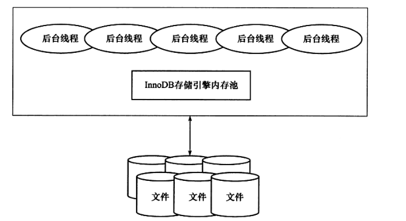
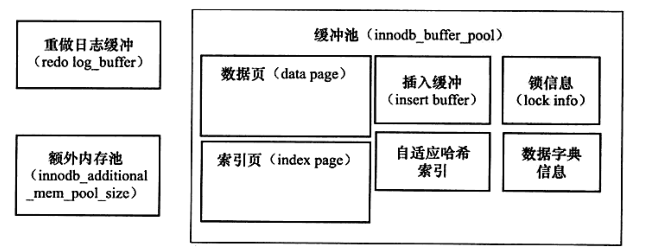

# Overview

> 数据库和实例：
>
> 数据库：物理操作系统文件或其他形式文件类型的集合。在MySQL数据库中，数据库文件可以是`frm`、MYD、MYI、`ibd`结尾的文件。当使用NDB引擎时，数据库的文件可能不是操作系统的文件，而是内存中的文件。
>
> 实例：MySQL数据库实例由后台线程以及一个共享内存区组成，数据库实例才是真正用于操作数据库文件的。

在MySQL数据库中，实例和数据库通常一一对应，但是，在集群情况下，可能存在一个数据库被多个实例使用的情况。

MySQL实例在系统上的表现是一个进程。

MySQL实例启动时，会在以下路径一次查找配置文件，后查找到的配置会覆盖先查找到的配置：

`/etc/my.cnf		/etc/mysql/my.cnf		/usr/local/mysql/etc/my.cnf		~/.my.cnf`

MySQL体系结构：

MySQL的存储引擎是插件式的，每个存储引擎开发者可以按照自己的意愿来进行开发。

## `InnoDB`存储引擎

`InnoDB`存储引擎支持事务，其设计目标主要面向 OLTP(on-line transaction processing) 的应用。其特点是行锁设计、支持外键，并支持非锁定读。

InnoDB 存储引擎将数据放在一个逻辑的表空间中，它使用多版本并发控制（MVCC）来提高并发性，并实现了SQL标准的四种隔离级别。同时，使用next-key locking策略来避免幻读现象。

InnoDB采用了聚簇索引来存储表中的数据，每张表按照主键顺序进行存储，如果没有显式为一张表指定主键，InnoDB存储引擎会为每一行生成一个6字节的ROWID作为主键。

## `MyISAM`存储引擎

MyISAM存储引擎不支持事务、表锁设计，支持全文索引，主要面向一些 OLAP(On-Line Analytical Processing) 数据库应用。

MyISAM存储引擎表由MYD和MYI组成，前者存放数据文件，后者存放索引。

# `InnoDB`存储引擎

## InnoDB体系架构

InnoDB存储引擎有多个内存块，共同组成了一个大的内存池，负责：

- 维护所有进程/线程需要访问的多个内部数据结构
- 缓存磁盘上的数据，同时对磁盘文件的数据修改之前在这里缓存
- 重做日志缓冲
- ….

后台线程的主要作用是负责刷新内存池中的数据，保证缓冲池中的内存缓存的是最新的数据，此外，将已修改的数据文件刷新到磁盘文件，同时保证在数据库发生异常时InnoDB能恢复到正常运行状态。

### 后台线程

1. Master Thread

   Master Thread是核心后台线程，负责将缓冲池的数据异步刷新到磁盘，保证数据的一致性，包括脏页的刷新、合并插入缓冲、undo页的回收等。

2. IO Thread

   InnoDB大量使用了AIO来处理写请求，IO Thread的工作主要是负责这些IO请求的回调，IO Thread包括read、write、insert buffer和log。

3. Purge Thread

   回收已经使用并分配的undo页，减轻Master Thread的压力。

4. Page Cleaner Thread

   回收脏页，减轻Master Thread的压力。

### 内存

1. 缓冲池

   InnoDB 存储引擎是基于磁盘存储的，由于磁盘速度和 CPU 速度的差距，采用了缓冲池技术来提高数据库的性能。

   当修改缓冲池中页的数据时，首先将数据写入缓冲池，然后通过 Checkpoint 机制刷新回磁盘。

   

2. LRU List，Free List 和 Flush List

   InnoDB 引擎的缓冲池采用了优化的LRU算法进行管理，将新读取到的页放到LRU列表的midpoint位置。

   传统LRU链表的问题：

   - 进行全表扫描时，可能会将访问频率很低的数据页装入缓存，扫描结束后导致命中率明显降低。
   - 触发MySQL的预读机制时，会将可能使用的其他页加载到内存，此时可能会淘汰访问比较频繁的数据页，降低命中率。

   优化后，缓冲池中63%的空间用于存放热数据，37%的空间用于存放冷数据。

   用户可以通过`innodb_old_blocks_time`参数控制数据页在冷数据区停留多久后转移到热数据区。

   Free List 存放缓冲池中可以使用的页，LRU List 存放使用 LRU 算法管理的数据页。

   LRU List中的页被修改后，称该页为脏页，即缓冲池中的页和磁盘中的页的数据产生了不一致。这是数据库会通过CHECKPOINT机制将脏页刷新回磁盘，Flush List 中的页即为脏页列表（脏页同时存在于LRU List和Flush List）。

3. Redo Log 缓冲

   InnoDB存储引擎首先把Redo Log 存入到该缓冲中，然后以一定频率将其刷新到Redo Log文件。

   - Master Thread 每个1s将Redo Log缓冲刷新到Redo Log文件。
   - 每个事务提交时会将Redo Log缓冲刷新到Redo Log文件。
   - Redo Log缓冲剩余空间小于1/2时，会将Redo Log缓冲刷新到Redo Log文件。

## Checkpoint技术

如果每次一个数据页发生变化，就立即将缓冲池中的页刷新到磁盘，那么开销将非常大。同时，如果在从缓冲池将页的新版本刷新到磁盘时发生了宕机，那么数据就不能恢复了。为了避免发生数据丢失的问题，当前基于事务的数据库系统都普遍采用了Write Ahead Log策略，即当事务提交时，先写redo log，再修改页。当由于发生宕机导致数据丢失时，通过重做日志来完成数据的恢复。

checkpoint机制的目的是：

- 缩短数据库的恢复时间（缓冲池和redo log文件很大时，恢复数据库耗时会增加）
- 缓冲池不够用时，脏页刷新
- Redo log不可用时，刷新脏页

当数据库宕机时，只需要对checkpoint之后的日志进行恢复即可。

当LRU算法淘汰的页是脏页时，需要强制执行checkpoint，将脏页刷新回磁盘。

InnoDB的checkpoint包括Sharp Checkpoint和Fuzzy Checkpoint。

Sharp Checkpoint发生在数据库关闭时将所有的脏页都刷新回磁盘。

Fuzzy Checkpoint包括：

- Master Thread Checkpoint：每隔一段时间异步刷新一定比例的页回磁盘。
- FLUSH_LRU_LIST checkpoint：保证LRU列表中有一定数量的空闲页可用（Page Cleaner Thread）。
- Async/Sync Flush Checkpoint：Redo Log不可用时，刷新一定数量的脏页回磁盘（Purge Thread）。
- Dirty Page too much checkpoint：脏页占缓冲池比例过高时，强制执行checkpoint。

## Master Thread工作方式

## InnoDB关键特性

### 插入缓冲

# 索引

`InnoDB`存储引擎支持以下几种常见的索引：

- B+树
- 全文索引
- 哈希索引

B+树索引并不能找到一个给定键值的具体行，它只能找到被查找数据行所在的页，然后数据库把页读入到内存，再在内存中进行查找。

## AVL

平衡二叉树，指左右子树高度差绝对值不大于1的二叉搜索树。

插入一个节点后，可能需要多次左旋或右旋来保持AVL的平衡性，代价很大。

## B+树

B+树的所有记录都在叶子节点上，并且是顺序存放的。

B+树的索引分为聚簇索引和辅助索引。

### 聚簇索引

`InnoDB`存储引擎表是索引组织表，表中数据按照主键顺序存放。聚簇索引就是按照每张表的主键构建一棵二叉树，同时，叶子节点存放的是整张表的行记录数据，也将聚簇索引的叶子节点称为数据叶，每个数据叶都通过一个双向链表进行链接。

