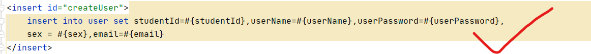
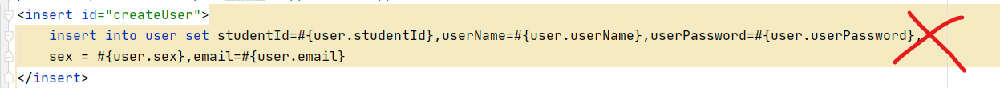
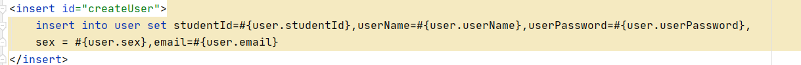
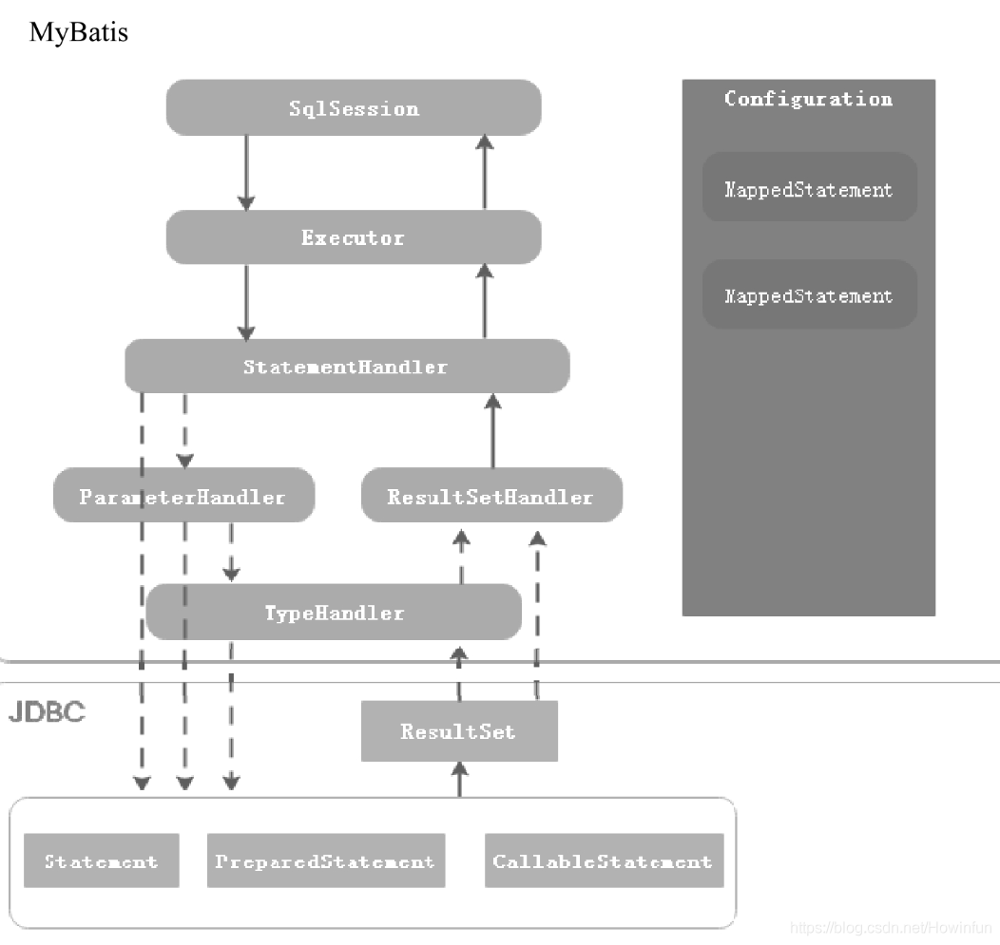
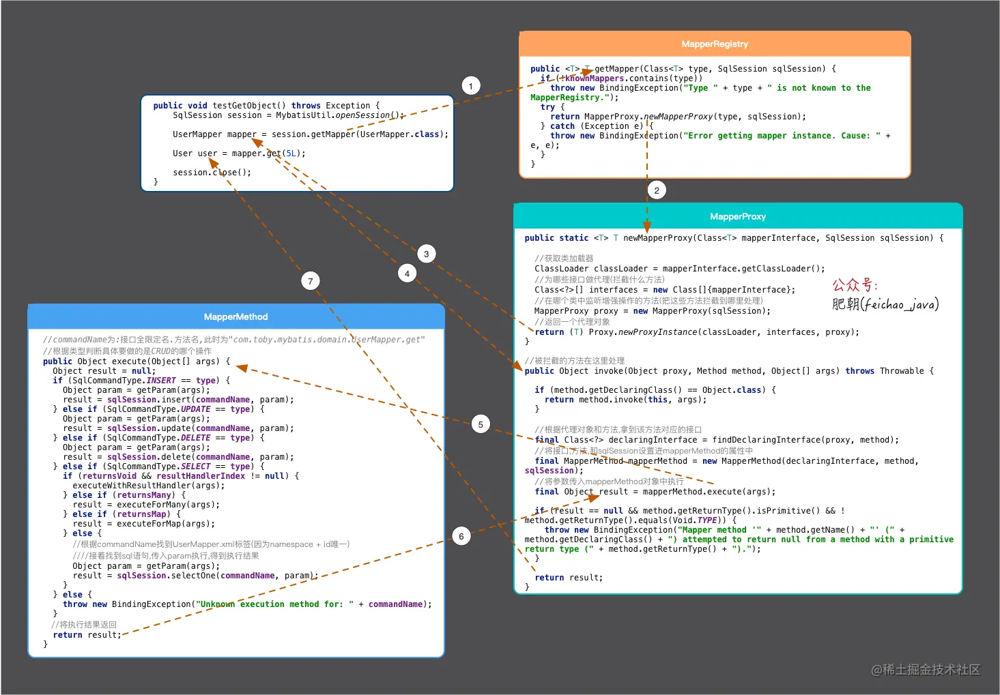
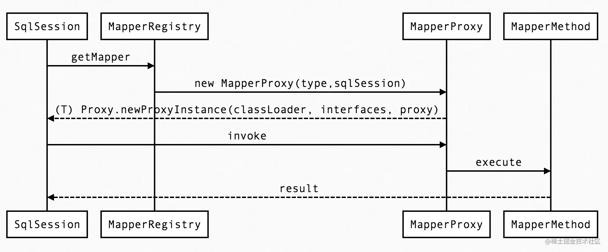

# MyBatis 是什么？

MyBatis 是支持定制化 SQL、存储过程以及高级映射的优秀的持久层框架。MyBatis 避免了几乎所有的 JDBC 代码和手动设置参数以及获取结果集。MyBatis 可以对配置和原生 Map 使用简单的 XML 或注解，将接口和 Java 的 POJOs(Plain Old Java Objects, 普通的 Java对象)映射成数据库中的记录。

使用：

```xml
<dependency> 
    <groupId>org.mybatis</groupId>  
    <artifactId>mybatis</artifactId>  
    <version>x.x.x</version>
</dependency>
```

MyBatis 的功能架构分为三层：

1. API 接口层：提供给外部使用的接口API，开发人员通过这些本地 API 来操纵数据库。接口层一接收到调用请求就会调用数据处理层来完成具体的数据处理。
2. 数据处理层：负责具体的 SQL 查找、SQL 解析、SQL 执行和执行结果映射处理等。它主要的目的是根据调用的请求完成一次数据库操作。
3. 基础支撑层：负责最基础的功能支撑，包括连接管理、事务管理、配置加载和缓存处理，这些都是共用的东西，将他们抽取出来作为最基础的组件。为上层的数据处理层提供最基础的支撑。

# MyBatis 和 Hibernate 的区别？

ORM 全称是 Object Relation Mapping（对象关系映射），是一种为了解决面向对象与关系数据库存在的互不匹配的现象的技术。简单的说，ORM是通过使用描述对象和数据库之间映射的元数据，将程序中的对象自动持久化到关系数据库中。

在程序开发中，数据库保存的表，字段与程序中的实体类之间是没有关联的，在实现持久化时就比较不方便。那么，到底如何实现持久化呢？一种简单的方案是采用硬编码方式，为每一种可能的数据库访问操作提供单独的方法。这种方案存在以下不足：

- 持久化层缺乏弹性。一旦出现业务需求的变更，就必须修改持久化层的接口
- 持久化层同时与域模型与关系数据库模型绑定，不管域模型还是关系数据库模型发生变化，都要修改持久化曾的相关程序代码，增加了软件的维护难度

ORM提供了实现持久化层的另一种模式，它采用映射元数据来描述对象关系的映射，使得ORM中间件能在任何一个应用的业务逻辑层和数据库层之间充当桥梁

不同于Hibernate，**MyBatis是一个半ORM框架**，需要程序员自己编写 SQL 语句。

区别：

- Mybatis直接编写原生态sql，可以严格控制sql执行性能，灵活度高，非常适合对关系数据模型要求不高的软件开发，因为这类软件需求变化频繁，一但需求变化要求迅速输出成果。但是灵活的前提是mybatis无法做到数据库无关性，如果需要实现支持多种数据库的软件，则需要自定义多套sql映射文件，工作量大。
- Hibernate对象/关系映射能力强，数据库无关性好，对于关系模型要求高的软件，如果用 Hibernate 开发可以节省很多代码，提高效率。


# MyBatis 的优缺点

------

**优点：**

- 简单易学：本身就很小且简单。没有任何第三方依赖，最简单安装只要两个 jar 文件+配置几个 SQL 映射文件易于学习，易于使用，通过文档和源代码，可以比较完全的掌握它的设计思路和实现。
- 灵活：MyBatis 不会对应用程序或者数据库的现有设计强加任何影响。 SQL 写在 xml 里，便于统一管理和优化。通过 SQL 基本上可以实现我们不使用数据访问框架可以实现的所有功能，或许更多。
- 解除 SQL 与程序代码的耦合：通过提供 DAL 层，将业务逻辑和数据访问逻辑分离，使系统的设计更清晰，更易维护，更易单元测试。SQL 和代码的分离，提高了可维护性。
- 提供映射标签，支持对象与数据库的 ORM 字段关系映射
- 提供对象关系映射标签，支持对象关系组建维护
- 提供 XML 标签，支持编写动态 SQL。

**缺点：**

- 编写 SQL 语句时工作量很大，尤其是字段多、关联表多时，更是如此。
- SQL 语句依赖于数据库，导致数据库移植性差，不能更换数据库。
- 二级缓存机制不佳。

# #{} 和 ${} 的区别

> `#{}` 是预编译处理，`${}`是字符串替换
>
> Mybatis在处理`#{}`时，会将sql中的`#{}`替换为`?`号，调用PreparedStatement的set方法来赋值；
>
> Mybatis在处理`${}`时，就是把`${}`替换成变量的值。
>
> 使用#{}可以有效的防止SQL注入，提高系统安全性。

有时，需要通过条件将字符串添加到 SQL 中，如 ORDER BY，此时必须用 $。

# 参数

之前见到的所有语句都使用了简单的参数形式。但实际上，参数是 MyBatis 非常强大的元素。对于大多数简单的使用场景，你都不需要使用复杂的参数，比如：

```
<select id="selectUsers" resultType="User">
  select id, username, password
  from users
  where id = #{id}
</select>
```

上面的这个示例说明了一个非常简单的命名参数映射。鉴于参数类型（parameterType）会被自动设置为 `int`，这个参数可以随意命名。原始类型或简单数据类型（比如 `Integer` 和 `String`）因为没有其它属性，会用它们的值来作为参数。 然而，如果传入一个复杂的对象，行为就会有点不一样了。比如：

```
<insert id="insertUser" parameterType="User">
  insert into users (id, username, password)
  values (#{id}, #{username}, #{password})
</insert>
```

如果 User 类型的参数对象传递到了语句中，会查找 id、username 和 password 属性，然后将它们的值传入预处理语句的参数中。

对传递语句参数来说，这种方式真是干脆利落。不过参数映射的功能远不止于此。

首先，和 MyBatis 的其它部分一样，参数也可以指定一个特殊的数据类型。

```
#{property,javaType=int,jdbcType=NUMERIC}
```

和 MyBatis 的其它部分一样，几乎总是可以根据参数对象的类型确定 javaType，除非该对象是一个 `HashMap`。这个时候，你需要显式指定 `javaType` 来确保正确的类型处理器（`TypeHandler`）被使用。

**提示** JDBC 要求，如果一个列允许使用 null 值，并且会使用值为 null 的参数，就必须要指定 JDBC 类型（jdbcType）。阅读 `PreparedStatement.setNull()`的 JavaDoc 来获取更多信息。

对于数值类型，还可以设置 `numericScale` 指定小数点后保留的位数。

```
#{height,javaType=double,jdbcType=NUMERIC,numericScale=2}
```

大多时候，只须简单指定属性名，顶多要为可能为空的列指定 `jdbcType`，其他的事情交给 MyBatis 自己去推断就行了。

```
#{firstName}
#{middleInitial,jdbcType=VARCHAR}
#{lastName}
```

**@Param：**

使用与否的区别

**不使用@param：**

1. 只能有一个参数
2. 该参数只能为Javabean类型（即参数只能是对象）
3. sql语句只能使用 # 获取参数值
4. **在SQL语句中，可以直接获取对象的字段，而不需要使用“对象.字段”的形式（这样使用反而会报错）**





注：

- 这三种限制中**前两种**是网上广为流传的，但是在我的实际使用中发现并不是这样，即使不使用@param注解，mapper方法中也可以使用多个参数且并没有类型的限制，xml中的SQL语句可以正常接收，出现这种情况可能跟mybatis的版本有关
- 第四种情况是我自己遇到的：**若不使用@param注解，则sql语句应该直接获取字段**

**使用@param：**

1. 可以有多个参数
2. 参数类型没有限制
3. **sql语句可以使用 # 或者 $ 获取参数值**
4. **若参数为对象，在SQL语句中，需要使用“对象.字段”的形式获取对象的字段值**



另外：在网上查资料的时候，发现似乎还有很多种情况需要使用@param注解，比如使用动态sql，只是没有自己验证过

以上，为避免麻烦，建议在使用mybatis时，mapper中的方法都为参数添加上@param参数


# 属性与字段映射

## 方式一：别名

为数据库表中的列起别名，令返回值与对象中的变量名一致

```xml
<select id="selectUsers" resultType="User">
  select
    user_id             as "id",
    user_name           as "userName",
    hashed_password     as "hashedPassword"
  from some_table
  where id = #{id}
</select>
```

## 方式二：resultMap

```xml
	<resultMap id = "BaseResultMap" type = "com.example.pojo.vo.DeviceQueryVO">
        <id column = "asset_num" jdbcType = "VARCHAR" property="assetNum"/>
        <result column = "device_name" jdbcType = "VARCHAR" property="deviceName"/>
        <result column = "receive_department" jdbcType = "VARCHAR" property="receiveDepartment"/>
        <result column = "receive_academy" jdbcType = "VARCHAR" property="receiveAcademy"/>
        <result column = "model" jdbcType = "VARCHAR" property="model"/>
        <result column = "present_situation" jdbcType = "VARCHAR" property="presentSituation"/>
        <result column = "receive_people_name" jdbcType = "VARCHAR" property="receivePeopleName"/>
        <result column = "use_field" jdbcType = "VARCHAR" property="useField"/>
        <result column = "storage_place" jdbcType = "VARCHAR" property="storagePlace"/>
    </resultMap>
    <sql id = "Base_Column_List">
        asset_num, device_name, receive_department, receive_academy, model,present_situation,
        receive_people_name, use_field, storage_place
    </sql>
    <select id = "listDevices" resultMap = "BaseResultMap">
        select
        <include refid = "Base_Column_List"/>
        from `user_device_map`
        inner join `device`
            on `user_device_map`.device_id = `device`.device_id
        where
            user_id = #{id}
            and map_type = #{mapType}
    </select>
```

**高级结果映射：**

```xml
<!-- 非常复杂的语句 -->
<select id="selectBlogDetails" resultMap="detailedBlogResultMap">
  select
       B.id as blog_id,
       B.title as blog_title,
       B.author_id as blog_author_id,
       A.id as author_id,
       A.username as author_username,
       A.password as author_password,
       A.email as author_email,
       A.bio as author_bio,
       A.favourite_section as author_favourite_section,
       P.id as post_id,
       P.blog_id as post_blog_id,
       P.author_id as post_author_id,
       P.created_on as post_created_on,
       P.section as post_section,
       P.subject as post_subject,
       P.draft as draft,
       P.body as post_body,
       C.id as comment_id,
       C.post_id as comment_post_id,
       C.name as comment_name,
       C.comment as comment_text,
       T.id as tag_id,
       T.name as tag_name
  from Blog B
       left outer join Author A on B.author_id = A.id
       left outer join Post P on B.id = P.blog_id
       left outer join Comment C on P.id = C.post_id
       left outer join Post_Tag PT on PT.post_id = P.id
       left outer join Tag T on PT.tag_id = T.id
  where B.id = #{id}
</select>
```

这个对象表示了一篇博客，它由某位作者所写，有很多的博文，每篇博文有零或多条的评论和标签。 我们先来看看下面这个完整的例子，它是一个非常复杂的结果映射（假设作者，博客，博文，评论和标签都是类型别名）。 

```xml
<!-- 非常复杂的结果映射 -->
<resultMap id="detailedBlogResultMap" type="Blog">
  <constructor>
    <idArg column="blog_id" javaType="int"/>
  </constructor>
  <result property="title" column="blog_title"/>
  <association property="author" javaType="Author">
    <id property="id" column="author_id"/>
    <result property="username" column="author_username"/>
    <result property="password" column="author_password"/>
    <result property="email" column="author_email"/>
    <result property="bio" column="author_bio"/>
    <result property="favouriteSection" column="author_favourite_section"/>
  </association>
  <collection property="posts" ofType="Post">
    <id property="id" column="post_id"/>
    <result property="subject" column="post_subject"/>
    <association property="author" javaType="Author"/>
    <collection property="comments" ofType="Comment">
      <id property="id" column="comment_id"/>
    </collection>
    <collection property="tags" ofType="Tag" >
      <id property="id" column="tag_id"/>
    </collection>
    <discriminator javaType="int" column="draft">
      <case value="1" resultType="DraftPost"/>
    </discriminator>
  </collection>
</resultMap>
```

### resultMap的结构

#### id & result

```
<id property="id" column="post_id"/>
<result property="subject" column="post_subject"/>
```

这些元素是结果映射的基础。*id* 和 *result* 元素都将一个列的值映射到一个简单数据类型（String, int, double, Date 等）的属性或字段。

这两者之间的唯一不同是，*id* 元素对应的属性会被标记为对象的标识符，在比较对象实例时使用。 这样可以提高整体的性能，尤其是进行缓存和嵌套结果映射（也就是连接映射）的时候。

| 属性          | 描述                                                         |
| :------------ | :----------------------------------------------------------- |
| `property`    | 映射到列结果的字段或属性。如果 JavaBean 有这个名字的属性（property），会先使用该属性。否则 MyBatis 将会寻找给定名称的字段（field）。 无论是哪一种情形，你都可以使用常见的点式分隔形式进行复杂属性导航。 比如，你可以这样映射一些简单的东西：“username”，或者映射到一些复杂的东西上：“address.street.number”。 |
| `column`      | 数据库中的列名，或者是列的别名。一般情况下，这和传递给 `resultSet.getString(columnName)` 方法的参数一样。 |
| `javaType`    | 一个 Java 类的全限定名，或一个类型别名。 如果你映射到一个 JavaBean，MyBatis 通常可以推断类型。然而，如果你映射到的是 HashMap，那么你应该明确地指定 javaType 来保证行为与期望的相一致。 |
| `jdbcType`    | JDBC 类型。 只需要在可能执行插入、更新和删除的且允许空值的列上指定 JDBC 类型。这是 JDBC 的要求而非 MyBatis 的要求。如果你直接面向 JDBC 编程，你需要对可以为空值的列指定这个类型。 |
| `typeHandler` | 我们在前面讨论过默认的类型处理器。使用这个属性，你可以覆盖默认的类型处理器。 这个属性值是一个类型处理器实现类的全限定名，或者是类型别名。 |

#### 构造方法

通过修改对象属性的方式，可以满足大多数的数据传输对象（Data Transfer Object, DTO）以及绝大部分领域模型的要求。但有些情况下你想使用不可变类。 一般来说，很少改变或基本不变的包含引用或数据的表，很适合使用不可变类。 构造方法注入允许你在初始化时为类设置属性的值，而不用暴露出公有方法。MyBatis 也支持私有属性和私有 JavaBean 属性来完成注入，但有一些人更青睐于通过构造方法进行注入。 *constructor* 元素就是为此而生的。

看看下面这个构造方法:

```
public class User {
   //...
   public User(Integer id, String username, int age) {
     //...
  }
//...
}
```

为了将结果注入构造方法，MyBatis 需要通过某种方式定位相应的构造方法。 在下面的例子中，MyBatis 搜索一个声明了三个形参的构造方法，参数类型以 `java.lang.Integer`, `java.lang.String` 和 `int` 的顺序给出。

```
<constructor>
   <idArg column="id" javaType="int"/>
   <arg column="username" javaType="String"/>
   <arg column="age" javaType="_int"/>
</constructor>
```

当你在处理一个带有多个形参的构造方法时，很容易搞乱 arg 元素的顺序。 从版本 3.4.3 开始，可以在指定参数名称的前提下，以任意顺序编写 arg 元素。 为了通过名称来引用构造方法参数，你可以添加 `@Param` 注解，或者使用 '-parameters' 编译选项并启用 `useActualParamName` 选项（默认开启）来编译项目。下面是一个等价的例子，尽管函数签名中第二和第三个形参的顺序与 constructor 元素中参数声明的顺序不匹配。

```
<constructor>
   <idArg column="id" javaType="int" name="id" />
   <arg column="age" javaType="_int" name="age" />
   <arg column="username" javaType="String" name="username" />
</constructor>
```

如果存在名称和类型相同的属性，那么可以省略 `javaType` 。

剩余的属性和规则和普通的 id 和 result 元素是一样的。

| 属性          | 描述                                                         |
| :------------ | :----------------------------------------------------------- |
| `column`      | 数据库中的列名，或者是列的别名。一般情况下，这和传递给 `resultSet.getString(columnName)` 方法的参数一样。 |
| `javaType`    | 一个 Java 类的完全限定名，或一个类型别名。 如果你映射到一个 JavaBean，MyBatis 通常可以推断类型。然而，如果你映射到的是 HashMap，那么你应该明确地指定 javaType 来保证行为与期望的相一致。 |
| `jdbcType`    | JDBC 类型。只需要在可能执行插入、更新和删除的且允许空值的列上指定 JDBC 类型。这是 JDBC 的要求而非 MyBatis 的要求。如果你直接面向 JDBC 编程，你需要对可能存在空值的列指定这个类型。 |
| `typeHandler` | 默认的类型处理器。使用这个属性，你可以覆盖默认的类型处理器。 这个属性值是一个类型处理器实现类的完全限定名，或者是类型别名。 |
| `select`      | 用于加载复杂类型属性的映射语句的 ID，它会从 column 属性中指定的列检索数据，作为参数传递给此 select 语句。具体请参考关联元素。 |
| `resultMap`   | 结果映射的 ID，可以将嵌套的结果集映射到一个合适的对象树中。 它可以作为使用额外 select 语句的替代方案。它可以将多表连接操作的结果映射成一个单一的 `ResultSet`。这样的 `ResultSet` 将会将包含重复或部分数据重复的结果集。为了将结果集正确地映射到嵌套的对象树中，MyBatis 允许你 “串联”结果映射，以便解决嵌套结果集的问题。想了解更多内容，请参考下面的关联元素。 |
| `name`        | 构造方法形参的名字。从 3.4.3 版本开始，通过指定具体的参数名，你可以以任意顺序写入 arg 元素。参看上面的解释。 |


#### 关联

```
<association property="author" column="blog_author_id" javaType="Author">
  <id property="id" column="author_id"/>
  <result property="username" column="author_username"/>
</association>
```

关联（association）元素处理“有一个”类型的关系。 比如，在我们的示例中，一个博客有一个用户。关联结果映射和其它类型的映射工作方式差不多。 你需要指定目标属性名以及属性的`javaType`（很多时候 MyBatis 可以自己推断出来），在必要的情况下你还可以设置 JDBC 类型，如果你想覆盖获取结果值的过程，还可以设置类型处理器。

关联的不同之处是，你需要告诉 MyBatis 如何加载关联。MyBatis 有两种不同的方式加载关联：

- 嵌套 Select 查询：通过执行另外一个 SQL 映射语句来加载期望的复杂类型。
- 嵌套结果映射：使用嵌套的结果映射来处理连接结果的重复子集。

首先，先让我们来看看这个元素的属性。你将会发现，和普通的结果映射相比，它只在 select 和 resultMap 属性上有所不同。

| 属性          | 描述                                                         |
| :------------ | :----------------------------------------------------------- |
| `property`    | 映射到列结果的字段或属性。如果用来匹配的 JavaBean 存在给定名字的属性，那么它将会被使用。否则 MyBatis 将会寻找给定名称的字段。 无论是哪一种情形，你都可以使用通常的点式分隔形式进行复杂属性导航。 比如，你可以这样映射一些简单的东西：“username”，或者映射到一些复杂的东西上：“address.street.number”。 |
| `javaType`    | 一个 Java 类的完全限定名，或一个类型别名（关于内置的类型别名，可以参考上面的表格）。 如果你映射到一个 JavaBean，MyBatis 通常可以推断类型。然而，如果你映射到的是 HashMap，那么你应该明确地指定 javaType 来保证行为与期望的相一致。 |
| `jdbcType`    | JDBC 类型，所支持的 JDBC 类型参见这个表格之前的“支持的 JDBC 类型”。 只需要在可能执行插入、更新和删除的且允许空值的列上指定 JDBC 类型。这是 JDBC 的要求而非 MyBatis 的要求。如果你直接面向 JDBC 编程，你需要对可能存在空值的列指定这个类型。 |
| `typeHandler` | 我们在前面讨论过默认的类型处理器。使用这个属性，你可以覆盖默认的类型处理器。 这个属性值是一个类型处理器实现类的完全限定名，或者是类型别名。 |

##### 关联的嵌套 Select 查询

| 属性        | 描述                                                         |
| :---------- | :----------------------------------------------------------- |
| `column`    | 数据库中的列名，或者是列的别名。一般情况下，这和传递给 `resultSet.getString(columnName)` 方法的参数一样。 注意：在使用复合主键的时候，你可以使用 `column="{prop1=col1,prop2=col2}"` 这样的语法来指定多个传递给嵌套 Select 查询语句的列名。这会使得 `prop1` 和 `prop2` 作为参数对象，被设置为对应嵌套 Select 语句的参数。 |
| `select`    | 用于加载复杂类型属性的映射语句的 ID，它会从 column 属性指定的列中检索数据，作为参数传递给目标 select 语句。 具体请参考下面的例子。注意：在使用复合主键的时候，你可以使用 `column="{prop1=col1,prop2=col2}"` 这样的语法来指定多个传递给嵌套 Select 查询语句的列名。这会使得 `prop1` 和 `prop2` 作为参数对象，被设置为对应嵌套 Select 语句的参数。 |
| `fetchType` | 可选的。有效值为 `lazy` 和 `eager`。 指定属性后，将在映射中忽略全局配置参数 `lazyLoadingEnabled`，使用属性的值。 |

示例：

```
<resultMap id="blogResult" type="Blog">
  <association property="author" column="author_id" javaType="Author" select="selectAuthor"/>
</resultMap>

<select id="selectBlog" resultMap="blogResult">
  SELECT * FROM BLOG WHERE ID = #{id}
</select>

<select id="selectAuthor" resultType="Author">
  SELECT * FROM AUTHOR WHERE ID = #{id}
</select>
```

就是这么简单。我们有两个 select 查询语句：一个用来加载博客（Blog），另外一个用来加载作者（Author），而且博客的结果映射描述了应该使用 `selectAuthor` 语句加载它的 author 属性。

其它所有的属性将会被自动加载，只要它们的列名和属性名相匹配。

这种方式虽然很简单，但在大型数据集或大型数据表上表现不佳。这个问题被称为“N+1 查询问题”。 概括地讲，N+1 查询问题是这样子的：

- 你执行了一个单独的 SQL 语句来获取结果的一个列表（就是“+1”）。
- 对列表返回的每条记录，你执行一个 select 查询语句来为每条记录加载详细信息（就是“N”）。

这个问题会导致成百上千的 SQL 语句被执行。有时候，我们不希望产生这样的后果。

好消息是，MyBatis 能够对这样的查询进行延迟加载，因此可以将大量语句同时运行的开销分散开来。 然而，如果你加载记录列表之后立刻就遍历列表以获取嵌套的数据，就会触发所有的延迟加载查询，性能可能会变得很糟糕。

所以还有另外一种方法。

##### 关联的嵌套结果映射

| 属性            | 描述                                                         |
| :-------------- | :----------------------------------------------------------- |
| `resultMap`     | 结果映射的 ID，可以将此关联的嵌套结果集映射到一个合适的对象树中。 它可以作为使用额外 select 语句的替代方案。它可以将多表连接操作的结果映射成一个单一的 `ResultSet`。这样的 `ResultSet` 有部分数据是重复的。 为了将结果集正确地映射到嵌套的对象树中, MyBatis 允许你“串联”结果映射，以便解决嵌套结果集的问题。使用嵌套结果映射的一个例子在表格以后。 |
| `columnPrefix`  | 当连接多个表时，你可能会不得不使用列别名来避免在 `ResultSet` 中产生重复的列名。指定 columnPrefix 列名前缀允许你将带有这些前缀的列映射到一个外部的结果映射中。 详细说明请参考后面的例子。 |
| `notNullColumn` | 默认情况下，在至少一个被映射到属性的列不为空时，子对象才会被创建。 你可以在这个属性上指定非空的列来改变默认行为，指定后，Mybatis 将只在这些列非空时才创建一个子对象。可以使用逗号分隔来指定多个列。默认值：未设置（unset）。 |
| `autoMapping`   | 如果设置这个属性，MyBatis 将会为本结果映射开启或者关闭自动映射。 这个属性会覆盖全局的属性 autoMappingBehavior。注意，本属性对外部的结果映射无效，所以不能搭配 `select` 或 `resultMap` 元素使用。默认值：未设置（unset）。 |

之前，你已经看到了一个非常复杂的嵌套关联的例子。 下面的例子则是一个非常简单的例子，用于演示嵌套结果映射如何工作。 现在我们将博客表和作者表连接在一起，而不是执行一个独立的查询语句，就像这样：

```
<select id="selectBlog" resultMap="blogResult">
  select
    B.id            as blog_id,
    B.title         as blog_title,
    B.author_id     as blog_author_id,
    A.id            as author_id,
    A.username      as author_username,
    A.password      as author_password,
    A.email         as author_email,
    A.bio           as author_bio
  from Blog B left outer join Author A on B.author_id = A.id
  where B.id = #{id}
</select>
```

注意查询中的连接，以及为确保结果能够拥有唯一且清晰的名字，我们设置的别名。 这使得进行映射非常简单。现在我们可以映射这个结果：

```
<resultMap id="blogResult" type="Blog">
  <id property="id" column="blog_id" />
  <result property="title" column="blog_title"/>
  <association property="author" column="blog_author_id" javaType="Author" resultMap="authorResult"/>
</resultMap>

<resultMap id="authorResult" type="Author">
  <id property="id" column="author_id"/>
  <result property="username" column="author_username"/>
  <result property="password" column="author_password"/>
  <result property="email" column="author_email"/>
  <result property="bio" column="author_bio"/>
</resultMap>
```

在上面的例子中，你可以看到，博客（Blog）作者（author）的关联元素委托名为 “authorResult” 的结果映射来加载作者对象的实例。

非常重要： id 元素在嵌套结果映射中扮演着非常重要的角色。你应该总是指定一个或多个可以唯一标识结果的属性。 虽然，即使不指定这个属性，MyBatis 仍然可以工作，但是会产生严重的性能问题。 只需要指定可以唯一标识结果的最少属性。显然，你可以选择主键（复合主键也可以）。

现在，上面的示例使用了外部的结果映射元素来映射关联。这使得 Author 的结果映射可以被重用。 然而，如果你不打算重用它，或者你更喜欢将你所有的结果映射放在一个具有描述性的结果映射元素中。 你可以直接将结果映射作为子元素嵌套在内。这里给出使用这种方式的等效例子：

```
<resultMap id="blogResult" type="Blog">
  <id property="id" column="blog_id" />
  <result property="title" column="blog_title"/>
  <association property="author" javaType="Author">
    <id property="id" column="author_id"/>
    <result property="username" column="author_username"/>
    <result property="password" column="author_password"/>
    <result property="email" column="author_email"/>
    <result property="bio" column="author_bio"/>
  </association>
</resultMap>
```

那如果博客（blog）有一个共同作者（co-author）该怎么办？select 语句看起来会是这样的：

```
<select id="selectBlog" resultMap="blogResult">
  select
    B.id            as blog_id,
    B.title         as blog_title,
    A.id            as author_id,
    A.username      as author_username,
    A.password      as author_password,
    A.email         as author_email,
    A.bio           as author_bio,
    CA.id           as co_author_id,
    CA.username     as co_author_username,
    CA.password     as co_author_password,
    CA.email        as co_author_email,
    CA.bio          as co_author_bio
  from Blog B
  left outer join Author A on B.author_id = A.id
  left outer join Author CA on B.co_author_id = CA.id
  where B.id = #{id}
</select>
```

回忆一下，Author 的结果映射定义如下：

```
<resultMap id="authorResult" type="Author">
  <id property="id" column="author_id"/>
  <result property="username" column="author_username"/>
  <result property="password" column="author_password"/>
  <result property="email" column="author_email"/>
  <result property="bio" column="author_bio"/>
</resultMap>
```

由于结果中的列名与结果映射中的列名不同。你需要指定 `columnPrefix` 以便重复使用该结果映射来映射 co-author 的结果。

```
<resultMap id="blogResult" type="Blog">
  <id property="id" column="blog_id" />
  <result property="title" column="blog_title"/>
  <association property="author"
    resultMap="authorResult" />
  <association property="coAuthor"
    resultMap="authorResult"
    columnPrefix="co_" />
</resultMap>
```

#### 集合

```
<collection property="posts" ofType="domain.blog.Post">
  <id property="id" column="post_id"/>
  <result property="subject" column="post_subject"/>
  <result property="body" column="post_body"/>
</collection>
```

集合元素和关联元素几乎是一样的，它们相似的程度之高，以致于没有必要再介绍集合元素的相似部分。 所以让我们来关注它们的不同之处吧。

我们来继续上面的示例，一个博客（Blog）只有一个作者（Author)。但一个博客有很多文章（Post)。 在博客类中，这可以用下面的写法来表示：

```
private List<Post> posts;
```

要像上面这样，映射嵌套结果集合到一个 List 中，可以使用集合元素。 和关联元素一样，我们可以使用嵌套 Select 查询，或基于连接的嵌套结果映射集合。

##### 集合的嵌套 Select 查询

首先，让我们看看如何使用嵌套 Select 查询来为博客加载文章。

```
<resultMap id="blogResult" type="Blog">
  <collection property="posts" javaType="ArrayList" column="id" ofType="Post" select="selectPostsForBlog"/>
</resultMap>

<select id="selectBlog" resultMap="blogResult">
  SELECT * FROM BLOG WHERE ID = #{id}
</select>

<select id="selectPostsForBlog" resultType="Post">
  SELECT * FROM POST WHERE BLOG_ID = #{id}
</select>
```

你可能会立刻注意到几个不同，但大部分都和我们上面学习过的关联元素非常相似。 首先，你会注意到我们使用的是集合元素。 接下来你会注意到有一个新的 “ofType” 属性。这个属性非常重要，它用来将 JavaBean（或字段）属性的类型和集合存储的类型区分开来。 所以你可以按照下面这样来阅读映射：

```
<collection property="posts" javaType="ArrayList" column="id" ofType="Post" select="selectPostsForBlog"/>
```

读作： “posts 是一个存储 Post 的 ArrayList 集合”

在一般情况下，MyBatis 可以推断 javaType 属性，因此并不需要填写。所以很多时候你可以简略成：

```
<collection property="posts" column="id" ofType="Post" select="selectPostsForBlog"/>
```

##### 集合的嵌套结果映射

现在你可能已经猜到了集合的嵌套结果映射是怎样工作的——除了新增的 “ofType” 属性，它和关联的完全相同。

首先, 让我们看看对应的 SQL 语句：

```
<select id="selectBlog" resultMap="blogResult">
  select
  B.id as blog_id,
  B.title as blog_title,
  B.author_id as blog_author_id,
  P.id as post_id,
  P.subject as post_subject,
  P.body as post_body,
  from Blog B
  left outer join Post P on B.id = P.blog_id
  where B.id = #{id}
</select>
```

我们再次连接了博客表和文章表，并且为每一列都赋予了一个有意义的别名，以便映射保持简单。 要映射博客里面的文章集合，就这么简单：

```
<resultMap id="blogResult" type="Blog">
  <id property="id" column="blog_id" />
  <result property="title" column="blog_title"/>
  <collection property="posts" ofType="Post">
    <id property="id" column="post_id"/>
    <result property="subject" column="post_subject"/>
    <result property="body" column="post_body"/>
  </collection>
</resultMap>
```

再提醒一次，要记得上面 id 元素的重要性，如果你不记得了，请阅读关联部分的相关部分。

如果你喜欢更详略的、可重用的结果映射，你可以使用下面的等价形式：

```
<resultMap id="blogResult" type="Blog">
  <id property="id" column="blog_id" />
  <result property="title" column="blog_title"/>
  <collection property="posts" ofType="Post" resultMap="blogPostResult" columnPrefix="post_"/>
</resultMap>

<resultMap id="blogPostResult" type="Post">
  <id property="id" column="id"/>
  <result property="subject" column="subject"/>
  <result property="body" column="body"/>
</resultMap>
```

##### 集合的多结果集（ResultSet）

像关联元素那样，我们可以通过执行存储过程实现，它会执行两个查询并返回两个结果集，一个是博客的结果集，另一个是文章的结果集：

```
SELECT * FROM BLOG WHERE ID = #{id}

SELECT * FROM POST WHERE BLOG_ID = #{id}
```

在映射语句中，必须通过 `resultSets` 属性为每个结果集指定一个名字，多个名字使用逗号隔开。

```
<select id="selectBlog" resultSets="blogs,posts" resultMap="blogResult">
  {call getBlogsAndPosts(#{id,jdbcType=INTEGER,mode=IN})}
</select>
```

我们指定 “posts” 集合将会使用存储在 “posts” 结果集中的数据进行填充：

```
<resultMap id="blogResult" type="Blog">
  <id property="id" column="id" />
  <result property="title" column="title"/>
  <collection property="posts" ofType="Post" resultSet="posts" column="id" foreignColumn="blog_id">
    <id property="id" column="id"/>
    <result property="subject" column="subject"/>
    <result property="body" column="body"/>
  </collection>
</resultMap>
```

**注意** 对关联或集合的映射，并没有深度、广度或组合上的要求。但在映射时要留意性能问题。 在探索最佳实践的过程中，应用的单元测试和性能测试会是你的好帮手。 而 MyBatis 的好处在于，可以在不对你的代码引入重大变更（如果有）的情况下，允许你之后改变你的想法。

高级关联和集合映射是一个深度话题。文档的介绍只能到此为止。配合少许的实践，你会很快了解全部的用法。


# Mapper原理

MyBatis核心组件：

- **Configuration**：用于描述 MyBatis 主配置文件信息，MyBatis 框架在启动时会加载主配置文件，将配置信息转换为 Configuration 对象。
- **SqlSession**：面向用户的 API，是 MyBatis 与数据库交互的接口。
- **Executor**：SQL 执行器，用于和数据库交互。SqlSession 可以理解为 Executor 组件的外观（外观模式），真正执行 SQL 的是 Executor 组件。
- **MappedStatement**：用于描述 SQL 配置信息，MyBatis 框架启动时，XML 文件或者注解配置的 SQL 信息会被转换为 MappedStatement 对象注册到 Configuration 组件中。
- **StatementHandler**：封装了对 JDBC 中 Statement 对象的操作，包括为 Statement 参数占位符设置值，通过 Statement 对象执行 SQL 语句。
- **TypeHandler**：类型处理器，用于 Java 类型与 JDBC 类型之间的转换。
- **ParameterHandler**：用于处理 SQL 中的参数占位符，为参数占位符设置值。
- **ResultSetHandler**：封装了对 ResultSet 对象的处理逻辑，将结果集转换为 Java 实体对象。

Mapper执行流程：

SqlSession组件，它是用户层面的API。用户可利用 SqlSession 获取想要的 Mapper 对象（MapperProxy 代理对象）；当执行 Mapper 的方法，MapperProxy 会创建对应的 MapperMetohd，然后 MapperMethod 底层利用 SqlSession 来执行 SQL。

但是真正执行 SQL 操作的是 Executor组 件，Executor 可以理解为 SQL 执行器，它会使用 StatementHandler 组件对 JDBC 的 Statement 对象进行操作。当 Statement 类型为 CallableStatement 和 PreparedStatement 时，会通过 ParameterHandler 组件为参数占位符赋值。

ParameterHandler 组件中会根据 Java 类型找到对应的 TypeHandler 对象，TypeHandler 中会通过 Statement 对象提供的 setXXX() 方法（例如setString()方法）为 Statement 对象中的参数占位符设置值。

StatementHandler 组件使用 JDBC 中的 Statement 对象与数据库完成交互后，当 SQL 语句类型为 SELECT 时，MyBatis 通过 ResultSetHandler 组件从 Statement 对象中获取 ResultSet 对象，然后将 ResultSet 对象转换为 Java 对象。

我们可以用一幅图来描述上面各个核心组件之间的关系：



使用Mapper接口执行查询时的流程：





源码分析：[抛开 Spring ，你知道 MyBatis 加载 Mapper 的底层原理吗？ - 不送花的程序猿 - 博客园 (cnblogs.com)](https://www.cnblogs.com/Howinfun/p/12973902.html)

# SQL与Mapper接口的绑定关系是如何建立的？

在MyBatis初始化阶段，当解析一个xml配置文件时，会尝试根据`<mapper namespace="....">`中的namespace属性值，判断classpath下有没有这样一个接口的全路径与namespace属性值完全相同，如果有，则建立二者之间的映射关系，否则，抛出`ClassNotFound`异常。

建立映射关系后，会调用 **Configuration** 的 addMapper方法，随后向 MapperRegistry 注册该 Mapper，MapperRegistry 会为该 Mapper 生成一个动态代理工厂类，随后调用 getMapper 方法时，会从工厂类中获取一个动态代理对象。


