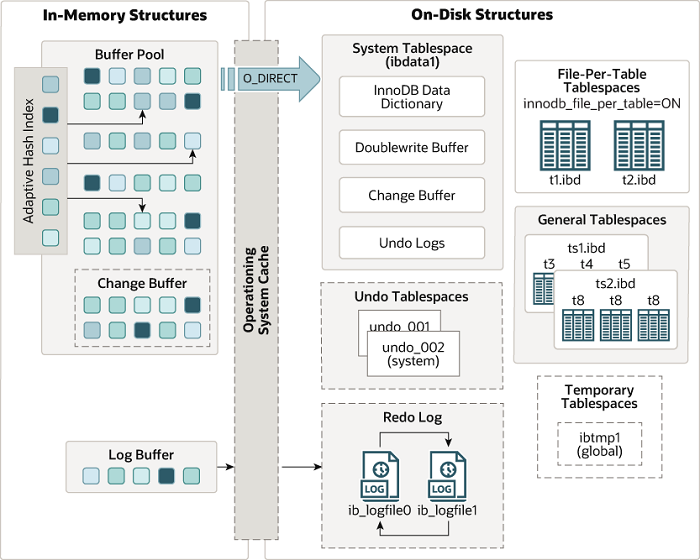
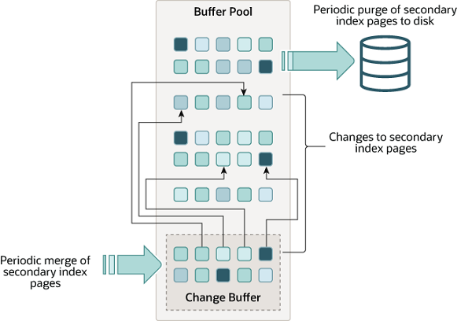

# SOverview

> 数据库和实例：
>
> 数据库：物理操作系统文件或其他形式文件类型的集合。在MySQL数据库中，数据库文件可以是`frm`、MYD、MYI、`ibd`结尾的文件。当使用NDB引擎时，数据库的文件可能不是操作系统的文件，而是内存中的文件。
>
> 实例：MySQL数据库实例由后台线程以及一个共享内存区组成，数据库实例才是真正用于操作数据库文件的。

在MySQL数据库中，实例和数据库通常一一对应，但是，在集群情况下，可能存在一个数据库被多个实例使用的情况。

MySQL实例在系统上的表现是一个进程。

MySQL体系结构：


MySQL的存储引擎是插件式的，每个存储引擎开发者可以按照自己的意愿来进行开发。

## `InnoDB`存储引擎

`InnoDB`存储引擎支持事务，其设计目标主要面向 OLTP(on-line transaction processing) 的应用。其特点是行锁设计、支持外键，并支持非锁定读。

`InnoDB` 存储引擎将数据放在一个逻辑的表空间中，它使用多版本并发控制（MVCC）来提高并发性，并实现了SQL标准的四种隔离级别。同时，使用next-key locking策略来避免幻读现象。

`InnoDB`采用了聚簇索引来存储表中的数据，每张表按照主键顺序进行存储，如果没有显式为一张表指定主键，`InnoDB`存储引擎会为每一行生成一个6字节的ROWID作为主键。

## `MyISAM`存储引擎

`MyISAM`存储引擎不支持事务、表锁设计，支持全文索引，主要面向一些 OLAP(On-Line Analytical Processing) 数据库应用。

`MyISAM`存储引擎表由MYD和MYI组成，前者存放数据文件，后者存放索引。


# `InnoDB`存储引擎

## `InnoDB`体系架构

`InnoDB`存储引擎有多个内存块，共同组成了一个大的内存池，负责：

- 维护所有进程/线程需要访问的多个内部数据结构
- 缓存磁盘上的数据，同时对磁盘文件的数据修改之前在这里缓存
- 重做日志缓冲
- ….


后台线程的主要作用是负责刷新内存池中的数据，保证缓冲池中的内存缓存的是最新的数据，此外，将已修改的数据文件刷新到磁盘文件，同时保证在数据库发生异常时`InnoDB`能恢复到正常运行状态。



## 后台线程

1. Master Thread

   Master Thread是核心后台线程，负责将缓冲池的数据异步刷新到磁盘，保证数据的一致性，包括脏页的刷新、合并插入缓冲、undo页的回收等。

2. IO Thread

   `InnoDB`大量使用了AIO来处理写请求，IO Thread的工作主要是负责这些IO请求的回调，IO Thread包括read、write、insert buffer和log。一般来说，包括4个read thread，4个write thread，1个insert buffer thread和1个log thread。

3. Purge Thread

   事务提交后，其undo log可能不再需要，Purge Thread回收已经使用并分配的undo页，减轻Master Thread的压力。

4. Page Cleaner Thread

   回收脏页，减轻Master Thread的压力。

## 缓冲池

`InnoDB` 存储引擎是基于磁盘存储的，由于磁盘速度和 CPU 速度的差距，采用了缓冲池技术来提高数据库的性能。

当修改缓冲池中页的数据时，首先将数据写入缓冲池，然后通过 Checkpoint 机制刷新回磁盘。

查看缓冲池大小：

```mysql
mysql> show variables like 'innodb_buffer_pool_size';
+-------------------------+-----------+
| Variable_name           | Value     |
+-------------------------+-----------+
| innodb_buffer_pool_size | 134217728 |
+-------------------------+-----------+
1 row in set, 1 warning (0.01 sec)
```

从`InnoDB` 1.0.x开始，允许有多个缓冲池实例，每个页根据哈希值平均分配到不同的缓冲池实例中，减少数据库内部的资源竞争，增加数据库的并发处理能力。

查看缓冲池实例数：

```mysql
mysql> show variables like 'innodb_buffer_pool_instances';
+------------------------------+-------+
| Variable_name                | Value |
+------------------------------+-------+
| innodb_buffer_pool_instances | 1     |
+------------------------------+-------+
1 row in set, 1 warning (0.00 sec)
```

可以在配置文件中修改该值。

### LRU List，Free List 和 Flush List

`InnoDB` 引擎的缓冲池中存储数据页和索引页组成的链表，采用了优化的 LRU 算法进行管理，将新读取到的页放到 LRU 列表的 midpoint 位置。


传统LRU链表的问题：

- 进行全表扫描时，可能会将访问频率很低的数据页装入缓存，扫描结束后导致命中率明显降低。
- 触发MySQL的预读机制时，会将可能使用的其他页加载到内存，此时可能会淘汰访问比较频繁的数据页，降低命中率。

优化后，缓冲池中5/8的空间用于存放热数据，称为 young 区，3/8的空间用于存放冷数据，称为 old 区。

```mysql
mysql> show variables like 'innodb_old_blocks_pct';
+-----------------------+-------+
| Variable_name         | Value |
+-----------------------+-------+
| innodb_old_blocks_pct | 37    |
+-----------------------+-------+
1 row in set, 1 warning (0.00 sec)
```


当数据页第一次被加载到缓冲池时（用户执行一条SQL查询，或者预读机制），会放到 old 区的首部，当这个数据页再次被访问到时，如果该页在old区存在的时间超过了1秒，就把它移动到 young 区的首部（这会导致young区和old区的其他数据页全部后移一位）。

用户可以通过`innodb_old_blocks_time`参数控制数据页在冷数据区停留多久后转移到热数据区。

改进的LRU算法解决了之前提到的两个问题。

**针对全表扫描的问题：**

1. 扫描过程中，需要新插入的数据页，都放到old区
2. 一个数据页有多条记录，因此一个数据页会被访问多次
3. 由于是顺序扫描，因此一个页的连续的两次访问间隔时间会小于1s，不会转移到 young 区。
4. 该页扫描完后，不会再访问该页，因此该页很快就会被淘汰。

**针对预读机制：**预读到的页位于 old 区，如果它不是热点页，会很快被淘汰。

可以通过`show engine innnodb status\G`监控冷热数据，pages made young表示页从old 区转移到young区的数量，pages not made young表示在old区被淘汰的页个数。

Free List 存放缓冲池中可以使用的页，LRU List 存放使用 LRU 算法管理的数据页。

LRU List中的页被修改后，称该页为脏页，即缓冲池中的页和磁盘中的页的数据产生了不一致。这是数据库会通过CHECKPOINT机制将脏页刷新回磁盘，Flush List 中的页即为脏页列表（脏页同时存在于LRU List和Flush List）。

### Change Buffer

写缓冲，在MySQL5.5之前叫Insert Buffer，是一种特殊的数据结构，当辅助索引页不在缓冲池中，且需要对其进行修改（由UPDATE，DELETE，INSERT操作导致）时，`InnoDB`会将这些修改缓存在写缓冲之中，并在特定时机将缓冲的修改与辅助索引对应的物理页进行合并。

Change Buffer是一棵B树，存储在`ibdata`系统表空间中。



与聚簇索引不同，辅助索引字段通常是nonunique的，插入数据时，插入的行相对于辅助索引，其顺序一般是随机的，此时如果实时对辅助索引页进行修改，将会导致频繁的B+树的维护操作。同样的，删除和更新行，也会需要读入很多物理上不相邻的辅助索引页并维护索引。当需要使用辅助索引检索数据，加载辅助索引页时，MySQL会对change buffer和辅助索引页进行merge操作，避免对辅助索引页的大量随机IO。

使用Change Buffer的两个条件：

- 需要修改的索引页为辅助索引页(secondary index)
- 索引非唯一（否则需要加载索引页进行唯一性检查）

change buffer写入磁盘的时机：

- 当一个被修改的页需要加载到缓冲池中时
- 一个后台线程认为数据库空闲时

- 数据库正常关闭时
- redo log写满时

merge 操作的时机：

- 原始数据页加载到 Buffer Pool 时
- 系统后台定时触发 merge 操作
- 数据库正常关闭时


> 对聚簇索引或UNIQUE数据的操作需要进行唯一性检查，必须将索引页加载到缓冲池，因此只有对辅助索引的操作可以使用写缓冲。


### Redo Log Buffer

`InnoDB`存储引擎首先把Redo Log 存入到该缓冲中，然后以一定频率将其刷新到Redo Log文件。

- Master Thread 每隔1s将Redo Log缓冲刷新到Redo Log文件。
- 每个事务提交时会将Redo Log缓冲刷新到Redo Log文件。
- Redo Log缓冲剩余空间小于1/2时，会将Redo Log缓冲刷新到Redo Log文件。


## Checkpoint技术

如果每次一个数据页发生变化，就立即将缓冲池中的页刷新到磁盘，那么开销将非常大。同时，如果在从缓冲池将页的新版本刷新到磁盘时发生了宕机，那么数据就不能恢复了。为了避免发生数据丢失的问题，当前基于事务的数据库系统都普遍采用了 WAL(Write Ahead Log) 策略，即当事务提交时，先写redo log，再修改页。当由于发生宕机导致数据丢失时，通过重做日志来完成数据的恢复。

checkpoint机制的目的是：

- 缩短数据库的恢复时间（缓冲池和redo log文件很大时，恢复数据库耗时会增加）
- 缓冲池不够用时，脏页刷新
- Redo log不可用时，刷新脏页

当数据库宕机时，只需要对checkpoint之后的日志进行恢复即可。

当LRU算法淘汰的页是脏页时，需要强制执行checkpoint，将脏页刷新回磁盘。

`InnoDB`的checkpoint包括Sharp Checkpoint和Fuzzy Checkpoint。

Sharp Checkpoint发生在数据库关闭时将所有的脏页都刷新回磁盘。

Fuzzy Checkpoint包括：

- Master Thread Checkpoint：每隔一段时间异步刷新一定比例的页回磁盘。
- FLUSH_LRU_LIST checkpoint：保证LRU列表中有一定数量的空闲页可用（Page Cleaner Thread）。
- `Async/Sync Flush Checkpoint`：Redo Log不可用时，刷新一定数量的脏页回磁盘（Purge Thread）。
- Dirty Page too much checkpoint：脏页占缓冲池比例过高时，强制执行checkpoint。


## Master Thread工作方式


## `InnoDB`关键特性

### 两次写


### 自适应哈希索引


### 异步IO


### 刷新邻接页


# 文件

## 参数文件

MySQL实例启动时，会在以下路径一次查找配置文件，后查找到的配置会覆盖先查找到的配置：

`/etc/my.cnf		/etc/mysql/my.cnf		/usr/local/mysql/etc/my.cnf		~/.my.cnf`

MySQL数据库中的参数可以分为两类：

- 动态参数
- 静态参数

动态参数意味着可以在MySQL实例运行中进行更改，静态参数说明在整个实例生命周期内都不得进行修改。

对参数的修改可以设置为对当前会话有效或修改变量的全局值，对当前实例生命周期内的所有会话都生效。

## 日志文件

### 错误日志

错误日志文件对MySQL的启动、运行、关闭过程进行了记录。MySQL DBA在遇到问题时应该首先查看该文件来定位问题。

可以通过以下命令来定位该文件：

```shell
mysql> show variables like 'log_error';
+---------------+------------------------------------------------+
| Variable_name | Value                                          |
+---------------+------------------------------------------------+
| log_error     | D:\MySQL\mysql-5.7.30\data\DESKTOP-LE1O5PF.err |
+---------------+------------------------------------------------+
1 row in set, 1 warning (0.05 sec)
```

文件内容：


### 慢查询日志

默认情况下，MySQL数据库并不启动慢查询日志，需要用户手动开启。不需要调优时不建议开启该功能，会影响MySQL数据库的性能。

```shell
mysql> show variables like 'slow_query_log%';
+---------------------+-----------------------------------------------------+
| Variable_name       | Value                                               |
+---------------------+-----------------------------------------------------+
| slow_query_log      | OFF                                                 |
| slow_query_log_file | D:\MySQL\mysql-5.7.30\data\DESKTOP-LE1O5PF-slow.log |
+---------------------+-----------------------------------------------------+
2 rows in set, 1 warning (0.00 sec)

#开启命令
set global slow_query_log = 1;
```

通过long_query_time参数设置超过多少秒的查询视为慢查询，数据库会将这些查询语句记录在慢查询日志中。

```shell
mysql> SHOW VARIABLES LIKE 'long_query_time';
+-----------------+-----------+
| Variable_name   | Value     |
+-----------------+-----------+
| long_query_time | 10.000000 |
+-----------------+-----------+
1 row in set, 1 warning (0.00 sec)

#修改值
set global long_query_time = 4;
```

可以通过`log_output`参数选择将日志存储到文件中或者MySQL的slow_log表中，默认是存储在文件中（存储在表中会耗费更多的系统资源）。

```shell
mysql> show variables like '%log_output%';
+---------------+-------+
| Variable_name | Value |
+---------------+-------+
| log_output    | FILE  |
+---------------+-------+
1 row in set, 1 warning (0.00 sec)
```

**使用`mysql dumpslow`命令可以更方便的分析日志。**

### 查询日志

查询日志记录了所有客户端对MySQL数据库请求的信息，无论这些请求是否得到了正确的执行。

默认文件名为：主机名.log

```shell
mysql> show variables like '%general_log%';
+------------------+------------------------------------------------+
| Variable_name    | Value                                          |
+------------------+------------------------------------------------+
| general_log      | OFF                                            |
| general_log_file | D:\MySQL\mysql-5.7.30\data\DESKTOP-LE1O5PF.log |
+------------------+------------------------------------------------+
2 rows in set, 1 warning (0.00 sec)
```

默认也是关闭的，需要调优时可选择开启。

### 二进制日志

Binary Log 记录了对 MySQL 数据库执行更改的所有操作，例如建表或 UPDATE 操作，同时，使用 Statement-based logging 时，一些可能对数据库产生更改但未产生更改的语句也会被记录（例如没有删除任何一行的DELETE语句）。

二进制日志的作用：

- 在主从集群中，Master 节点会将二进制日志发送给 Worker 节点，Worker 节点执行二进制日志的内容来与 master 节点保持一致。
- 从一个备份恢复数据库时，在该备份的时间节点后的二进制日志中的操作会被执行。

Binary Log 不会记录 SELECT 和 SHOW 命令，需要记录所有操作时应使用查询日志 general log。**bin log 只在事务提交完成后，但还没释放锁前进行一次写入。**

默认情况下 bin log 是二进制文件，无法直接查看，可以通过`mysqlbinlog`工具来查看。

bin_log 的文件大小可能会大于`max_binlog_size`，因为一个事务的二进制日志只会写入到一个文件中。

记录二进制日志有两种方式：

1. Row-based logging：描述独立的一行记录被修改的细节。

   缺点：由于所有的执行的语句在日志中都将以每行记录的修改细节来记录，因此，可能会产生大量的日志内容，干扰内容也较多；比如一条 update 语句，如修改多条记录，则 bin log 中每一条修改都会有记录，这样造成 bin log 日志量会很大，特别是当执行 alter table 之类的语句的时候，由于表结构修改，每条记录都发生改变，那么该表每一条记录都会记录到日志中，实际等于重建了表。

   使用这种方式记录日志时，Worker 节点根据 bin log 执行的 SQL 语句不会写入到 general log

2. Statement-based logging：记录导致数据改变的SQL语句。

   缺点：为了保证SQL语句能在 worker 节点上正确执行，必须记录上下文信息，以保证所有语句能在 worker 得到和在 master 端执行时相同的结果；另外，主从复制时，存在部分函数（如 sleep）及存储过程在 worker 上会出现与 master 结果不一致的情况，而相比 Row level 记录每一行的变化细节，绝不会发生这种不一致的情况
   
   使用该方式时，Worker 节点收到的 bin log 中的SQL语句会写入到其 general log 中。

如果想开启基于行的复制，需要在 MySQL 配置中加入以下配置：

```
binlog-format=ROW
```

默认参数是 STATEMENT，基于语句的复制：

```
binlog-format=STATEMENT
```

官方推荐混合模式（正常情况下使用基于 statement 的复制，对不安全的语句则切换到基于行的复制），通过以下配置来打开：

```
binlog-format=MIXED
```


**基于Bin Log的主从复制过程：**

```
a.Master将数据改变记录到二进制日志(binary log)中
b.Worker上的IO进程连接Master，并请求从指定日志文件的指定位置（或者从最开始的日志）之后的日志内容
c.Master接收到来自Worker的IO进程的请求后，负责复制的IO进程会根据请求信息读取日志指定位置之后的日志信息，返回给Worker的IO进程。
  返回信息中除了日志所包含的信息之外，还包括本次传输中，Master端传输的最后的bin-log文件的名称以及bin-log的位置。
d.Worker的IO进程接收到信息后，将接收到的日志内容依次添加到Worker端的relay-log文件的最末端，并将读取到的Master端的bin-log的文   件名和位置记录到master-info文件中，以便在下一次读取的时候能够告诉Master需要读取从某个bin-log的哪个位置开始往后的日志内容。
e.Worker的Sql进程检测到relay-log中新增加了内容后，会马上解析relay-log的内容成为在Master端真实执行时候的那些可执行的内容，并在自身执行。
```

#### Bin log 日志结构

binlog 包含若干二进制文件，另外还包含一个索引文件，这个索引记录了所有的二进制文件。

每个 binlog 文件包含若干个事件，每个文件都是以 Format_description 开始和 Rotate 事件结尾。注意，如果服务器突然宕机，binlog 文件结尾就不会是 Rotate 事件。

Format_description 事件包含了服务器信息，以及关于文件状态的关键信息。在服务器重启后，会在一个新的文件内写入一个新的 Format_description 事件，因为服务器重启后，服务器配置可能更新。

写完 binlog 文件后，会在文件末尾添加一个 Rotate 事件，该事件记录了下一个 binlog 文件，并且记录了文件的起始位置。

除了这俩控制事件，其他事件都被分成组，每个组大致对应一个事务，对于非事务引擎来说，一个组就是一个语句。

一个组要么全执行，要么全不执行。

#### Bin log 事件结构

每个事件由以下部分组成：

- **Common header** 包含基本信息，最重要的是事件类型和事件大小
- **Post header** 提交头与特定的事件类型有关。
- **Event body** 事件体，储存事件的主要数据。
- **Checksum** 校验和，是一个 32 位整数，用于检查事件写入后是否有损坏，5.6 版本加入。

其中 ，Common header 与 Post header 的大小是固定的，大小记录在 Format_description 事件之中。

Format_description 包含的信息如下：

- 服务器版本
- binlog 文件格式版本
- 通用头长度
- 提交头长度

#### 清除 Bin Log 文件

通过设置下面的参数可以让服务器自动清除旧的 binlog 文件：

```shell
expire-logs-days=3
```

若要手工删除，可以使用以下命令：

```shell
mysql> PURGE BINARY LOGS BEFORE '2020-06-29 00:00:00';
```

或者：

```shell
mysql> PURGE BINARY LOGS TO 'master-bin.000002';
```


## 表结构定义文件

MySQL数据的存储是根据表进行的，每个表都会有与之对应的文件，但无论采用哪种存储引擎，MySQL都有一个以`frm`为后缀名的文件，记录该表的表结构定义，

`frm`文件还能存储视图的定义。

## `InnoDB`存储引擎文件

### 表空间文件

`InnoDB`采用将存储的数据按表空间进行存放的设计。在默认情况下，会有一个初始大小为10MB，名为ibdata1的文件，是默认的表空间文件，也叫系统表空间，用户可以通过参数`innodb_data_file_path`对其进行设置。

用户可以将多个文件组合为一个系统表空间：

```
[mysqld]
innodb_data_file_path = /db/ibdata1:2000M;/dr2/db/ibdata2:2000M:autoextend
```

此时，如果两个文件位于不同的磁盘，磁盘的负载可能被平均，因此能提高数据库的整体性能。

没有设置`innodb_file_per_table`为ON时，所有基于`InnoDB`的表的数据都会被记录到共享的系统表空间文件中。

当设置了参数`innodb_file_per_table`时，每个基于`InnoDB`存储引擎的表将被存储到一个独立的表空间中，命名为`表名.idb`。需要注意的是，这些单独的表空间文件仅存储该表的数据、索引和插入缓冲BITMAP等信息，其余信息如undo信息、系统事务信息、二次写缓冲等还是存在默认的表空间中。

默认开启：

```shell
mysql> show variables like '%innodb_file_per_table%';
+-----------------------+-------+
| Variable_name         | Value |
+-----------------------+-------+
| innodb_file_per_table | ON    |
+-----------------------+-------+
1 row in set, 1 warning (0.00 sec)
```

独占表空间的优点：

- 使用独占表空间，删除表后可以回收磁盘空间；使用共享表时，删除表后共享表空间数据文件的大小不会改变，仅会对已删除空间进行标记，下次写入时可以覆盖该位置。
- 能够实现单表在不同数据库中移动
- 灾难恢复更容易


### 重做日志文件

在默认情况下，在`InnoDB`存储引擎的数据目录下会有两个名为`ib_logfile0`和`ib_logfile1`的文件，用来存储redo log，代表重做日志文件组下的2个重做日志文件。

`innodb_log_file_size`控制重做日志文件的大小，太大的话会导致数据库恢复变慢，太小的话会导致频繁的磁盘写入。


# 表

## 索引组织表

在`InnoDB`中，表都是按照主键顺序组织存放的，这种存储方式的表称为索引组织表。

当没有显式定义主键时，`InnoDB`引擎会按照以下方式创建或选择主键：

- 如果表中存在非空的unique索引字段，则设置为主键；
- 否则，自动创建一个6字节大小的主键。

存在多个非空unique索引时，选择第一个定义的非空unique索引作为主键，eg：

```mysql
create table a {
	a INT NOT NULL,
	b INT NOT NULL,
	UNIQUE KEY (b),
	UNIQUE KEY(a)
};
# 默认选择b作为索引
```

## `InnoDB`逻辑存储结构


`InnoDB`中，所有数据都逻辑的存放在一个空间中，即表空间。表空间由段 segment、簇（区） extent、页 page 组成。

**段**：分为索引段、数据段和回滚段等。索引段是非叶子节点部分，数据段是叶子节点部分，回滚段用于数据的回滚和多版本控制。一个段包含256个簇（256MB左右）。

**簇**：簇（区）是页的集合，一个区包含64个页，默认大小为1MB（64 * 16KB）。为了节省磁盘开销，创建表时默认大小为96KB。

**页**：页是`InnoDB`管理的最小单位，默认大小为16KB。

常见的页类型包括：

- 数据页（B-tree Node)

- undo页（undo Log Page）

- 系统页 （System Page）

- 事务数据页 （Transaction System Page）

- 插入缓冲位图页（Insert Buffer Bitmap）

- 插入缓冲空闲列表页（Insert Buffer Free List）

- 未压缩的二进制大对象页（Uncompressed BLOB Page）

- 压缩的二进制大对象页 （compressed BLOB Page）

**行**：`InnoDB` engine is row–oriented，数据是按照行存储的。

## `InnoDB`行记录格式

表的行记录格式决定它的列是怎样在物理上存储的，同一个物理页中的行越多，索引和查询的效率就越高。

`InnoDB`支持四种行记录格式：


行记录最大长度：

1. 页大小（page size）为4KB、8KB、16KB和32KB时，行记录最大长度（maximum row length）应该略小于页大小的一半。
2. 默认页大小为16KB，因此行记录最大长度应该略小于8KB ，因此一个B+Tree叶子节点最少有2个行记录。


### 变长列

在`InnoDB`中，变长列（`variable-length column`）可能是以下几种情况

1. 长度不固定的数据类型，例如`VARCHAR`、`VARBINARY`、`BLOB`、`TEXT`等。
2. 对于长度固定的数据类型，如`CHAR`，如果实际存储占用的空间大于768Byte，`InnoDB`会将其视为变长列。
3. 变长编码下的`CHAR`

### 行溢出

1. 当行记录的长度没有超过行记录最大长度时，所有数据都会存储在当前页
2. 当行记录的长度超过`行记录最大长度`时，变长列（`variable-length column`）会选择外部溢出页（`overflow page`，一般是`Uncompressed BLOB Page`）进行存储
   - `Compact` + `Redundant`：保留前768 Byte 在当前页（`B+Tree叶子节点`），其余数据存放在`溢出页`。`768Byte`后面跟着`20Byte`的数据，用来存储`指向溢出页的指针`
   - `Dynamic` + `Compressed`：仅存储20 Byte 数据，存储`指向溢出页的指针`，这时比`Compact`和`Redundant`更高效，因为一个`B+Tree叶子节点`能`存放更多的行记录`

[](https://innodb-1253868755.cos.ap-guangzhou.myqcloud.com/overflow.png)

### Redundant 行记录格式

Redundant 行记录格式兼容 5.0 版本之前的页格式。


字段偏移列表：

1. 按照列的顺序逆序放置
2. 列长度小于255Byte，用`1Byte`存储
3. 列长度大于255Byte，用`2Byte`存储

记录头信息：

| 名称                | 大小（bit） | 描述                                   |
| :------------------ | :---------- | :------------------------------------- |
| ()                  | 1           | 未知                                   |
| ()                  | 1           | 未知                                   |
| deleted_flag        | 1           | 该行是否已被删除                       |
| min_rec_flag        | 1           | 如果该行记录是预定义为最小的记录，为1  |
| **n_owned**         | 4           | 该记录拥有的记录数，用于`Slot`         |
| heap_no             | 13          | 索引堆中该条记录的索引号               |
| **n_fields**        | 10          | 记录中`列的数量`，一行最多支持`1023`列 |
| **1byte_offs_flag** | 1           | 偏移列表的单位为`1Byte`还是`2Byte`     |
| next_record         | 16          | 页中下一条记录的相对位置               |
| Total               | `48(6Byte)` | nothing                                |

隐藏列：

1. ROWID：没有显式定义主键`或`唯一非NULL的索引时，`InnoDB`会自动创建6 Byte 的 ROWID
2. Transaction ID：事务ID
3. Roll Pointer：回滚指针

实例：

```shell
mysql> CREATE TABLE t (
    -> a VARCHAR(9000)
    -> ) ENGINE=INNODB CHARSET=LATIN1 ROW_FORMAT=REDUNDANT;
Query OK, 0 rows affected (0.08 sec)

mysql> INSERT INTO t SELECT REPEAT('a',9000);
Query OK, 1 row affected (0.05 sec)
Records: 1  Duplicates: 0  Warnings: 0

$ sudo python py_innodb_page_info.py -v /var/lib/mysql/test/t.ibd
page offset 00000000, page type <File Space Header>
page offset 00000001, page type <Insert Buffer Bitmap>
page offset 00000002, page type <File Segment inode>
page offset 00000003, page type <B-tree Node>, page level <0000>
page offset 00000004, page type <Uncompressed BLOB Page>
page offset 00000000, page type <Freshly Allocated Page>
Total number of page: 6:
Insert Buffer Bitmap: 1
Freshly Allocated Page: 1
File Segment inode: 1
B-tree Node: 1
File Space Header: 1
Uncompressed BLOB Page: 1
```

16 进制信息：

```shell
# Vim,:%!xxd
# page offset=3
0000c000: 17e8 3157 0000 0003 ffff ffff ffff ffff  ..1W............
0000c010: 0000 0000 408f 6113 45bf 0000 0000 0000  ....@.a.E.......
0000c020: 0000 0000 0113 0002 03b2 0003 0000 0000  ................
0000c030: 008b 0005 0000 0001 0000 0000 0000 0000  ................
0000c040: 0000 0000 0000 0000 0157 0000 0113 0000  .........W......
0000c050: 0002 00f2 0000 0113 0000 0002 0032 0801  .............2..
0000c060: 0000 0300 8b69 6e66 696d 756d 0009 0200  .....infimum....
0000c070: 0803 0000 7375 7072 656d 756d 0043 2700  ....supremum.C'.
0000c080: 1300 0c00 0600 0010 0800 7400 0000 14b2  ..........t.....
0000c090: 0300 0000 1408 cea3 0000 01f9 0110 6161  ..............aa
0000c0a0: 6161 6161 6161 6161 6161 6161 6161 6161  aaaaaaaaaaaaaaaa
......
0000c390: 6161 6161 6161 6161 6161 6161 6161 0000  aaaaaaaaaaaaaa..
0000c3a0: 0113 0000 0004 0000 0026 0000 0000 0000  .........&......
0000c3b0: 2028 0000 0000 0000 0000 0000 0000 0000   (..............
......

# page offset=4
00010000: 273a f701 0000 0004 0000 0000 0000 0000  ':..............
00010010: 0000 0000 408f 6113 000a 0000 0000 0000  ....@.a.........
00010020: 0000 0000 0113 0000 2028 ffff ffff 6161  ........ (....aa
00010030: 6161 6161 6161 6161 6161 6161 6161 6161  aaaaaaaaaaaaaaaa
......
00012050: 6161 6161 6161 0000 0000 0000 0000 0000  aaaaaa..........
00012060: 0000 0000 0000 0000 0000 0000 0000 0000  ................
......
```

- 长度偏移列表（`4327 0013 000c 0006`）
  总共有`4`列，`a`列的长度超过了`255Byte`，偏移列表的单位为`2Byte`，所以`0xc07d~0xc084`为长度偏移列表

| 列序号 | 长度                   | 描述                   |
| :----- | :--------------------- | :--------------------- |
| 1      | `6` = 0x0006           | ROWID，隐藏列          |
| 2      | `6` = 0x000c-0x0006    | Transaction ID，隐藏列 |
| 3      | `7` = 0x0013-0x000c    | Roll Pointer，隐藏列   |
| 4      | `9000`(0x4327暂不理解) | a VARCHAR(9000)        |

- 记录头信息（`00 00 10 08 00 74`）

| 名称            | 值   | 描述                    |
| :-------------- | :--- | :---------------------- |
| n_fields        | 4    | 记录中列的数量          |
| 1byte_offs_flag | 0    | 偏移列表的单位为`2Byte` |

- ROWID（`00 00 00 14 b2 03`）
- Transaction ID（`00 00 00 14 08 ce`）
- Roll Pointer（`a3 00 00 01 f9 01 10`）
- a
  - `page offset=3`，前768Byte（`0xc09e~0xc39d`），在溢出页的长度为`0x2028`，即`8232`
  - `page offset=4`为`溢出页`，存放后8232Byte的数据(`0x1002e~0x12055`)

### Compact 行记录格式

Compact 行记录格式是在 MySQL 5.0 中引入的，其设计目标是高效的存储数据。

对比 Redundant：

- 减少了大约 20% 空间
- 在某些操作下会增加 CPU 的占用
- 在典型的应用场景下，比 Redundant 块

Compact 行记录的存储方式：

| 变长字段长度列表 | NULL标志位 | 记录头信息 | 列1数据 | 列2数据 | ……   |
| ---------------- | ---------- | ---------- | ------- | ------- | ---- |

变长字段长度列表是按照列的顺序逆序放置的，其长度为：

- 若列的长度小于 255 字节，用 1 字节表示。
- 若列的长度大于 255 字节，用 2 字节表示。

变长字段的长度最大不能超过 2 字节，MySQL 数据库中 VARCHAR 的最大长度限制为 65535 。

NULL 标志位记录该行数据中是否有 NULL 值，是一个位向量，可为 NULL 的列数量为 N ，则该标志位占用的字节数为`CEILING(N/8)` BYTE，列为 NULL 时不占用实际空间。

记录头信息固定占用5字节，含义为：

| 名称         | 大小 | 描述                                                         |
| ------------ | ---- | ------------------------------------------------------------ |
| ()           | 1    | 未知                                                         |
| ()           | 1    | 未知                                                         |
| deleted_flag | 1    | 该行是否被删除                                               |
| min_rec_flag | 1    | 为1，如果该记录是预先被定义好的最小的记录                    |
| n_owned      | 4    | 该记录拥有的记录数                                           |
| heap_no      | 13   | 索引堆中该条记录的排序记录                                   |
| record_type  | 3    | 000表示普通，001表示 B+ 树节点指针，010表示 infimum，<br>011表示 supremum，1xx保留 |
| next_record  | 16   | 页中下一条记录的相对位置                                     |
| total        | 40   |                                                              |

**实例：**

```mysql
mysql> CREATE TABLE t (
    -> a VARCHAR(10),
    -> b VARCHAR(10),
    -> c CHAR(10),
    -> d VARCHAR(10)
    -> ) ENGINE=INNODB CHARSET=LATIN1 ROW_FORMAT=COMPACT;
Query OK, 0 rows affected (0.03 sec)

mysql> INSERT INTO t VALUES ('1','22','22','333'),('4',NULL,NULL,'555');                                                               Query OK, 2 rows affected (0.02 sec)
Records: 2  Duplicates: 0  Warnings: 0

$ sudo python py_innodb_page_info.py -v /var/lib/mysql/test/t.ibd
page offset 00000000, page type <File Space Header>
page offset 00000001, page type <Insert Buffer Bitmap>
page offset 00000002, page type <File Segment inode>
page offset 00000003, page type <B-tree Node>, page level <0000>
page offset 00000000, page type <Freshly Allocated Page>
page offset 00000000, page type <Freshly Allocated Page>
Total number of page: 6:
Freshly Allocated Page: 2
Insert Buffer Bitmap: 1
File Space Header: 1
B-tree Node: 1
File Segment inode: 1
```

十六进制信息：

```shell
# Vim,:%!xxd
# page offset=3
0000c000: 1f96 f8df 0000 0003 ffff ffff ffff ffff  ................
0000c010: 0000 0000 408f deaa 45bf 0000 0000 0000  ....@...E.......
0000c020: 0000 0000 0116 0002 00c3 8004 0000 0000  ................
0000c030: 00ac 0002 0001 0002 0000 0000 0000 0000  ................
0000c040: 0000 0000 0000 0000 015a 0000 0116 0000  .........Z......
0000c050: 0002 00f2 0000 0116 0000 0002 0032 0100  .............2..
0000c060: 0200 1e69 6e66 696d 756d 0003 000b 0000  ...infimum......
0000c070: 7375 7072 656d 756d 0302 0100 0000 1000  supremum........
0000c080: 2b00 0000 14b2 0a00 0000 1409 03c6 0000  +...............
0000c090: 020a 0110 3132 3232 3220 2020 2020 2020  ....12222
0000c0a0: 2033 3333 0301 0600 0018 ffc4 0000 0014   333............
0000c0b0: b20b 0000 0014 0903 c600 0002 0a01 1f34  ...............4
0000c0c0: 3535 3500 0000 0000 0000 0000 0000 0000  555.............


第1行记录（0xc078）
变长字段长度列表（03 02 01）
列a长度为1,列b长度为2,列c在LATIN1单字节编码下，长度固定，因此不会出现在该列表中,列d长度为3
NULL标志位（00）
在表中可以为NULL的可变列为a、b、d，0< 3/8 < 1，所以NULL标志位占用1Byte
00表示没有字段为NULL
记录头信息（00 00 10 00 2b）
本行记录结束的位置0xc078+0x2b=c0a3
ROWID（00 00 00 14 b2 0a）
Transaction ID（00 00 00 14 09 03）
Roll Pointer（c6 00 00 02 0a 01 10）
a（31）
字符1，VARCHAR(10)，1个字符只占用了1Byte
b（32 32）
字符22，VARCHAR(10)，2个字符只占用了2Byte
c（32 32 20 20 20 20 20 20 20 20）
字符22，CHAR(10)，2个字符依旧占用了10Byte
d（33 33 33）
字符333，VARCHAR(10)，3个字符只占用了3Byte

第2行记录（0xc0a4）
变长字段长度列表（03 01）
列a长度为1,列b、c为NULL，不占用空间，因此不会出现在该列表中，NULL标志位会标识那一列为NULL,列d长度为3
NULL标志位（06）
0000 0110，表示列b和列c为NULL
记录头信息（00 00 18 ff c4）
ROWID（00 00 00 14 b2 0b）
Transaction ID（00 00 00 14 09 03）
跟第1行记录在同一个事务内
Roll Pointer（c6 00 00 02 0a 01 1f）
a（34）
字符1，VARCHAR(10)，1个字符只占用了1Byte
b
VARCHAR(10)为NULL时，不占用空间
c
CHAR(10)为NULL时，不占用空间
d（35 35 35）
字符555，VARCHAR(10)，3个字符只占用了3Byte
```


### Compressed与Dynamic行记录格式

`InnoDB` Plugin引入了新的文件格式（file format，可以理解为新的页格式），对于以前支持的Compact和Redundant格式将其称为Antelope文件格式，新的文件格式称为Barracuda。Barracuda文件格式下拥有两种新的行记录格式Compressed和Dynamic两种。新的两种格式对于存放BLOB的数据采用了完全的行溢出的方式，在数据页中只存放20个字节的指针，实际的数据都存放在BLOB Page中，而之前的Compact和Redundant两种格式会存放768个前缀字节。

下图是Barracuda文件格式的溢出行：


Compressed行记录格式的另一个功能就是，存储在其中的行数据会以zlib的算法进行压缩，因此对于BLOB、TEXT、VARCHAR这类大长度类型的数据能进行非常有效的存储。

实例：

```mysql
mysql> CREATE TABLE t (
    -> a VARCHAR(9000)
    -> ) ENGINE=INNODB CHARSET=LATIN1 ROW_FORMAT=DYNAMIC;
Query OK, 0 rows affected (0.01 sec)

mysql> INSERT INTO t SELECT REPEAT('a',9000);                                                                                          Query OK, 1 row affected (0.02 sec)
Records: 1  Duplicates: 0  Warnings: 0

$ sudo python py_innodb_page_info.py -v /var/lib/mysql/test/t.ibd
page offset 00000000, page type <File Space Header>
page offset 00000001, page type <Insert Buffer Bitmap>
page offset 00000002, page type <File Segment inode>
page offset 00000003, page type <B-tree Node>, page level <0000>
page offset 00000004, page type <Uncompressed BLOB Page>
page offset 00000000, page type <Freshly Allocated Page>
Total number of page: 6:
Insert Buffer Bitmap: 1
Freshly Allocated Page: 1
File Segment inode: 1
B-tree Node: 1
File Space Header: 1
Uncompressed BLOB Page: 1
```

16 进制信息：

```shell
# Vim,:%!xxd
# page offset=3
0000c000: 0006 f2d2 0000 0003 ffff ffff ffff ffff  ................
0000c010: 0000 0000 4090 bbcb 45bf 0000 0000 0000  ....@...E.......
0000c020: 0000 0000 011a 0002 00a7 8003 0000 0000  ................
0000c030: 0080 0005 0000 0001 0000 0000 0000 0000  ................
0000c040: 0000 0000 0000 0000 015e 0000 011a 0000  .........^......
0000c050: 0002 00f2 0000 011a 0000 0002 0032 0100  .............2..
0000c060: 0200 1d69 6e66 696d 756d 0002 000b 0000  ...infimum......
0000c070: 7375 7072 656d 756d 14c0 0000 0010 fff0  supremum........
0000c080: 0000 0014 b211 0000 0014 093d ee00 0001  ...........=....
0000c090: c201 1000 0001 1a00 0000 0400 0000 2600  ..............&.
0000c0a0: 0000 0000 0023 2800 0000 0000 0000 0000  .....#(.........
......

# page offset=4
00010000: 2371 f7ac 0000 0004 0000 0000 0000 0000  #q..............
00010010: 0000 0000 4090 bbcb 000a 0000 0000 0000  ....@...........
00010020: 0000 0000 011a 0000 2328 ffff ffff 6161  ........#(....aa
00010030: 6161 6161 6161 6161 6161 6161 6161 6161  aaaaaaaaaaaaaaaa
......
00012340: 6161 6161 6161 6161 6161 6161 6161 6161  aaaaaaaaaaaaaaaa
00012350: 6161 6161 6161 0000 0000 0000 0000 0000  aaaaaa..........

```


1. `page offset=3`中没有前缀的`768Byte`，`Roll Pointer`后直接跟着`20Byte`的指针
2. `page offset=4`为`溢出页`，存储实际的数据，范围为`0x1002d~0x12355`，总共`9000`，即完全溢出

### UTF8与CHAR

1. `Latin1`与`UTF8`代表了两种编码类型，分别是定长编码和变长编码。
2. `UTF8`对`CHAR(N)`的的处理方式在`Redundant`和`Compact`（或Dynamic、Compressed）中是不一样的：
   - `Redundant`中占用`N * Maximum_Character_Byte_Length`
   - `Compact`中`最小化`占用空间
3. CHAR(N) 中的 N 实际代表的是字符的数量，而不是字节的数量，因此对于`'ab'`，其占用1个字节，`‘我们’`占用 2 个字节，但均是 CHAR(2) 类型。

## `InnoDB`数据页格式

**页结构：**


| 名称               | 中文名                     | 占用空间 | 简单描述                 |
| ------------------ | -------------------------- | -------- | ------------------------ |
| File Header        | 文件头部                   | 38字节   | 页的一些头信息           |
| Page Header        | 页面头部                   | 56字节   | 数据页的状态信息         |
| Infimum + Supremum | 逻辑上的最小记录和最大记录 | 26字节   | 两个虚拟的行记录         |
| User Records       | 用户记录                   | 不确定   | 实际存储的行记录内容     |
| Free Space         | 空闲空间                   | 不确定   | 页中尚未使用的空间       |
| Page Directory     | 页面目录                   | 不确定   | 页中的某些记录的相对位置 |
| File Trailer       | 文件尾部                   | 8字节    | 校验页是否完整           |

- **各个数据页**之间可以组成一个**双向链表**（就是B+树的各个页之间都按照索引值顺序用双向链表连接起来）
- 而**每个数据页中的记录**又可以组成一个**单向**链表
- 每个数据页都会为存储在它里边的记录生成一个**页目录**，该目录页是用**数组**进行管理，在通过**主键**查找某条记录的时候可以在页目录中使用**二分法快速定位**到对应的槽，然后再遍历该槽对应分组中的记录即可快速找到指定的记录
- 以**其他列**(非主键)作为搜索条件：只能从最小记录开始**依次遍历单链表中的每条记录**。

示意图：


### 插入记录

核心入口函数在`page_cur_insert_rec_low`。核心步骤如下:

1. 获取记录的长度。函数传入参数就有已经组合好的完整记录，所以只需要从记录的元数据中获取即可。
2. 首先从`PAGE_FREE`链表中尝试获取足够的空间。仅仅比较链表头的一个记录，如果这个记录的空间大于需要插入的记录的空间，则复用这块空间(包括heap_no)，否则就从`PAGE_HEAP_TOP`分配空间。如果这两个地方都没有，则返回空。这里注意一下，由于只判断Free链表的第一个头元素，所以算法对空间的利用率不是很高，估计也是为了操作方便。假设，某个数据页首先删除了几条大的记录，但是最后一条删除的是比较小的记录A，那么后续插入的记录大小只有比记录A还小，才能把Free链表利用起来。举个例子，假设先后删除记录的大小为4K, 3K, 5K, 2K，那么只有当插入的记录小于2K时候，这些被删除的空间才会被利用起来，假设新插入的记录是0.5K，那么Free链表头的2K，可以被重用，但是只是用了前面的0.5K，剩下的1.5K依然会被浪费，下次插入只能利用5K记录所占的空间，并不会把剩下的1.5K也利用起来。这些特性，从底层解释了，为什么InnoDB那么容易产生碎片，经常需要进行空间整理。
3. 如果Free链表不够，就从`PAGE_HEAP_TOP`分配，如果分配成功，需要递增`PAGE_N_HEAP`。
4. 如果这个数据页有足够的空间，则拷贝记录到指定的空间。
5. 修改新插入记录前驱上的next指针，同时修改这条新插入记录的指针next指针。这两步主要是保证记录上链表的连续性。
6. 递增`PAGE_N_RECS`。设置heap_no。设置owned值为0。
7. 更新`PAGE_LAST_INSERT`，`PAGE_DIRECTION`，`PAGE_N_DIRECTION`，设置这些参数后，可以一定程度上提高连续插入的性能，因为插入前需要先定位插入的位置，有了这些信息可以加快查找。详见查找记录代码分析。
8. 修改数据目录。因为增加了一条新的记录，可能有些目录own的记录数量超过了最大值(目前是8条)，需要重新整理一下这个数据页的目录(`page_dir_split_slot`)。算法比较简单，就是找到中间节点，然后用这个中间节点重新构建一个新的目录，为了给这个新的目录腾空间，需要把后续的所有目录都平移，这个涉及一次momove操作(`page_dir_split_slot`和`page_dir_add_slot`)。
9. 写redolog日志，持久化操作。
10. 如果有blob字段，则处理独立的off-page。


### 查找记录/定位位置

B+树索引本身不能找到具体的一条记录，只能找到数据所在的页，然后将页加载到内存中，根据页中的 Page Directory 在进行二分查找。

在`InnoDB`中，需要查找某条件记录，需要调用函数page_cur_search_with_match，但如果需要定位某个位置，例如大于某条记录的第一条记录，也需要使用同一个函数。定位的位置有PAGE_CUR_G，PAGE_CUR_GE，PAGE_CUR_L，PAGE_CUR_LE四种，分别表示大于，大于等于，小于，小于等于四种位置。 由于数据页目录的存在，查找和定位就相对简单，先用二分查找，定位周边的两个目录，然后再用线性查找的方式定位最终的记录或者位置。 

此外，由于每次插入前，都需要调用这个函数确定插入位置，为了提高效率，`InnoDB`针对按照主键顺序插入的场景做了一个小小的优化。因为如果按照主键顺序插入的话，能保证每次都插入在这个数据页的最后，所以只需要直接把位置直接定位在数据页的最后(`PAGE_LAST_INSERT`)就可以了。至于怎么判断当前是否按照主键顺序插入，就依赖`PAGE_N_DIRECTION`，`PAGE_LAST_INSERT`，`PAGE_DIRECTION`这几个信息了，目前的代码中要求满足5个条件：

1. 当前的数据页是叶子节点
2. 位置查询模式为PAGE_CUR_LE
3. 相同方向的插入已经大于3了(`page_header_get_field(page, PAGE_N_DIRECTION) > 3`)
4. 最后插入的记录的偏移量为空(`page_header_get_ptr(page, PAGE_LAST_INSERT) != 0`)
5. 从右边插入的(`page_header_get_field(page, PAGE_DIRECTION) == PAGE_RIGHT`)

## 分区表


# 锁

锁是数据库系统区分于文件系统的一个关键特性。锁机制用于管理对共享资源的并发访问。

## 为什么要加锁？

> 锁机制用于管理对共享资源的并发访问。

当多个用户并发地存取数据时，在数据库中就可能会产生多个事务同时操作同一行数据的情况，若对并发操作不加控制就可能会读取和存储不正确的数据，破坏数据的一致性。

一种典型的并发问题——丢失更新（其他锁问题及解决方法会在后面说到）：

> 注：RR默认隔离级别下，为更清晰体现时间先后，暂时忽略锁等待，不影响最终效果~

| 时间点 | 事务A                                                        | 事务B                                                        |
| ------ | ------------------------------------------------------------ | ------------------------------------------------------------ |
| 1      | 开启事务A                                                    |                                                              |
| 2      |                                                              | 开启事务B                                                    |
| 3      | 查询当前商品S库存为100                                       |                                                              |
| 4      |                                                              | 查询当前商品S库存为100                                       |
| 5      | 业务逻辑处理，确定要将商品S库存增加10，故更新库存为110（update stock set amount=110 where sku_id=S;） |                                                              |
| 6      |                                                              | 业务逻辑处理，确定要将商品S库存增加20，故更新库存为120（update stock set amount=120 where sku_id=S;） |
| 7      | 提交事务A                                                    |                                                              |
| 8      |                                                              | 提交事务B                                                    |

**异常结果：**商品S库存更新为120，但实际上针对商品S进行了两次入库操作，最终商品S库存应为100+10+20=130，但实际结果为120，首先提交的事务A的更新『丢失了』！！！所以就需要锁机制来保证这种情况不会发生。

## `InnoDB`中的锁

### 锁的类型

按照锁的粒度，可以划分为：行锁、页锁、表锁

按照使用方式：共享锁、排他锁

按照思想：乐观锁、悲观锁


### 共享锁与排他锁

`InnoDB`实现了两种标准行级锁，一种是共享锁(shared locks，S锁)，一种是排它锁(exclusive locks，X锁)。

S锁允许当前持有该锁的事务读取行。X锁允许当前持有该锁的事务更新或删除行。

S锁：如果事务T1持有了行r上的S锁，则其他事务可以同时持有行r的S锁，但是不能对行r加X锁。

X锁：如果事务T1持有了行r上的X锁，则其他任何事务不能持有行r的X锁，必须等待T1在行r上的X锁释放。

如果事务T1在行r上保持S锁，则另一个事务T2对行r的锁的请求按如下方式处理：

- T2可以同时持有S锁；

- T2如果想在行r上获取X锁，必须等待其他事务对该行添加的S锁或X锁的释放。

### 意向锁

`InnoDB`支持多种粒度的锁，允许行级锁和表级锁的共存。例如 LOCK TABLES ... WRITE 等语句可以在指定的表上加上独占锁。`InnoDB`使用意向锁来实现多个粒度级别的锁定。意向锁是表级锁，表示 table 中的 row 所需要的锁( S 锁或 X 锁)的类型。

**为什么需要意向锁？**

某个事务申请表锁时，需要判断：

1. 其他事务是否持有该表的表锁
2. 是否有某一个事务持有该表中的某行的行锁（为此需要遍历每一行）

由于第二种操作的时间成本太高，设计了意向锁，用来快速判断是否有事务持有某个表中的行锁。


意向锁分为意向共享锁( IS 锁)和意向排它锁( IX 锁)。IS 锁表示当前事务意图在表中的行上设置共享锁，下面语句执行时会首先获取 IS 锁，因为这个操作在获取 S 锁：

 `SELECT ... LOCK IN SHARE MODE`


IX 锁表示当前事务意图在表中的行上设置排它锁。下面语句执行时会首先获取 IX 锁，因为这个操作在获取 X 锁：

`SELECT ... FOR UPDATE`

事务要获取某个表上的 S 行锁和 X 行锁之前，必须先分别获取对应的IS锁和IX锁。

意向锁是由数据库引擎自己维护的，用户无法手动操作意向锁，在为数据行加共享 / 排他锁之前，`InooDB` 会先获取该数据行所在数据表的对应意向锁。

**锁的兼容性：**

意向锁之间互相兼容：

|      | IS   | IX   |
| ---- | ---- | ---- |
| IS   | 兼容 | 兼容 |
| IX   | 兼容 | 兼容 |

意向锁与表锁间有兼容问题（**这里的排他 / 共享锁指的都是表锁！意向锁不会与行级的共享 / 排他锁互斥！**）


|      | IS     | IX     |
| ---- | ------ | ------ |
| S    | 兼容   | 不兼容 |
| X    | 不兼容 | 不兼容 |

按照上面的兼容性，如果不同事务之间的锁兼容，则当前加锁事务可以持有锁，如果有冲突则会等待其他事务的锁释放。

如果一个事务请求锁时，请求的锁与已经持有的锁冲突而无法获取时，互相等待就可能会产生死锁。

意向锁不会阻止除了全表锁定请求之外的任何锁请求。 意向锁的主要目的是显示事务正在锁定某行或者正意图锁定某行。

总结：

1. `InnoDB` 支持多粒度锁，特定场景下，行级锁可以与表级锁共存。

2. 意向锁之间互不排斥，但除了 IS 与 S 兼容外，意向锁会与 共享锁 / 排他锁 互斥。

3. IX，IS是表级锁，不会和行级的X，S锁发生冲突。只会和表级的X，S发生冲突。

4. 意向锁在保证并发性的前提下，实现了行锁和表锁共存且满足事务隔离性的要求。

通过 INNODB_TRX 表可以查看事务状态，定义：

| 字段                    | 描述                                                         |
| ----------------------- | ------------------------------------------------------------ |
| `trx_id`                | 事务唯一ID                                                   |
| `trx_state`             | 事务的状态                                                   |
| `trx_started`           | 事务开始时间                                                 |
| `trx_requested_lock_id` | 当`trx_state`为LOCK WAIT 时，该值为要等待的锁的 ID，否则为 NULL |
| `trx_weight`            | 事务的权重，反映了一个事务修改和锁定的行数。需要回滚时，引擎会<br>选择该值最小的事务进行回滚 |
| …..                     |                                                              |

INNODB_LOCKS 表中存储了锁的信息：

| 字段          | 描述                                                         |
| ------------- | ------------------------------------------------------------ |
| `lock_id`     | 锁ID                                                         |
| `lock_trx_id` | 事务ID                                                       |
| `lock_mode`   | 锁的模式（S、X、IX、IS、AUTO_INC）                           |
| `lock_type`   | 锁的类型                                                     |
| `lock_table`  | 要加锁的表                                                   |
| `lock_index`  | 锁住的索引                                                   |
| `lock_space`  | 锁对象的space id                                             |
| `lock_page`   | 锁住页的数量，若为表锁，则值为 NULL                          |
| `lock_rec`    | 锁住行的数量，若为表锁，则值为 NULL                          |
| `lock_data`   | 事务锁住记录的主键值，若是表锁，则值为 NULL（范围查找时，是第一行的主键值） |

INNODB_LOCK_WAITS 表反应事务的等待：

| 字段                 | 描述                   |
| -------------------- | ---------------------- |
| `requesting_trx_id`  | 申请锁的事务的ID       |
| `requesting_lock_id` | 申请的锁的ID           |
| `blocking_trx_id`    | 被阻塞的事务ID         |
| `blocking_lock_id`   | 被阻塞的事务申请的锁ID |

### 一致性非锁定读

一致性的非锁定读（consistent nonlocking read）是指 `InnoDB`存储引擎通过行多版本控制的方法来读取当前执行时间数据库中行的数据，如果读取的行正在执行 DELETE 或 UPDATE 操作，这时读取操作不会因此去等待行上锁的释放。相反地，`InnoDB` 存储引擎会去读取行的快照数据。

快照数据是指该行的之前版本的数据，该实现是通过 undo 段来完成。而 undo 用来在事务中回滚数据，因此快照数据本身没有额外的开销。此外，读取快照数据不需要加锁，因为没有事务需要对历史的数据进行修改操作。

一行记录可能有多个版本，一般称这种技术为行多版本技术，由此带来的并发控制，称为多版本并发控制（MVCC）。

在事务隔离级别 READ COMMITED 和 REPEATABLE READ（`InnoDB`存储引擎的默认事务隔离级别）下，`InnoDB`存储引擎使用非锁定的一致性读。然而，在 READ COMMITED 事务隔离级别下，非一致性读总是读取被锁定行的最新一份快照数据（其他事务在该事务期间执行 COMMIT 后，将导致不可重复读问题）。而在 REPEATABLE READ 事务隔离级别下，对于快照数据，非一致性读总是读取事务开始时的行数据版本（其他事务在该事务执行期间做出的提交，不会导致该事务执行期间相同的 SQL 语句得到不同的结果）。

demo：

```mysql
# Session A
mysql> BEGIN
Query OK, 0 rows affected (0.00 sec)
mysql> SELECT * FROM parent WHERE id = 1;
+----+
| id |
+----+
|  1 |
+----+
1 row in set (0.00 sec)

# Session B
mysql> BEGIN
Query OK, 0 rows affected (0.00 sec)
mysql> UPDATE parent SET id = 3 WHERE id = 1;
Query OK, 1 row affected (0.00 sec)
Rows matched: 1 Changed: 1 Warnings: 0
```

在会话 B 中修改 id 为 3，但是没有 COMMIT，这时相当于给 id = 1 的行加了一个 X 锁。如果这时在 A 中再次读取 id 为 1 的记录，当隔离级别为 READ COMMITED 和 REPEATABLE READ 时，数据库事务引擎会利用非锁定一致性读的特性读取数据：

```mysql
mysql> SELECT * FROM parent WHERE id = 1;
+----+
| id |
+----+
|  1 |
+----+
1 row in set (0.00 sec)
```

在会话 B 中执行 COMMIT 后：

```sql
# Session B
mysql> COMMIT;
Query OK, 0 rows affected (0.00 sec)

# Session A
# READ-COMMITED 事务隔离级别下
mysql> SELECT * FROM parent WHERE id = 1;
Empty set (0.00 sec)

# Session A
# REPEATABLE READ 事务隔离级别下
mysql> SELECT * FROM parent WHERE id = 1;
+----+
| id |
+----+
|  1 |
+----+
1 row in set (0.00 sec)
```

> 对于 READ COMMITED 事务隔离级别而言，其违反了 ACID 特性的 I 特性，即同一时间只允许一个事务访问某一数据。

### 一致性锁定读

在默认的 REPEATABLE READ 隔离级别下，对于 SELECT 语句，`InnoDB`存储引擎对 SELECT 操作会使用一致性非锁定读，但是在某些情况下，用户需要显式地对数据库的读取操作加锁来保证数据逻辑的一致性。

`InnoDB`对于 SELECT 语句支持两种一致性的锁定读操作：

- `SELECT … FOR UPDATE`：对读取的行记录加一个 X 锁，其他事务不能对已锁定的行加上任何锁。
- `SELECT … LOCK IN SHARE MODE`：对读取的行记录加一个 S 锁，其他事务可以向被锁定的行加 S 锁，不能加 X 锁。

这两种语句必须在一个事务中，当事务提交后，锁就释放了。

即使加锁后，一致性非锁定读也可以进行读取。

### 自增长与锁

自增主键是数据库中的一个常见属性。

得到计数器的值：`SELECT MAX(auto_inc_row) FROM t FOR UPDATE;`

插入操作会根据该语句的值加 1 赋值到自增列。这种锁采用了特殊的表锁机制（AUTO-INC-LOCKING），为了提高性能，锁不是在事务完成之后才释放，而是在完成对自增长值插入的 SQL 语句后立即释放。


## 锁的算法

### 行锁的 3 种算法

`InnoDB`存储引擎有三种行锁算法：

- `Record Lock`：单个行记录上的锁
- `Gap Lock`：间隙锁，锁定一个范围，但不包括记录本身
- `Next-Key Lock`：`Gap Lock + Record Lock`，锁定范围+记录

`InnoDB`所有的行锁算法都是基于索引实现的，锁定的也都是索引或索引区间。

`Gap Lock`的作用是为了阻止多个事务将记录插入到同一个范围内，因为这会导致幻读问题（phantom Problem）的产生，用户可以通过以下两种方式来显式地关闭`Gap Lock`：

- 将事务的隔离级别设置为`READ COMMITTED`
- 将参数 `innodb_locks_unsafe_for_binlog` 设置为 1

间隙锁锁住一个间隙以防止插入。假设索引列有2, 4, 8 三个值，如果对 4 加锁，会对 (2,4) 和 (4,8) 这两个间隙加锁。其他事务无法插入索引值在这两个间隙之间的记录。但是，间隙锁有个例外:

> 1. 如果索引列是唯一索引，那么只会锁住这条记录(只加行锁)，而不会锁住间隙。
> 2. 对于联合索引且是唯一索引，如果 where 条件只包括联合索引的一部分，那么依然会加间隙锁。


`Next-Key Lock` 是结合了 `Gap Lock` 和 `Record Lock` 的一种索引算法，这种锁定技术，不止锁定记录本身，还锁定一个范围。

例如一个索引有 10, 11, 13, 20 这四个值。`InnoDB`可以根据需要使用`Record Lock`将 10，11，13，20 四个索引锁住，也可以使用`Gap Lock`将``(-∞,10)，(10,11)，(11,13)，(13,20)，(20, +∞)``五个范围区间锁住。Next-Key Locking类似于上述两种锁的结合，它可以锁住的区间有为``(-∞,10]，(10,11]，(11,13]，(13,20]，(20, +∞)``，可以看出它即锁定了一个范围，也会锁定记录本身。


锁算法的一些规则：

- 在不通过索引条件查询时，`InnoDB` 会锁定表中的所有记录。所以，如果考虑性能，WHERE语句中的条件查询的字段都应该加上索引。

- `InnoDB`通过索引来实现行锁，而不是通过锁住记录。因此，当操作的两条不同记录拥有相同的索引时，也会因为行锁被锁而发生等待。

- 由于`InnoDB`的索引机制，数据库操作使用了主键索引，`InnoDB`会锁住主键索引；使用非主键索引时，`InnoDB`会先锁住非主键索引，再锁定主键索引。

- 当查询的索引是唯一索引(不存在两个数据行具有完全相同的键值)时，`InnoDB`存储引擎会将`Next-Key Lock`降级为`Record Lock`，即只锁住索引本身，而不是范围。

- `InnoDB`对于辅助索引有特殊的处理，不仅会锁住辅助索引值所在的范围，还会将其下一键值加上`Gap LOCK`。

- `InnoDB`使用`Next-Key Lock`机制来避免Phantom Problem（幻读问题）。


`InnoDB` 对于行的查询默认是采用 `Next-Key Lock` 算法（REPEATABLE READ级别下），当查询的索引含有唯一属性时（主键索引、唯一索引），`InnoDB` 存储引擎会对 `Next-Key Lock` 进行优化，将其降级为 `Record Lock`；而对于辅助索引，不仅会对索引列加 `Record Lock` ，还会对索引列前后的键值范围加上 `Gap Lock`。

```sql
CREATE TABLE e4 (a INT, b INT, PRIMARY KEY(a), KEY(b));
INSERT INTO e4 SELECT 1,1;
INSERT INTO e4 SELECT 3,1;
INSERT INTO e4 SELECT 5,3;
INSERT INTO e4 SELECT 7,6;
INSERT INTO e4 SELECT 10,8;
```

 然后开启一个会话执行下面的语句。

```sql
SELECT * FROM e4 WHERE b=3 FOR UPDATE; 
```

因为通过索引b来进行查询，所以`InnoDB`会使用`Next-Key Lock`进行加锁，并且索引 b 是非主键索引，所以还会对主键索引 a 进行加锁。对于主键索引 a，仅仅对值为 5 的索引加上 Record Lock（因为之前的规则）。而对于索引 b，需要加上`Next-Key Lock`索引，锁定的范围是 (1,3]。除此之外，还会对其下一个键值加上`Gap Lock`，即还有一个范围为`(3,6)`的锁。 再新开一个会话，执行下面的SQL语句，会发现都会被阻塞。

```sql
SELECT * FROM e4 WHERE a = 5 FOR UPDATE;  # 主键a被锁
INSERT INTO e4 SELECT 4,2;   # 插入行b的值为2，在锁定的(1,3]范围内
INSERT INTO e4 SELECT 6,5; # 插入行b的值为5，在锁定的(3,6)范围内
```

> 在 READ COMMITED 隔离级别下，仅使用 Record Lock，但是这破坏了事务的隔离性，还可能导致主从数据库的不一致。从性能上看，READ COMMITED 也不会优于默认的REPEATABLE READ。

### 幻读问题

在 REPEATABLE READ 隔离级别下，可能会出现幻读的问题。`InnoDB`采用了 Next-Key Locking 机制来避免幻读问题，这点不同于其他数据库，如 Oracle 数据库可能需要在 Serializable 级别下才能解决幻读。

 幻读是指同一事务执行两次相同的 SQL 语句，产生不同的结果。如，第一次执行范围查询后，另一个事务在该范围插入了数据，则第二次范围查询的结果将不同。

## 锁的问题

### 脏读

脏数据是指未提交的数据，脏读是指一个事务中读到了另一个事务中未提交的数据。

将数据库隔离级别设置为 READ UNCOMMITED 时，会发生脏读。

### 不可重复读

不可重复读是指在一直事务中多次读取同一数据集合，在这个事务还没有结束时，另外一个事务也访问同一数据集合，并做了 DML 操作然后 commit。在第一个事务的两次读数据之间，由于第二个事务的操作，可能读到不同的数据，这种情况称为不可重复读。

脏读是指读到了未提交的数据，而不可重复读是读到了已提交的数据。

### 阻塞

由于不同锁之间的兼容关系，在有些时刻一个事务中的锁需要等待另一个事务中的锁释放它所占用的资源，这就是阻塞。

参数`innodb_lock_wait_timeout`参数用来控制阻塞超时的时间，`innodb_rollback_on_timeout`参数用来设定是否在等待超时时对进行中的事务进行回滚操作。

### 死锁

死锁是并发系统中常见的问题，同样也会出现在数据库MySQL的并发读写请求场景中。当两个及以上的事务，双方都在等待对方释放已经持有的锁或因为加锁顺序不一致造成循环等待锁资源，就会出现“死锁”。常见的报错信息为 `Deadlock found when trying to get lock...`。

举例来说 A 事务持有 X1 锁 ，申请 X2 锁，B事务持有 X2 锁，申请 X1 锁。A 和 B 事务持有锁并且申请对方持有的锁进入循环等待，就造成了死锁。

从死锁的定义来看，MySQL 出现死锁的几个要素为：

1. 两个或者两个以上事务
2. 每个事务都已经持有锁并且申请新的锁
3. 锁资源同时只能被同一个事务持有或者不兼容
4. 事务之间因为持有锁和申请锁导致彼此循环等待

解决死锁最简单的一种方法是超时，即当两个事务互相等待时，当一个事务的等待时间超过设置的某一阈值时，其中一个事务进行回滚，另一个等待的事务就能继续进行。在 `InnoDB` 存储引擎中，参数 `innodb_lock_wait_timeout`用来设置超时的时间。

超时机制的问题：根据 FIFO 顺序对事务进行回滚，当事务很大时（执行了很多语句，占用较多 undo log），这时会存在很大的性能问题。

`Innodb`采用 wait-for graph 的方式来进行死锁检测，它要求数据库保存一下两种信息：

- 锁的信息链表
- 事务等待链表

通过上述链表可以构造出一张图，若在这个图里存在回路，就代表存在死锁。

demo：


wait-for graph：


wait-for graph 是一种较为主动的死锁检测机制，在每个事务申请锁并发生等待时都会判断是否存在回路，若存在则有死锁。通常 `InnoDB`回选择回滚 undo 量最小的事务。

#### 死锁的概率


# 事务

事务是数据库区分于文件系统的重要特性之一。事务会把数据库从一种一致状态转换为另一种一致状态。在数据库提交工作时，可以确保要么所有修改都已经保存了，要么所有修改都不保存。

`InnoDB`存储引擎中的事务完全符合ACID的特性：

- 原子性 atomicity
- 一致性 consistency
- 隔离性 isolation
- 持久性 durability

1 原子性

原子性指整个数据库事务是不可分割的工作单位，只有使事务中所有的数据库操作都执行成功，才算整个事务成功。任意一条SQL语句执行失败，已经执行成功的SQL语句也必须撤销，数据库状态应该退回到执行事务前的状态。

2 一致性

一致性是指事务将数据库从一种一致的状态转变为下一种一致的状态。在事务开始之前和事务结束以后，数据库的完整性约束没有被破坏。例如，表中的一个字段姓名满足唯一性，如果一个事务对姓名进行了修改，但是在事务提交或者回滚后，表中的姓名变得不唯一了，这就破坏了事务的一致性要求。因此，事务是一致性的单位，如果事务中某个动作失败了，系统会撤销事务，恢复初始状态。

3 隔离性

事务的隔离性要求同一时间，只允许一个事务请求同一数据，不同的事务之间彼此没有任何干扰。

4 持久性

事务一旦提交，其结果就是永久性的，即使发生宕机等故障，数据库也能将数据恢复。持久性保障事务系统的高可靠性，但不保障高可用性，如RAID损坏等。

## 事务的实现

### redo

重做日志用来实现事务的持久性，其由两部分组成：一是内存中的重做日志缓冲（redo log buffer），是易失的；二是重做日志文件（redo log file），是持久的。

`InnoDB`是事务的存储引擎，通过Force Log at Commit机制实现事物的持久性，即当事务提交时，必须先将事物的所有日志写入到重做日志文件中进行持久化。

为了确保每次日志都写入redo log file，在每次将redo log buffer写入redo log file后，`InnoDB`存储引擎都会调用一次`fsync`操作，将缓存池中的文件刷新到磁盘中，磁盘的性能决定了事务提交的性能。

用户可以手动控制日志写入磁盘的策略，让数据库在事务提交时不强制将log刷新到磁盘，但这样做会破坏ACID特性。

将`innodb_flush_log_at_trx_commit`设置为0时，表示每次提交事务不会将日志刷新到磁盘，而是等待Master线程每隔一秒进行一次刷新操作；为1时，表示执行commit时进行一次日志文件的`fsync`操作，将日志刷新到磁盘；为2时，表示仅将redo log在缓冲区进行修改。需要保证ACID中的持久性时，需要将该参数的值设置为1。

**某个事务未提交时，其redo log buffer也可能持久化到redo log文件中。**

在`InnoDB`中，重做日志都是以512字节进行存储的。若一个页中产生的重做日志大小大于512字节，则需要分割为多个redo log block进行存储。因为redo log block的大小与磁盘扇区一样，因此redo log的写入可以保证原子性。


**binary log和redo log的区别：**

- 任何MySQL存储引擎的写入性操作都会记录到bin log中，而redo log只记录`innodb`对数据的修改记录。
- redo log采用循环写入的方式记录；bin log采用追加写入的方式记录，一个文件写满后会生成新的文件。
- redo log适用于数据库崩溃后进行恢复，bin log适用于主从复制和数据恢复。

- bin log只在事务提交前进行一次写入，无论事务多大；而redo log在一条事务执行过程中可能会多次写入。
- bin log记录一条事务的逻辑操作日志，一条事务对应一个记录；redo log记录物理页的修改记录，一条事务可能对应多条日志。

**当binary log比redo log的记录更多时，MySQL会废弃一部分binary log的记录：**例如，①事务提交时，MySQL会将事务的一系列日志按顺序写入磁盘；②然后将事务提交给`InnoDB`。如果在①和②的中间机器宕机，则`InnoDB`会对事务进行回滚，但此时binary log中会存在多余的记录，`InnoDB`会检查binary log中的记录，并将无效记录删除。


重做日志块的结构：


### undo

undo用来支持事务的回滚操作，存放在数据库内部的undo段中。undo segment位于共享表空间内。

undo操作会将数据库逻辑的恢复到执行事务之前的状态，所有修改都被逻辑地取消了（防止物理将数据库恢复到先前的状态时影响到其他事务）。例如，对每个INSERT，执行一个DELETE；对每个UPDATE，执行一个相反的UPDATE。

undo的了另一个作用时MVCC，当用户读取一行记录时，若该记录已被其他事务占用，当前事务可以通过undo读取之前的行版本信息，实现非锁定读取。


## 事务控制语句


## 隐式提交的SQL语句


## 事务的隔离级别

**1、READ UNCOMMITTED**

在该隔离级别，所有事务都可以看到其他未提交事务的执行结果。

本隔离级别很少用于实际应用，因为它的性能也不比其他级别好多少。读取未提交的数据，也被称之为脏读（Dirty Read）。

**2、READ COMMITTED**

这是大多数数据库系统的默认隔离级别（但不是MySQL默认的）。
它满足了隔离的简单定义：一个事务只能看见已经提交事务所做的改变。
这种隔离级别会导致不可重复读（`Nonrepeatable Read`）的问题，因为同一事务的其他实例在该实例处理期间可能会有新的commit，所以相同的 select 可能返回不同结果。

**3、REPEATABLE READ**

这是MySQL的默认事务隔离级别，一个事务读取数据后，会对数据加锁，其他事务无法进行UPDATE操作。
不过理论上，这会导致另一个棘手的问题：幻读 （Phantom Read）。
幻读指当用户读取某一范围的数据行时，另一个事务又在该范围内插入了新行，当用户再读取该范围的数据行时，会发现有新的“幻影” 行。由于其他事务的INSERT操作，当前事务会产生幻读现象。
`InnoDB`和Falcon存储引擎通过多版本并发控制（MVCC，Multi Version Concurrency Control）机制解决了该问题。

**4、SERIALIZABE**

这是最高的隔离级别，它通过强制事务排序，使之不可能相互冲突，从而解决幻读问题。
简言之，它是在每个读的数据行上加上共享锁。在这个级别，可能导致大量的超时现象和锁竞争。

```sql
[窗口A]:

mysql> SET GLOBAL tx_isolation='SERIALIZABLE';
Query OK, 0 rows affected (0.00 sec)

mysql> quit;
Bye

[root@vagrant-centos65 ~]# mysql -uroot -pxxxx(重新登录)

mysql> SELECT @@tx_isolation;
+----------------+
| @@tx_isolation |
+----------------+
| SERIALIZABLE   |
+----------------+
1 row in set (0.00 sec)

mysql> select * from test.user;
+----+------+
| id | name |
+----+------+
|  2 | b    |
|  4 | d    |
+----+------+
2 rows in set (0.00 sec)

mysql> begin;
Query OK, 0 rows affected (0.00 sec)

mysql> insert into test.user values (5, 'e');
Query OK, 1 row affected (0.00 sec)

[窗口B]:

mysql> quit;
Bye

[root@vagrant-centos65 ~]# mysql -uroot -pxxxx(重新登录)

mysql> SELECT @@tx_isolation;
+----------------+
| @@tx_isolation |
+----------------+
| SERIALIZABLE   |
+----------------+
1 row in set (0.00 sec)

mysql> select * from test.user;
ERROR 1205 (HY000): Lock wait timeout exceeded; try restarting transaction

[窗口A]:

mysql> commit;
Query OK, 0 rows affected (0.01 sec)

[窗口B]:

mysql> mysql> select * from test.user;
+----+------+
| id | name |
+----+------+
|  2 | b    |
|  4 | d    |
|  5 | e    |
+----+------+
3 rows in set (0.00 sec)
```


四种隔离级别的问题：

| 隔离级别                        | 脏读（Dirty Read） | 不可重复读（`NonRepeatable` Read） | 幻读（Phantom Read） |
| ------------------------------- | ------------------ | ---------------------------------- | -------------------- |
| 未提交读（Read uncommitted）    | 可能               | 可能                               | 可能                 |
| 已提交读（Read committed）      | 不可能             | 可能                               | 可能                 |
| **可重复读（Repeatable read）** | **不可**能         | **不可**能                         | **可能**             |
| 可串行化（Serializable ）       | 不可能             | 不可能                             | 不可能               |