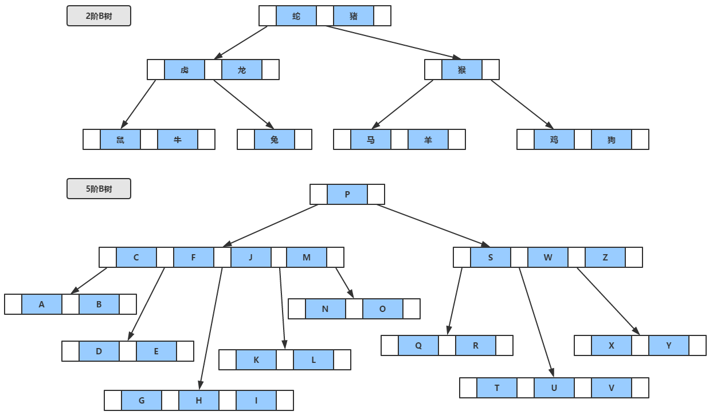
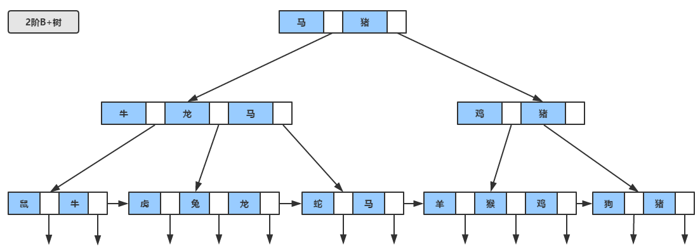
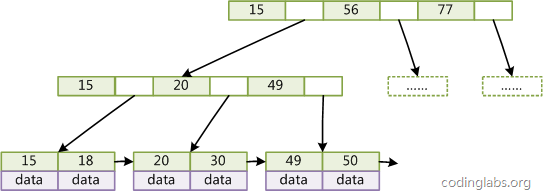
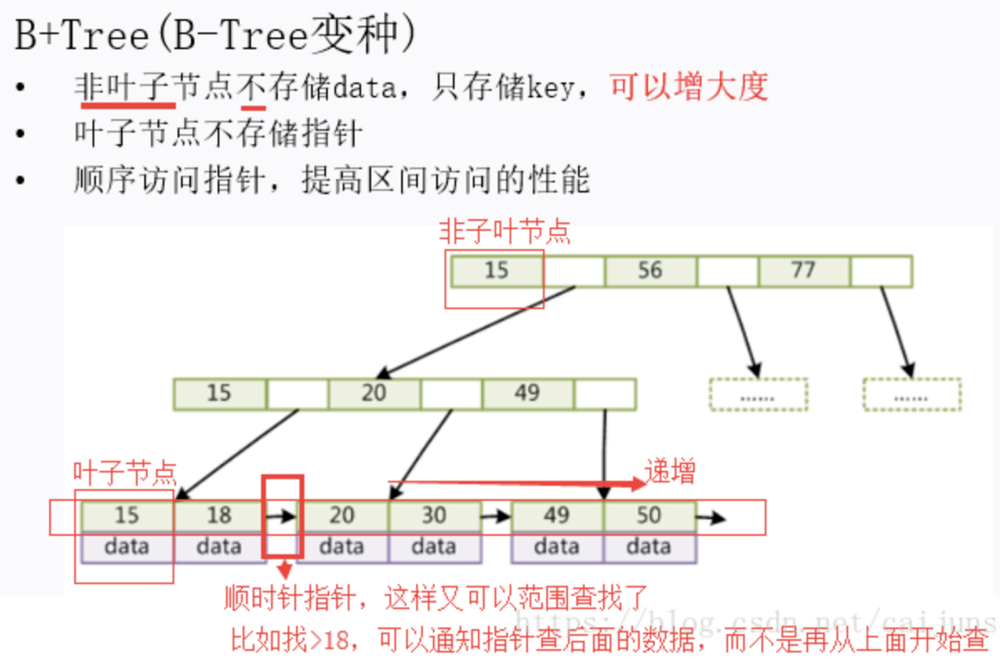
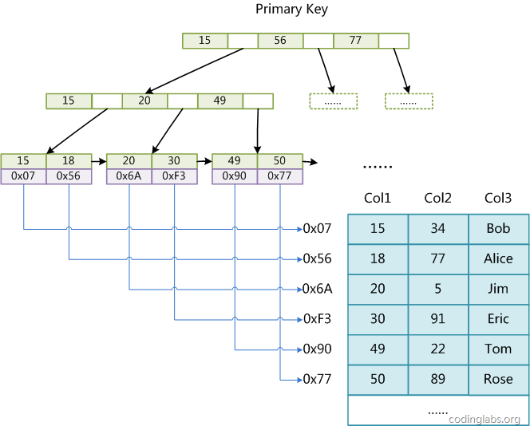
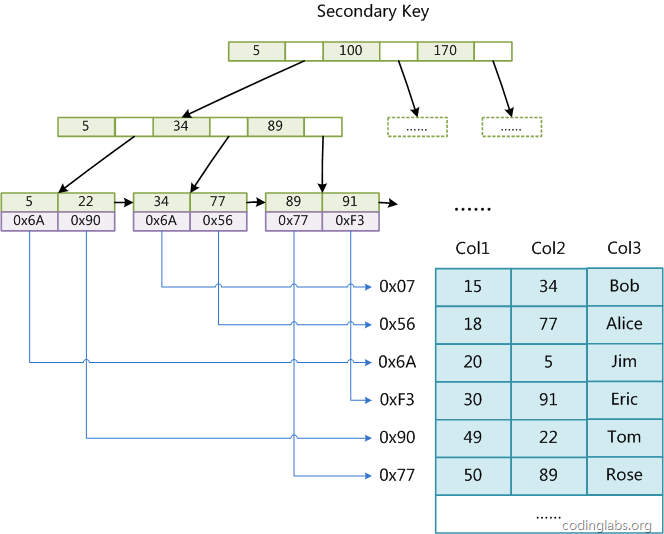
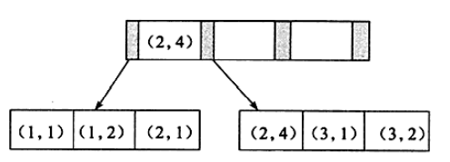
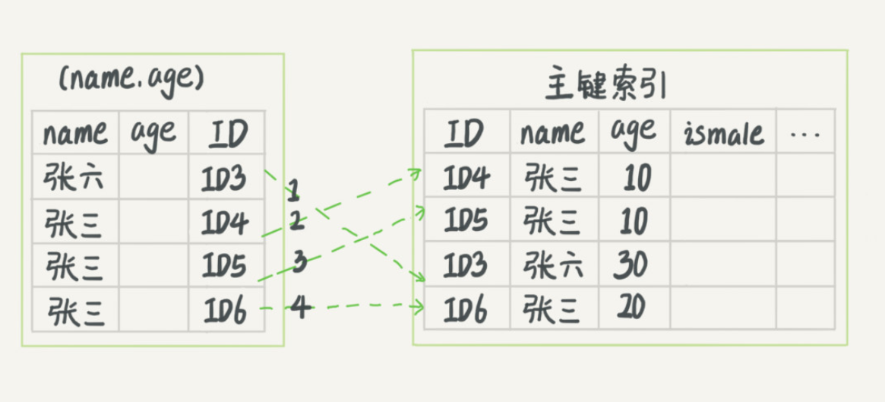
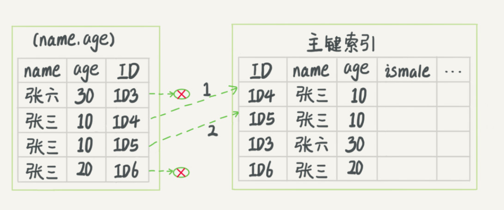
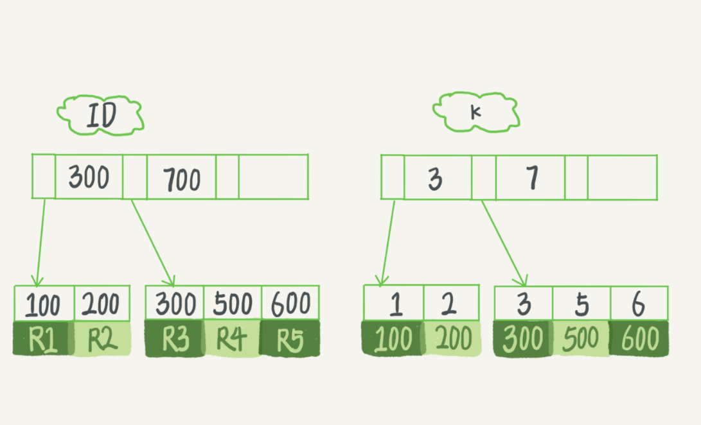

# overview

索引是应用程序设计和开发的一个重要方面。若索引太多，应用程序的性能可能会收到影响，而索引太少，对查询性能又会产生影响。找到一个合适的平衡点，对于应用程序的性能至关重要。

`InnoDB`存储引擎支持以下几种常见的索引：

- B+树
- 全文索引
- 哈希索引

`InnoDB`存储引擎支持的哈希索引是自适应的，会根据表的使用情况自动为表生成哈希索引，不能认为干预是否在一张表生成哈希索引。

# 为什么需要索引

索引结构的选择基于这样一个性质：**大数据量时，索引无法全部装入内存**。

为什么索引无法全部装入内存？假设使用树结构组织索引，简单估算一下：

- 假设单个索引节点12B，1000w个数据行，unique索引，则叶子节点共占约100MB，整棵树最多200MB。
- 假设一行数据占用200B，则数据共占约2G。

假设索引存储在内存中。也就是说，每在物理盘上保存2G的数据，就要占用200MB的内存，索引:数据的占用比约为1/10。1/10的占用比算不算大呢？物理盘比内存廉价的多，以一台内存16G硬盘1T的服务器为例，如果要存满1T的硬盘，至少需要100G的内存，远大于16G。

考虑到一个表上可能有多个索引、联合索引、数据行占用更小等情况，实际的占用比通常大于1/10，某些时候能达到1/3。**在基于索引的存储架构中，索引:数据的占用比过高，因此，索引无法全部装入内存**。

由于无法装入内存，则必然依赖磁盘（或SSD）存储。而内存的读写速度远远快于磁盘，因此，核心问题是“**如何减少磁盘读写次数**”。

首先不考虑页表机制，假设每次读、写都直接穿透到磁盘，那么：

- 线性结构：读/写平均 O(n) 次
- 二叉搜索树（BST）：读/写平均 O(log~2~N) 次；如果树不平衡，则最差读/写 O(n) 次
- 自平衡二叉搜索树（AVL）：在BST的基础上加入了自平衡算法，读/写最大 O(log~2~N) 次
- 红黑树（RBT）：另一种自平衡的查找树，读/写最大 O(2*log~2~N) 次

假设使用自增主键，则主键本身是有序的，树结构的读写次数能够优化到树高，树高越低读写次数越少；自平衡保证了树结构的稳定。如果想进一步优化，可以引入B树和B+树。

# 数据结构与算法

## 哈希

哈希索引适用于只有等值查询的场景，在范围查找场景的表现很差。

## BST

二叉搜索数是一棵保证左子树中节点的值全部小于当前节点，右子树中节点的值全部大于当前节点的二叉树。BST的中序遍历会产生一个有序数组。

BST存在的问题是随即插入节点后，左右子树可能会不平衡，且在最差情况下会退化为单链表。

## AVL

AVL是一种平衡二叉树，保证左右子树高度差的绝对值小于等于1。

平衡二叉树可以保证数据查询的时间复杂度为O(log N)，但是再插入节点后，可能需要做多次旋转操作来维持平衡性，产生性能开销，但平衡二叉树多用于内存结构中，所以维护的开销相对较小。

红黑树是一种特殊的平衡二叉树，它是非严格平衡的。将红色节点的链接拉平后，它将与一个2-3树一一对应。

通过引入节点的颜色，红黑树降低了插入节点后平衡操作的次数与开销，相比 AVL 有更高的插入性能，在查询性能上稍微逊色，工业界对红黑树的使用更为广泛，如 Java 的 `HashMap`、Linux 的 `epoll` 等。

## B树



B树的特点：

1. 关键字集合分布在整颗树中。
2. 任何一个关键字出现且只出现在一个节点中。
3. 搜索有可能在非叶子节点结束。
4. 其搜索性能等价于在关键字集合内做一次二分查找。
5. B树在插入删除新的数据记录会破坏B-Tree的性质，因为在插入删除时，需要对树进行一个分裂、合并、转移等操作以保持B-Tree性质。

## B+树

B+树是为磁盘或其他直接存取辅助设备设计的一种多路平衡查找树，B+树的所有记录都在叶子节点上，并且是顺序存放的，且它们之间通过指针双向连接。

B+树与B树的差异在于

- 有n棵子树的节点含有n个关键字（也有认为是n-1个关键字）。
- 所有的关键字全部存储在叶子节点上，且叶子节点本身根据关键字自小而大顺序连接。
- 非叶子节点可以看成索引部分，节点中仅含有其子树（根节点）中的最大（或最小）关键字。



一般在数据库系统或文件系统中使用的B+Tree结构都在经典B+Tree的基础上进行了优化，增加了顺序访问指针。





MySQL使用B+树作为索引数据结构的优点：

- B+树的磁盘读写代价更低：B+树的内部节点并没有指向关键字具体信息的指针，因此其内部节点相对B(B-)树更小，如果把所有同一内部节点的关键字存放在同一盘块中，那么盘块所能容纳的关键字数量也越多，一次性读入内存的需要查找的关键字也就越多，相对`IO读写次数就降低`了。
- 由于B+树的数据都存储在叶子结点中，分支结点均为索引，方便扫库，只需要扫一遍叶子结点即可，但是B树因为其分支结点同样存储着数据，我们要找到具体的数据，需要进行一次中序遍历按序来扫，所以B+树更加适合在`区间查询`的情况，所以通常B+树用于数据库索引。

# `MyISAM` 非聚簇索引

`MyISAM`引擎使用 B+ Tree 作为索引结构，叶节点的 data 域存放的是数据记录的地址。下图是`MyISAM`索引的原理图：



这里设表一共有三列，假设我们以 Col1 为主键，则上图是一个 `MyISAM` 表的主索引（Primary key）示意。可以看出 `MyISAM` 的索引文件仅仅保存数据记录的地址。在`MyISAM`中，主索引和辅助索引（Secondary key）在结构上没有任何区别，只是主索引要求key是唯一的，而辅助索引的key可以重复。如果我们在Col2上建立一个辅助索引，则此索引的结构如下图所示：



同样也是一棵B+树，data 域保存数据记录的地址。因此，`MyISAM`中索引检索的算法为首先按照 B+Tree 搜索算法搜索索引，如果指定的 Key 存在，则取出其 data 域的值，然后以 data 域的值为地址，读取相应数据记录。

`MyISAM`的索引方式也叫做“非聚集”的，之所以这么称呼是为了与`InnoDB`的聚集索引区分。

# `InnoDB`索引实现

`InnoDB`中的 B+ 树索引可以分为聚簇索引和辅助索引。

**聚簇索引**：将数据存储与索引放到了一块，索引结构的叶子节点保存了行数据

**非聚簇索引**：将数据与索引分开存储，索引结构的叶子节点指向了数据对应的位置

## 聚簇索引

在`innodb`中，在聚簇索引之上创建的索引称之为辅助索引，`innodb`中的非聚簇索引都是辅助索引，如复合索引、前缀索引、唯一索引。辅助索引叶子节点存储的不再是行的物理位置，而是主键值，辅助索引访问数据总是需要二次查找。


1. `InnoDB`使用的是聚簇索引，将主键组织到一棵B+树中，而行数据就储存在叶子节点上，若使用"where id = 14"这样的条件查找主键，则按照B+树的检索算法即可查找到对应的叶节点，之后获得行数据。
2. 若对Name列进行条件搜索，则需要两个步骤：第一步在辅助索引B+树中检索Name，到达其叶子节点获取对应的主键。第二步使用主键在主索引B+树种再执行一次B+树检索操作，最终到达叶子节点即可获取整行数据。（重点在于通过其他键需要建立辅助索引）

**聚簇索引具有唯一性**，由于聚簇索引是将数据跟索引结构放到一块，因此一个表仅有一个聚簇索引。

**聚簇索引默认是主键**，如果表中没有定义主键，`InnoDB` 会选择一个**唯一且非空的索引**代替。如果没有这样的索引，`InnoDB` 会隐式定义一个主键来作为聚簇索引。

**使用聚簇索引的优势：**

1. 可以把相关数据保存在一起。        

   例如实现电子邮箱时，可以根据用户ID来聚集数据，这样只需要从磁盘读取少数的数据页就能获取某个用户的全部邮件。如果没有则每封邮件都有可能导致一次磁盘I/O。

2. 数据访问速度快。        

   聚簇索引将索引和数据保存在同一个B+Tree中，因此从聚簇索引中获取数据通常比在非聚簇索引中查找要快。

3. 使用覆盖索引扫描的查询可以直接使用页节点中的主键值。

**缺点：**

1. 聚簇索引最大限度地提高了IO密集型应用的性能，但如果数据全部都放在内存中，则访问的顺序就没么重要了，聚簇索引也就没什么优势了。
2. 插入速度严重依赖插入顺序。按照主键的顺序插入是加载数据到`InnoDB`表中速度最快的方式。但如果不是按照主键顺序加载数据，那么在加载完成后最好使用OPTIMIZE TABLE命令重新组织一下表。当对MySQL进行大量的增删改操作的时候，很容易产生一些碎片，这些碎片占据着空间，所以可能会出现删除很多数据后，数据文件大小变化不大的现象。新插入的数据仍然会利用这些碎片。但过多的碎片，对数据的插入操作是有一定影响的，此时，我们可以通过optimize来对表的优化。
3. 更新聚簇索引列的代价很高，因为会强制`InnoDB`将每个被更新的行移动到新的位置。
4. 基于聚簇索引的表在插入新行，或者主键或者主键被更新导致需要移动行的时候，可能面临“页分裂”的问题。当行的主键值要求必须将这一行插入到某个已满的页中时，存储引擎会将该页分裂成两个页面来容纳该行，这就是一次页分裂操作。页分裂会导致表占用更多的磁盘空间。
5. 二级索引（非聚簇索引）可能比想象的要更大，因为在二级索引的叶子节点包含了引用行的主键列。

**聚簇索引需要注意的地方：**

当使用主键为聚簇索引时，主键最好不要使用`uuid`，因为`uuid`的值太过离散，不适合排序且可能出现新增加记录的`uuid`，会插入在索引树中间的位置，导致索引树调整复杂度变大，消耗更多的时间和资源。

建议使用`int`类型的自增，方便排序并且默认会在索引树的末尾增加主键值，对索引树的结构影响最小。而且，主键值占用的存储空间越大，辅助索引中保存的主键值也会跟着变大，占用存储空间，也会影响到IO操作读取到的数据量。

## 非聚簇索引

优点：

**更新代价比聚集索引要小** 。非聚集索引的更新代价就没有聚集索引那么大了，非聚集索引的叶子节点是不存放数据的

缺点：

1. 跟聚集索引一样，非聚集索引也依赖于有序的数据
2. **可能会二次查询(回表)** :这应该是非聚集索引最大的缺点了。 当查到索引对应的指针或主键后，可能还需要根据指针或主键再到数据文件或表中查询。

**非聚簇索引不一定回表查询。**

> 试想一种情况，用户准备使用 SQL 查询用户名，而用户名字段正好建立了索引。

```text
 SELECT name FROM table WHERE name='guang19';Copy to clipboardErrorCopied
```

> 那么这个索引的 key 本身就是 name，查到对应的 name 直接返回就行了，无需回表查询。

**即使是 MYISAM 也是这样，虽然 MYISAM 的主键索引确实需要回表， 因为它的主键索引的叶子节点存放的是指针。但是如果 SQL 查的就是主键呢?**

```text
SELECT id FROM table WHERE id=1;Copy to clipboardErrorCopied
```

主键索引本身的 key 就是主键，查到返回就行了。这种情况就称之为覆盖索引了。

## 索引的管理

MySQL中给字段创建索引的四种方式：

1. 添加**主键**

   ```mysql
   # 该语句添加一个主键，这意味着索引值必须是唯一的，且不能为NULL。
   ALTER TABLE tbl_name ADD PRIMARY KEY(col_list);  
   ```

2. 添加**唯一索引**
	```mysql
   # 这条语句创建索引的值必须是唯一的,但允许有空值
   # 如果是组合索引，则列值的组合必须唯一
	#  建立唯一索引的目的大部分时候都是为了该属性列的数据的唯一性，而不是为了查询效率。
	ALTER TABLE tbl_name ADD UNIQUE index_name(col_list);
	# or
	CREATE UNIQUE INDEX index_name ON tbl_name(col_list);
	```
	
3. 添加**普通索引**
	
   **普通索引的唯一作用就是为了快速查询数据，一张表允许创建多个普通索引，并允许数据重复和 NULL**
   
   ```mysql
	# 这条语句创建索引的值必须是唯一的。
	ALTER TABLE tbl_name ADD INDEX|KEY index_name (col_list);
	# or
	CREATE INDEX|KEY index_name ON tbl_name(col_list)
	
	# 如果是TEXT，BLOB类型，必须指定length
	CREATE INDEX indexName ON tbl_name(row_description(length)) 
	```
	
4. 添加**全文索引**

```mysql
# 该语句指定了索引为 FULLTEXT ，用于全文索引
ALTER TABLE tbl_name ADD UNIQUE index_name (col_list);
```
删除索引的语法：

```mysql
DROP INDEX index_name ON tbl_name; 
# 或者
ALTER TABLE tbl_name DROP INDEX|KEY index_name；
ALTER TABLE tbl_name DROP PRIMARY KEY;
```

可以设置对整个列的数据进行索引，或者只索引一个列的开头部分数据：

```mysql
# 对varchar的前100个字符索引
ALTER TABLE t ADD INDEX idx_b(b(100));
```


## 自增主键

自增主键是指自增列上定义的主键，在建表语句中一般是这么定义的： NOT NULL PRIMARY KEY AUTO_INCREMENT。

插入新记录的时候可以不指定 ID 的值，系统会获取当前 ID 最大值加 1 作为下一条记录的 ID 值。自增主键可以保证顺序插入，不会触发叶子节点的分裂。而有业务逻辑的字段做主键，则往往不容易保证有序插入，这样写数据成本相对较高。

**主键长度越小，辅助索引的叶子节点就越小，辅助索引占用的空间就越小。**

从性能和存储空间方面考量，自增主键往往是更合理的选择。

对于 key-value 场景，不存在辅助索引，可以考虑使用普通字段作为索引。


## Cardinality

并不是所有的查询条件中出现的列都需要添加索引，一般认为，查询表中的小部分数据时使用B+树索引才有意义。例如，对于性别字段，每次所有出表中大概一半的数据，称为低选择性，此时使用索引是没有意义的。而对于姓名字段，几乎很少会有重名，称为高选择性，使用索引是合适的。

Cardinality 可用于观察索引中的数据的高选择性或低选择性，Cardinality 表示索引中不重复记录数量的预估值（不是一个准确值）。

Max cardinality: 所有值都是唯一的。

Min cardinality: 所有值都是相同的。

在实际应用在，`(Cardinality/n_rows_in_table)`应尽量接近1，此时选择使用索引来加速查找。

`InnoDB`引擎内部更新Cardinality信息的策略为：

- 表中1/16数据发生变化
- 表中数据的修改次数>2000000000时

Cardinality的计算方法：

- 取得B+树索引中叶子节点的数量，记为A
- 随机取B+树索引中的8个叶子节点，统计每个页不同记录的个数，记为`P1,P2,...,P8`
- `Cardinality = (P1 + P2 + ... + P8) * A / 8`

## 联合索引

联合索引是指对表上的多个列进行索引。

demo：

```mysql
CREATE TABLE `tuser` (
  `id` int(11) NOT NULL,
  `id_card` varchar(32) DEFAULT NULL,
  `name` varchar(32) DEFAULT NULL,
  `age` int(11) DEFAULT NULL,
  `ismale` tinyint(1) DEFAULT NULL,
  PRIMARY KEY (`id`),
  KEY `id_card` (`id_card`),
  KEY `name_age` (`name`,`age`)
) ENGINE=InnoDB
```

name_age是一个联合索引。

**最左匹配**

如果SQL语句中用到了联合索引的最左边的索引，那么这条SQL语句就可以利用联合索引去进行匹配，当遇到范围查询时会停止匹配。

例如，name_age索引，where条件为：

```mysql
name='alice'
name='alice' and age=10
# mysql优化器会自动调整语句顺序与索引一致
age=10 and name='alice'
```

是可以匹配索引的，但`age=10`不匹配索引。

对`(a,b,c,d)`建立索引，执行`a=1 and b=2 and c>5 and d=2`时，a，b，c可以用到索引，d用不到，因为c涉及到了范围查询。

最左匹配的原理：



如图所示它们是按照a来进行排序，在a相等的情况下，才按b来排序。

a是有序的，b全局无序，但是a固定时，b是有序的。

联合索引是按照每个列的数据进行排序的，因此可以SQL语句涉及ORDER BY时，如果可以通过联合索引直接获得排序后的数据，SQL优化器会优先使用联合索引，避免额外调用一次`filesort`。

**索引下推优化**

MySQL 5.6 引入了索引下推优化（index condition pushdown)， 可以在索引遍历过程中，对索引中包含的字段先做判断，直接过滤掉不满足条件的记录，减少回表次数。

无索引下推：



索引下推：




### 题目

**题型一**

如果SQL为

```
SELECT * FROM table WHERE a = 1 and b = 2 and c = 3; 
```

如何建立索引?
如果此题回答为对(a,b,c)建立索引，那都可以回去等通知了。
此题正确答法是，(a,b,c)或者(c,b,a)或者(b,a,c)都可以，重点要的是将区分度高的字段放在前面，区分度低的字段放后面。像性别、状态这种字段区分度就很低，我们一般放后面。

例如假设区分度由大到小为b,a,c。那么我们就对(b,a,c)建立索引。在执行SQL的时候，优化器会 帮我们调整where后a,b,c的顺序，让我们用上索引。

**题型二**

如果SQL为

```
SELECT * FROM table WHERE a > 1 and b = 2; 
```

如何建立索引?
如果此题回答为对(a,b)建立索引，那都可以回去等通知了。
此题正确答法是，对(b,a)建立索引。如果你建立的是(a,b)索引，那么只有a字段能用得上索引，毕竟最左匹配原则遇到范围查询就停止匹配。
如果对(b,a)建立索引那么两个字段都能用上，优化器会帮我们调整where后a,b的顺序，让我们用上索引。

**题型三**

如果SQL为

```
SELECT * FROM `table` WHERE a > 1 and b = 2 and c > 3; 
```

如何建立索引?
此题回答也是不一定，(b,a)或者(b,c)都可以，要结合具体情况具体分析。

拓展一下

```
SELECT * FROM `table` WHERE a = 1 and b = 2 and c > 3; 
```

(a,b,c)

**题型四**

```
SELECT * FROM `table` WHERE a = 1 ORDER BY b;
```

如何建立索引？
这还需要想？一看就是对(a,b)建索引，当a = 1的时候，b相对有序，可以避免再次排序！
那么

```
SELECT * FROM `table` WHERE a > 1 ORDER BY b; 
```

如何建立索引？
对(a)建立索引，因为a的值是一个范围，这个范围内b值是无序的，没有必要对(a,b)建立索引。

拓展一下

```
SELECT * FROM `table` WHERE a = 1 AND b = 2 AND c > 3 ORDER BY c;
```

怎么建索引?

**题型五**

```
SELECT * FROM `table` WHERE a IN (1,2,3) and b > 1; 
```

如何建立索引？
还是对(a，b)建立索引，因为IN在这里可以视为等值引用，不会中止索引匹配，所以还是(a,b)!

拓展一下

```
SELECT * FROM `table` WHERE a = 1 AND b IN (1,2,3) AND c > 3 ORDER BY c;
```

如何建立索引？此时c排序是用不到索引的。

## 覆盖索引

在下面这个表 T 中，如果我执行 select * from T where k between 3 and 5，需要执行几 次树的搜索操作，会扫描多少行？

下面是这个表的初始化语句。

```mysql
mysql> create table T (
ID int primary key,
k int NOT NULL DEFAULT 0, 
s varchar(16) NOT NULL DEFAULT '',
index k(k))
engine=InnoDB;
 
insert into T values(100,1, 'aa'),(200,2,'bb'),(300,3,'cc'),(500,5,'ee'),(600,6,'ff'),(700,7,'gg');
```




这条 SQL 查询语句的执行流程：

1. 在 k 索引树上找到 k=3 的记录，取得 ID = 300；
2. 再到 ID 索引树查到 ID=300 对应的 R3；
3. 在 k 索引树取下一个值 k=5，取得 ID=500；
4. 再回到 ID 索引树查到 ID=500 对应的 R4；
5. 在 k 索引树取下一个值 k=6，不满足条件，循环结束。

在这个过程中，**回到主键索引树搜索的过程，我们称为回表**。可以看到，这个查询过程读了 k 索引树的 3 条记录（步骤 1、3 和 5），回表了两次（步骤 2 和 4）。

在这个例子中，由于查询结果所需要的数据只在主键索引上有，所以不得不回表。那么，有没有可能经过索引优化，避免回表过程呢？

如果执行的语句是 select ID from T where k between 3 and 5，这时只需要查 ID 的值，而 ID 的值已经在 k 索引树上了，因此可以直接提供查询结果，不需要回表。也就是说，在这个查询里面，索引 k 已经“覆盖了”我们的查询需求，我们称为覆盖索引。

**由于覆盖索引可以减少树的搜索次数，显著提升查询性能，所以使用覆盖索引是一个常用的性能优化手段。**

demo：

对（user_id，buy_date）建立辅助索引，执行`SELECT COUNT(*) FROM buy_log WHERE buy_date >= '2011-01-01';`

由于涉及统计操作，需要遍历表，因为辅助索引远小于聚集索引，选择辅助索引可以减少IO操作，故优化器会选择辅助索引。

**优化器不适用索引的情况：**

对于`SELECT * FROM orderdetails WHERE order_id > 10000 and order_id < 100000;`

当使用辅助索引查找时，如果查找到大量数据，需要再根据这些id离散的从聚簇索引中查找整行数据；而离散查找的速度远远慢于顺序查找，此时，SQL优化器将会在聚簇索引中顺序扫描表。

当辅助索引查找的数据量较小时，优化器仍会选择使用辅助索引。

可以通过FORCE INDEX强制使用某个索引。

## 哈希索引

`InnoDB`存储引擎中，冲突机制采用链表方式，哈希函数采用除法散列方式（对k取余数）。

1、原理过程

 

`Innodb`存储引擎会监控对表上二级索引的查找，如果发现某二级索引被频繁访问，二级索引成为热数据，建立哈希索引可以带来速度的提升，则：

　　1、自适应hash索引功能被打开

```
mysql> show variables like '%ap%hash_index';
+----------------------------+-------+
| Variable_name              | Value |
+----------------------------+-------+
| innodb_adaptive_hash_index | ON    |
+----------------------------+-------+
1 row in set (0.01 sec)
```

　　2、经常访问的二级索引数据会自动被生成到hash索引里面去(最近连续被访问三次的数据)，自适应哈希索引通过缓冲池的B+树构造而来，因此建立的速度很快。

2、特点

　　1、无序，没有树高

　　2、降低对二级索引树的频繁访问资源

　　　　索引树高<=4，访问索引：访问树、根节点、叶子节点

　　3、自适应

3、缺陷

　　1、hash自适应索引会占用`innodb buffer pool`；

　　2、自适应hash索引只适合搜索等值的查询，如select * from table where index_col='xxx'，而对于其他查找类型，如范围查找，是不能使用的；

　　3、极端情况下，自适应hash索引才有比较大的意义，可以降低逻辑读。

## 全文检索

B+树索引可以通过索引字段的前缀进行查找，例如：

`SELECT * FROM blog WHERE content like 'xxx%'`

但是不支持`SELECT * FROM blog WHERE content like '%xxx%'`。

全文检索(Full-Text Search）是将存储于数据库中的整本书或整篇文章中的任意内容信息查找出来的技术。它可以根据需要获得全文中有关章、节、段、句、词等信息，也可以进行各种统计和分析。

`InnoDB` 1.2.x版本开始，`InnoDB`引擎开始支持全文检索。


### 倒排索引

全文索引通常使用倒排索引来实现，倒排索引跟B+树索引一样，也是一种索引结构。它在辅助表中存储了单词和单词自身在一个或多个文档中所在位置之间的映射。通常基于关联数组实现，包括两种表现形式：

- inverted file index，{单词，单词所在文档的ID}
- full inverted index，{单词，{单词所在文档的ID，单词在文档中的位置}}

demo：

全文检索表t：

| Document ID | TEXT                                     |
| ----------- | ---------------------------------------- |
| 1           | Pease porridge hot, please porridge cold |
| 2           | Pease porridge in the pot                |
| 3           | Nine days old                            |
| 4           | Some like it hot, some like it cold      |
| 5           | some like it in the pot                  |
| 6           | Nine days old                            |

inverted file index内容为：

| Number | Text | Documents | Number | Text     | Documents |
| ------ | ---- | --------- | ------ | -------- | --------- |
| 1      | code | 1,4       | 8      | old      | 3,6       |
| 2      | days | 3,6       | 9      | pease    | 1,2       |
| 3      | hot  | 1,4       | 10     | porridge | 1,2       |
| 4      | in   | 2,5       | 11     | pot      | 2,5       |
| 5      | it   | 4,5       | 12     | some     | 4,5       |
| 6      | like | 4,5       | 13     | the      | 2,5       |
| 7      | nine | 3,6       |        |          |           |

full inverted index存储的内容为：

| Document ID | TEXT                                     |
| ----------- | ---------------------------------------- |
| 1           | Pease porridge hot, please porridge cold |
| 2           | Pease porridge in the pot                |
| 3           | Nine days old                            |
| 4           | Some like it hot, some like it cold      |
| 5           | some like it in the pot                  |
| 6           | Nine days old                            |

inverted file index内容为：

| Number | Text | Documents | Number | Text     | Documents |
| ------ | ---- | --------- | ------ | -------- | --------- |
| 1      | code | (1:6),(4:8)       | 8      | old      | (3:3),(6:3) |
| 2      | days | (3:2),(6:2) | 9      | pease    | (1:1,4),(2:1) |
| 3      | hot  | (1:3),(4:4) | 10     | porridge | (1:2,5),(2:2) |
| 4      | in   | (2:3),(5:4) | 11     | pot      | (2:5),(5:6) |
| 5      | it   | (4:3,7),(5:3) | 12     | some     | (4:1,5),(5:1) |
| 6      | like | (4:2,6),(5:2) | 13     | the      | (2:4),(5:5) |
| 7      | nine | (3:1),(6:1) |        |          |           |

### `InnoDB`全文检索

`InnoDB`采用full inverted index的方式实现全文检索，将`(DocumentID, Position)`视为一个”`ilist`“，因此在全文检索的表中，有两个列，一个是word字段，一个是`ilist`字段，且在word字段上设有索引。

倒排索引需要把word存放到一张表中，这个表称为Auxiliary Table（辅助表），在`InnoDB`存储引擎中，为了提高全文检索的并行性能，共有6个辅助表，每张表根据word的Latin编码进行分区。

Auxiliary Table是持久的表，存放在磁盘上。在`InnoDB`存储引擎的全文索引中，FTS Index Cache用于提高全文检索的性能，它是一个**红黑树结构**，根据 (word,list) 进行排序。

FTS(Full-Text Search) Index Cache的作用类似Change Buffer，`InnoDB`引擎会在特定时刻批量将FTS Index Cache的修改刷入Auxiliary Table。

当数据库关闭时，在FTS Index Cache中的数据库会同步到磁盘上的Auxiliary Table中。然而，如果当数据库发生宕机时，一些FTS Index Cache 中的数据库可能未被同步到磁盘上。那么下次重启数据库时，当用户对表进行全文检索（查询或者插入操作）时，`InnoDB`存储引擎会自动读取未完成的文档，然后进行分词操作，再将分词的结果放入到FTS Index Cache 中。

在`InnoDB`存储引擎中，为了支持全文检索，必须有一个列和word进行映射，在`InnoDB`中，这个列被命名为FTS_DOC_ID，其类型必须是BIGINT UNSIGNED NOT NULL，并且`InnoDB`存储引擎会自动在该列上加入一个名为FTS_DOC_ID_INDEX的UNIQUE INDEX，这些操作由`InnoDB`自动完成。

文档中分词的插入操作是在事务提交时完成，然而对于删除操作，其在事务提交时，不删除磁盘Auxiliary Table中的记录，只是删除FTS Cache Index中的记录。对于Auxiliary Table中被删除的记录，`InnoDB`会记录其FTS Document ID，并将其保存在DELETED auxiliary table中。

如果用户想要彻底删除索引，则需要执行optimize命令。

