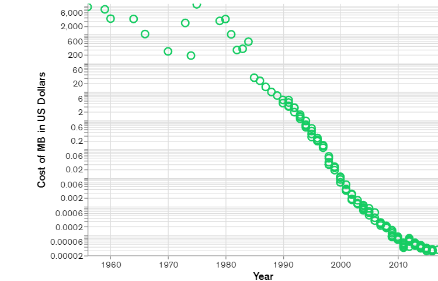

# NoSQL

人们使用“ NoSQL 数据库”一词时，通常会使用它来指代任何非关系型数据库。有人说“ NoSQL”代表“非 SQL”，而另一些人则说“不仅仅是SQL”。无论哪种方式，大多数人都认为 NoSQL 数据库是以关系表以外的格式存储数据的数据库。

一个常见的误解是 NoSQL 数据库或非关系型数据库不能很好地存储关系型数据。NoSQL 数据库可以存储关系型数据—它们与关系型数据库的存储方式不同。实际上，与 SQL 数据库相比，许多人发现在NoSQL 数据库中对关系型数据建模比在SQL 数据库中更容易，因为不必在表之间拆分相关数据。

NoSQL 数据模型允许将相关数据嵌套在单个数据结构中。

随着存储成本的急剧下降，二十世纪晚期出现了 NoSQL 数据库。仅出于减少数据重复目的而创建难以管理的复杂数据模型的日子已经一去不复返了。开发者（而非存储设备）已成为软件开发的主要成本，因此 NoSQL 数据库针对开发者的工作效率进行了优化。

随着存储成本迅速降低，存储和查询所需的数据应用程序数量也增加了。这些数据具有各种形状和大小（结构化、半结构化和多态性），因此预先定义架构几乎变得不可能。NoSQL 数据库允许开发者存储大量非结构化数据，从而为他们提供了很高的灵活性。

此外，[敏捷宣言 Agile Manifesto ]越来越受欢迎，软件工程师正在重新考虑他们开发软件的方式。他们认识到需要快速适应不断变化的需求。他们需要能够快速迭代并在整个软件堆栈中（一直到数据库模型）进行更改。NoSQL 数据库为他们提供了这种灵活性。

云计算也越来越流行，开发者开始使用公有云来托管其应用程序和数据。他们希望能够在多个服务器和区域之间分布数据，以使其应用程序具有弹性，可以横向扩展而不是纵向扩展以及对数据进行智能地理定位。一些 NoSQL 数据库（如 MongoDB）提供了这些功能。

# 什么是 SQL？

既然我们已了解 NoSQL 数据库，下面我们将其与流行的传统数据库（即：通过 SQL（结构化查询语言）访问的关系型数据库）进行对比。与关系型数据库（数据存储在具有固定列和行的表中）交互时，您可以使用 SQL。

SQL 数据库在二十世纪 70 年代初开始流行。当时，存储非常昂贵，因此软件工程师对其数据库进行规范化以减少数据重复。

此外，二十世纪 70 年代的软件工程师通常也遵循瀑布式软件开发模型。在开始开发之前详细规划项目。软件工程师精心创建复杂的实体关系 (E-R) 图，确保已仔细考虑需要存储的所有数据。由于采用了这种预先计划模型，因此如果开发周期中的需求发生变化，软件工程师就难以调整适应。结果，项目经常超出预算，超过截止日期，无法满足用户需求。

SQL数据库与NoSQL数据库的对比：

|                                | SQL Databases                                                | NoSQL Databases                                              |
| :----------------------------- | ------------------------------------------------------------ | ------------------------------------------------------------ |
| Data Storage Model             | Tables with fixed rows and columns                           | Document: JSON documents, Key-value: key-value pairs, Wide-column: tables with rows and dynamic columns, Graph: nodes and edges |
| Development History            | Developed in the 1970s with a focus on reducing data duplication | Developed in the late 2000s with a focus on scaling and allowing for rapid application change driven by agile and DevOps practices. |
| Examples                       | Oracle, MySQL, Microsoft SQL Server, and PostgreSQL          | Document: MongoDB and CouchDB, Key-value: Redis and DynamoDB, Wide-column: Cassandra and HBase, Graph: Neo4j and Amazon Neptune |
| Primary Purpose                | General purpose                                              | Document: general purpose, Key-value: large amounts of data with simple lookup queries, Wide-column: large amounts of data with predictable query patterns, Graph: analyzing and traversing relationships between connected data |
| Schemas                        | Rigid                                                        | Flexible                                                     |
| Scaling                        | Vertical (scale-up with a larger server)                     | Horizontal (scale-out across commodity servers)              |
| Multi-Record ACID Transactions | Supported                                                    | Most do not support multi-record ACID transactions. However, some—like MongoDB—do. |
| Joins                          | Typically required                                           | Typically not required                                       |
| Data to Object Mapping         | Requires ORM (object-relational mapping)                     | Many do not require ORMs. MongoDB documents map directly to data structures in most popular programming languages. |

# NoSQL数据库的类型

随着时间的推移，出现了四种主要的 NoSQL 数据库类型：

- 文档数据库
- 键值数据库
- 宽列存储数据库
- 图形数据库

介绍：

- **文档数据库**将数据存储在类似于 JSON（JavaScript 对象表示法）对象的文档中。每个文档包含成对的字段和值。这些值通常可以是各种类型，包括字符串、数字、布尔值、数组或对象等，并且它们的结构通常与开发者在代码中使用的对象保持一致。由于字段值类型和强大的查询语言的多样性，因此文档数据库非常适合各种各样的使用案例，并且可以用作通用数据库。它们可以横向扩展以适应大量数据。据 [DB-engines] (https://db-engines.com/en/ranking) 指出，MongoDB 一直被评为世界上较受欢迎的 NoSQL 数据库，它就是一种文档数据库。有关文档数据库的更多信息，请访问 [什么是文档数据库？] ([https://www.mongodb.com/document-databases)
- **键值数据库**是一种较简单的数据库，其中每个项目都包含键和值。通常只能通过引用键来检索值，因此学习如何查询特定键值对通常很简单。键值数据库非常适合需要存储大量数据但无需执行复杂查询来检索数据的使用案例。常见的使用案例包括存储用户首选项或缓存。Redis 和 DynanoDB 是流行的键值数据库。
- **宽列存储**将数据存储在表、行和动态列中。宽列存储提供了比关系型数据库更大的灵活性，因为不需要每一行都具有相同的列。许多人认为宽列存储是二维键值数据库。宽列存储非常适合需要存储大量数据并且可以预测查询模式的情况。宽列存储通常用于存储物联网数据和用户配置文件数据。Cassandra 和 HBase 是较受欢迎的两种宽列存储。
- **图形数据库**将数据存储在节点和边中。节点通常存储有关人物、地点和事物的信息，而边缘则存储有关节点之间的关系的信息。在需要遍历关系以查找模式（例如社交网络，欺诈检测和推荐引擎）的使用案例中，图形数据库非常出色。Neo4j 和 JanusGraph 是图形数据库的示例。

# NoSQL数据库的优缺点

优点：

- **Flexible data models**

  NoSQL databases typically have very flexible schemas. A flexible schema allows you to easily make changes to your database as requirements change. You can iterate quickly and continuously integrate new application features to provide value to your users faster.

- **Horizontal scaling**

  Most SQL databases require you to scale-up vertically (migrate to a larger, more expensive server) when you exceed the capacity requirements of your current server. Conversely, most NoSQL databases allow you to scale-out horizontally, meaning you can add cheaper, commodity servers whenever you need to.

- **Fast queries**

  Queries in NoSQL databases can be faster than SQL databases. Why? Data in SQL databases is typically normalized, so queries for a single object or entity require you to join data from multiple tables. As your tables grow in size, the joins can become expensive. However, data in NoSQL databases is typically stored in a way that is optimized for queries. The rule of thumb when you use MongoDB is **Data is that is accessed together should be stored together**. Queries typically do not require joins, so the queries are very fast.

- **Easy for developers**

  Some NoSQL databases like MongoDB map their data structures to those of popular programming languages. This mapping allows developers to store their data in the same way that they use it in their application code. While it may seem like a trivial advantage, this mapping can allow developers to write less code, leading to faster development time and fewer bugs.

缺点：

- 大多数NoSQL数据库不支持 ACID 事务，mongoDB支持。
- 由于数据冗余，耗费存储空间