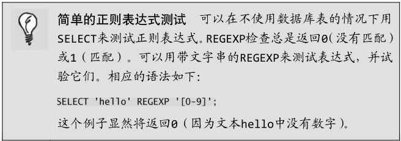
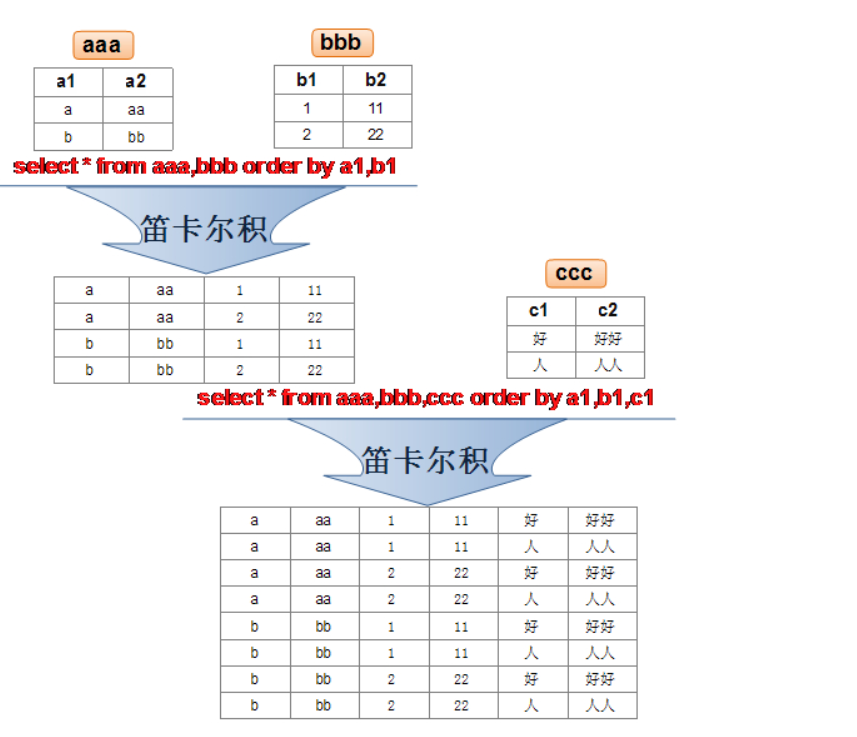
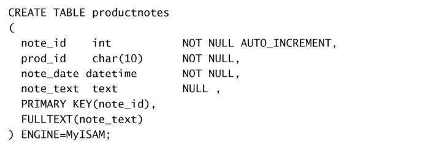
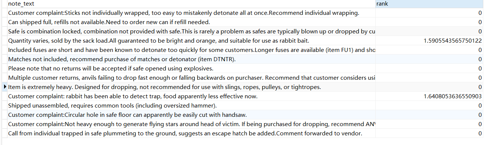
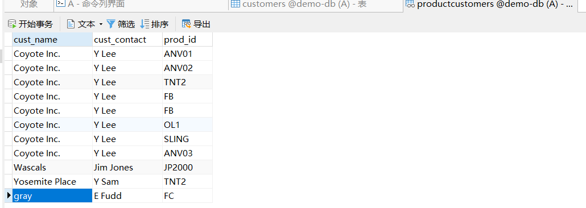
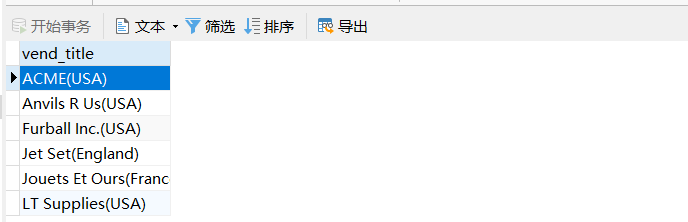
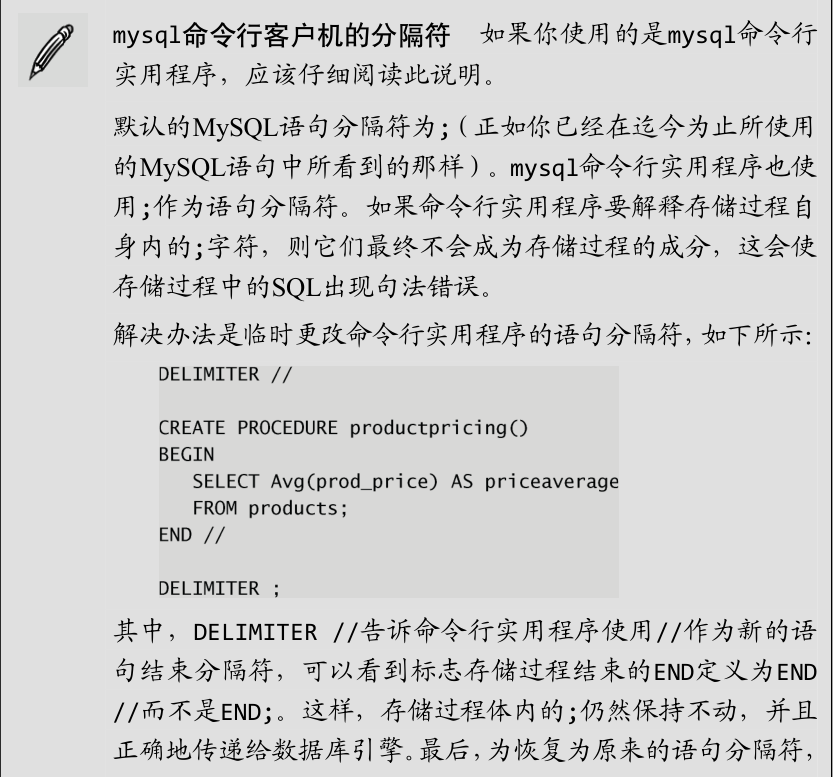
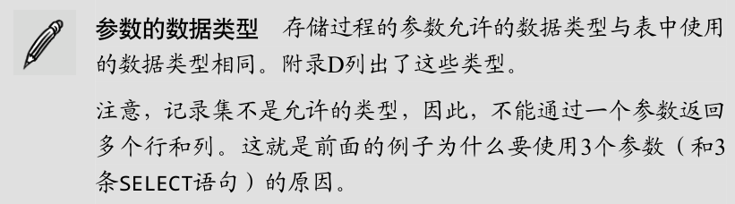

# SQL

数据库(database)：保存有组织的数据的容器（通常是一个文件或一组文件）。

表(table)：某种特定类型数据的结构化清单。

数据库中的每个表都有一个名字，用来标识自己。此名字是唯一的，同一个数据库中不能有名字相同的表。

表具有一些特性，这些特性定义了数据在表中如何存储，如可以存储什么样的数据，数据如何分解，各部分信息如何命名，等等。描述表
的这组信息就是所谓的模式，模式可以用来描述数据库中特定的表以及整个数据库（和其中表的关系）。

模式(schema)：关于数据库和表的布局及特性的信息。

行(row)：表中的一个记录。

列(column)：表中的一个字段。所有表都是由一个或多个列组成的。

主键(primary key)：一列（或一组列），其值能够唯一区分表中每个行。

主键的一些良好习惯：

- 不更新逐渐列中的值。
- 不重用主键列的值。
- 不在主键列中使用可能会更改的值。

初始化数据库：

```mysql
drop database if exists `iotdata`;
create database iotdata DEFAULT CHARACTER SET utf8mb4 COLLATE utf8mb4_unicode_ci;
use iotdata;
```


# MySQL基本命令

## 1 登录

```shell
C:\Users\liuqi>mysql -u root -p -h localhost -P 3306
Enter password: ****
```

默认端口为3306，且默认主机IP为localhost。

## 2 选择数据库

```shell
mysql> #show databases命令在控制台输出数据库列表，结尾需要加分号
mysql> show databases;
+--------------------+
| Database           |
+--------------------+
| information_schema |
| k8s_svc            |
| mybatis            |
| mysql              |
| performance_schema |
| ssmbuild           |
| sys                |
+--------------------+
7 rows in set (0.24 sec)

mysql> #use命令改变或打开需要操作的数据库
mysql> use k8s_svc;
Database changed
```

## 3 show命令

| 命令                                       | 描述                        |
| ------------------------------------------ | --------------------------- |
| `show databases`                           | 输出数据库列表              |
| `show tables`                              | 输出当前数据库table列表     |
| `show columns from xxx`                    | 输出xxx表中的列信息         |
| `show create database xxx`                 | 创建xxx数据库的语句         |
| `show create table databasename.tablename` | 创建当前数据库中xxx表的语句 |
| `show grants`                              | 授权信息                    |

```shell
#展示当前数据库的所有表
mysql> show tables;
+-------------------+
| Tables_in_k8s_svc |
+-------------------+
| svc               |
+-------------------+
1 row in set (0.00 sec)

#展示某个表的列数据
mysql> show columns from svc;
+---------+------------------+------+-----+---------+----------------+
| Field   | Type             | Null | Key | Default | Extra          |
+---------+------------------+------+-----+---------+----------------+
| svcName | varchar(255)     | NO   |     | NULL    |                |
| podIP   | varchar(255)     | YES  |     | NULL    |                |
| index   | int(32) unsigned | NO   | PRI | NULL    | auto_increment |
| port    | int(16)          | YES  |     | NULL    |                |
+---------+------------------+------+-----+---------+----------------+
4 rows in set (0.00 sec)

#展示建立数据库的语句
mysql> show create database k8s_svc;
+----------+------------------------------------------------------------------+
| Database | Create Database                                                  |
+----------+------------------------------------------------------------------+
| k8s_svc  | CREATE DATABASE `k8s_svc` /*!40100 DEFAULT CHARACTER SET utf8 */ |
+----------+------------------------------------------------------------------+
1 row in set (0.00 sec)

#展示建表语句
mysql> show create table svc;
+-------+----------------------------------------------------------------------------------------------------------------------------------------------------------------------------------------------------------------------------------------------------------------------------+
| Table | Create Table                                                                                                                                                                                                                                                               |
+-------+----------------------------------------------------------------------------------------------------------------------------------------------------------------------------------------------------------------------------------------------------------------------------+
| svc   | CREATE TABLE `svc` (
  `svcName` varchar(255) NOT NULL,
  `podIP` varchar(255) DEFAULT NULL,
  `index` int(32) unsigned NOT NULL AUTO_INCREMENT,
  `port` int(16) DEFAULT NULL,
  PRIMARY KEY (`index`) USING BTREE
) ENGINE=InnoDB AUTO_INCREMENT=18 DEFAULT CHARSET=utf8 |
+-------+----------------------------------------------------------------------------------------------------------------------------------------------------------------------------------------------------------------------------------------------------------------------------+
1 row in set (0.00 sec)

#展示授权
mysql> show grants;
+---------------------------------------------------------------------+
| Grants for root@localhost                                           |
+---------------------------------------------------------------------+
| GRANT ALL PRIVILEGES ON *.* TO 'root'@'localhost' WITH GRANT OPTION |
| GRANT PROXY ON ''@'' TO 'root'@'localhost' WITH GRANT OPTION        |
+---------------------------------------------------------------------+
2 rows in set (0.00 sec)
```

可执行`help show;`获取更多show的用法。

> 在`Mysql`中可以使用describe xxx代替show xxx xxx。

## 4 select命令

1. 检索单个列：`SELECT prod_name FROM products;`

2. 检索多个列：`SELECT prod_id,prod_name FROM products;`

3. 检索所有列：`SELECT * FROM products;`

4. 检索不同的行：DISTINCT关键字

```shell
# 不输出重复的行
mysql> SELECT DISTINCT vend_id FROM products;
+---------+
| vend_id |
+---------+
|    1001 |
|    1002 |
|    1003 |
|    1005 |
+---------+
4 rows in set (0.03 sec)
```

5. **限制结果数量（LIMIT）**

```sheell
SELECT prod_name FROM products LIMIT 5;
```

需要得到下五行时：

```shell
# 第一个5为索引，第二个为限制的行的数量
SELECT prod_name FROM products LIMIT 5,5;
```

**行的索引是从0开始的。**

LIMIT 1,1检索出的是第二行。

### 子查询

eg、如何查询订购物品TNT2的所有客户？

1. 检索包含TNT2的所有订单的编号
2. 检索拥有这些订单编号的客户的ID
3. 检索这些客户ID对应的客户信息。

分步执行：

```shell
# 1 找出产品号为TNT2的订单
mysql> SELECT order_num FROM orderitems WHERE prod_id='TNT2';
+-----------+
| order_num |
+-----------+
|     20005 |
|     20007 |
+-----------+
2 rows in set (0.03 sec)
# 2 找出拥有这些订单的客人id
mysql> SELECT cust_id FROM orders WHERE order_num IN (20005,20007);
+---------+
| cust_id |
+---------+
|   10001 |
|   10004 |
+---------+
2 rows in set (0.03 sec)
# 3 根据id查询客人信息
mysql> SELECT cust_name,cust_contact FROM customers WHERE cust_id IN (10001,10004);
+----------------+--------------+
| cust_name      | cust_contact |
+----------------+--------------+
| Coyote Inc.    | Y Lee        |
| Yosemite Place | Y Sam        |
+----------------+--------------+
2 rows in set (0.03 sec)
```

使用嵌套子查询的方式：

```shell
mysql> SELECT cust_name,cust_contact FROM customers WHERE cust_id IN (SELECT cust_id FROM orders WHERE order_num IN (SELECT order_num FROM orderitems WHERE prod_id='TNT2'));
+----------------+--------------+
| cust_name      | cust_contact |
+----------------+--------------+
| Coyote Inc.    | Y Lee        |
| Yosemite Place | Y Sam        |
+----------------+--------------+
2 rows in set (0.47 sec)
```

不宜太多次嵌套子查询，否则会影响性能。

将计算字段作为子查询：

```shell
# 括号中的子查询对每个cust_name和cust_state执行一次
mysql> SELECT cust_name,cust_state,(SELECT COUNT(*) FROM orders WHERE orders.cust_id=customers.cust_id) AS orders FROM customers ORDER BY cust_name;
+----------------+------------+--------+
| cust_name      | cust_state | orders |
+----------------+------------+--------+
| Coyote Inc.    | MI         |      2 |
| E Fudd         | IL         |      1 |
| Mouse House    | OH         |      0 |
| Wascals        | IN         |      1 |
| Yosemite Place | AZ         |      1 |
+----------------+------------+--------+
5 rows in set (0.04 sec)
```


## 5 排序数据

ORDER BY字句取一个或多个列的名字，据此对输出进行排序。

```shell
# 以字母序对prod_name进行过排序
mysql> SELECT prod_name FROM products ORDER BY prod_name;
+----------------+
| prod_name      |
+----------------+
| .5 ton anvil   |
| 1 ton anvil    |
| 2 ton anvil    |
| Bird seed      |
| Carrots        |
| Detonator      |
| Fuses          |
| JetPack 1000   |
| JetPack 2000   |
| Oil can        |
| Safe           |
| Sling          |
| TNT (1 stick)  |
| TNT (5 sticks) |
+----------------+
14 rows in set (0.03 sec)
# 按照price和name的字母序进行排序（价格相同时再按name排序）
mysql> SELECT prod_id,prod_price,prod_name FROM products ORDER BY prod_price,prod_name;
+---------+------------+----------------+
| prod_id | prod_price | prod_name      |
+---------+------------+----------------+
| FC      | 2.50       | Carrots        |
| TNT1    | 2.50       | TNT (1 stick)  |
| FU1     | 3.42       | Fuses          |
| SLING   | 4.49       | Sling          |
| ANV01   | 5.99       | .5 ton anvil   |
| OL1     | 8.99       | Oil can        |
| ANV02   | 9.99       | 1 ton anvil    |
| FB      | 10.00      | Bird seed      |
| TNT2    | 10.00      | TNT (5 sticks) |
| DTNTR   | 13.00      | Detonator      |
| ANV03   | 14.99      | 2 ton anvil    |
| JP1000  | 35.00      | JetPack 1000   |
| SAFE    | 50.00      | Safe           |
| JP2000  | 55.00      | JetPack 2000   |
+---------+------------+----------------+
14 rows in set (0.03 sec)
```

降序排列(DESC, descending)：

```shell
mysql> SELECT prod_id,prod_price,prod_name FROM products ORDER BY prod_price DESC;
+---------+------------+----------------+
| prod_id | prod_price | prod_name      |
+---------+------------+----------------+
| JP2000  | 55.00      | JetPack 2000   |
| SAFE    | 50.00      | Safe           |
| JP1000  | 35.00      | JetPack 1000   |
| ANV03   | 14.99      | 2 ton anvil    |
| DTNTR   | 13.00      | Detonator      |
| FB      | 10.00      | Bird seed      |
| TNT2    | 10.00      | TNT (5 sticks) |
| ANV02   | 9.99       | 1 ton anvil    |
| OL1     | 8.99       | Oil can        |
| ANV01   | 5.99       | .5 ton anvil   |
| SLING   | 4.49       | Sling          |
| FU1     | 3.42       | Fuses          |
| FC      | 2.50       | Carrots        |
| TNT1    | 2.50       | TNT (1 stick)  |
+---------+------------+----------------+
14 rows in set (0.03 sec)
# 价格降序，价格相同时产品名升序
mysql> SELECT prod_id,prod_price,prod_name FROM products ORDER BY prod_price DESC, prod_name;
+---------+------------+----------------+
| prod_id | prod_price | prod_name      |
+---------+------------+----------------+
| JP2000  | 55.00      | JetPack 2000   |
| SAFE    | 50.00      | Safe           |
| JP1000  | 35.00      | JetPack 1000   |
| ANV03   | 14.99      | 2 ton anvil    |
| DTNTR   | 13.00      | Detonator      |
| FB      | 10.00      | Bird seed      |
| TNT2    | 10.00      | TNT (5 sticks) |
| ANV02   | 9.99       | 1 ton anvil    |
| OL1     | 8.99       | Oil can        |
| ANV01   | 5.99       | .5 ton anvil   |
| SLING   | 4.49       | Sling          |
| FU1     | 3.42       | Fuses          |
| FC      | 2.50       | Carrots        |
| TNT1    | 2.50       | TNT (1 stick)  |
+---------+------------+----------------+
14 rows in set (0.03 sec)
```

DESC仅作用于位于它前面的一个列，如果想对多个列降序排列，需要对每个列都添加DESC关键字。与DESC相反的关键字是ASC(ascending)，默认为升序排列。

**在字典序中，A和a视为是相同的。**

**ORDER BY子句的位置**：在给出ORDER BY子句时，应该保证它位于FROM子句之后。如果使用LIMIT，它必须位于ORDER BY之后。使用子句的次序不对将产生错误消息。

## 6 过滤数据

在SELECT语句中，数据根据WHERE子句中指定的搜索条件进行过滤。WHERE子句在表名（FROM子句）之后给出。

`SELECT prod_name,prod_price FROM products WHERE prod_price=2.50;`

WHERE子句的操作符：

| 操作符  | 描述     |
| ------- | -------- |
| =       | 等于     |
| <>      | 不等于   |
| !=      | 不等于   |
| <       | 小于     |
| <=      | 小于等于 |
| >       | 大于     |
| >=      | 大于等于 |
| BETWEEN | 在…之间  |

当一个值需要与字符串进行比较时，需要将值扩在单引号内，与数值比较时则不需要。

```shell
mysql> SELECT prod_id,prod_price,prod_name FROM products WHERE prod_name <> 'Safe';
+---------+------------+----------------+
| prod_id | prod_price | prod_name      |
+---------+------------+----------------+
| ANV01   | 5.99       | .5 ton anvil   |
| ANV02   | 9.99       | 1 ton anvil    |
| ANV03   | 14.99      | 2 ton anvil    |
| DTNTR   | 13.00      | Detonator      |
| FB      | 10.00      | Bird seed      |
| FC      | 2.50       | Carrots        |
| FU1     | 3.42       | Fuses          |
| JP1000  | 35.00      | JetPack 1000   |
| JP2000  | 55.00      | JetPack 2000   |
| OL1     | 8.99       | Oil can        |
| SLING   | 4.49       | Sling          |
| TNT1    | 2.50       | TNT (1 stick)  |
| TNT2    | 10.00      | TNT (5 sticks) |
+---------+------------+----------------+
13 rows in set (0.04 sec)
# 检索范围内的值对应的行
mysql> SELECT prod_price,prod_name FROM products WHERE prod_price BETWEEN 5 AND 10;
+------------+----------------+
| prod_price | prod_name      |
+------------+----------------+
| 5.99       | .5 ton anvil   |
| 9.99       | 1 ton anvil    |
| 10.00      | Bird seed      |
| 8.99       | Oil can        |
| 10.00      | TNT (5 sticks) |
+------------+----------------+
5 rows in set (0.03 sec)
```

通过IS NULL子句，可以检查表中的空值NULL。

```shell
mysql> SELECT prod_name FROM products WHERE prod_price IS NULL;
Empty set
```

通过过滤选择出不具有特定值的行时，结果中不会包含具有NULL的行，因为NULL有特殊的含义，无法进行匹配。

### AND，OR

MySQL允许多个WHERE子句之间通过AND或OR来组合，实现更复杂的过滤控制。

`SELECT prod_id,prod_price,prod_name FROM products WHERE vend_id=1003 AND prod_price <= 10;`

`SELECT prod_id,prod_price,prod_name FROM products WHERE vend_id=1003 OR vend_id = 1002;`

WHERE子句可以包含任意数量的AND和OR操作符，AND操作符的优先级高于OR。建议尽量使用圆括号明确地指定操作符的结合关系，提高代码的可读性。

```shell
mysql> SELECT prod_name,prod_price FROM products WHERE (vend_id=1002 OR vend_id=1003) AND prod_price >= 10;
+----------------+------------+
| prod_name      | prod_price |
+----------------+------------+
| Detonator      | 13.00      |
| Bird seed      | 10.00      |
| Safe           | 50.00      |
| TNT (5 sticks) | 10.00      |
+----------------+------------+
4 rows in set (0.03 sec)
```

### IN

IN操作符用来指定条件范围，范围中的每个条件都可以进行匹配。IN取合法值的由逗号分隔的清单，全都括在圆括号内。

```shell
mysql> SELECT prod_name,prod_price FROM products WHERE vend_id IN (1000,1001,1002);
+--------------+------------+
| prod_name    | prod_price |
+--------------+------------+
| .5 ton anvil | 5.99       |
| 1 ton anvil  | 9.99       |
| 2 ton anvil  | 14.99      |
| Fuses        | 3.42       |
| Oil can      | 8.99       |
+--------------+------------+
5 rows in set (0.03 sec)
```

### NOT

NOT操作符用来否定它之后的条件，在MySQL中，NOT可以对IN，BETWEEN和EXISTS子句取反。

```shell
mysql> SELECT prod_name,prod_price FROM products WHERE vend_id NOT IN(1002,1003) ORDER BY prod_name;
+--------------+------------+
| prod_name    | prod_price |
+--------------+------------+
| .5 ton anvil | 5.99       |
| 1 ton anvil  | 9.99       |
| 2 ton anvil  | 14.99      |
| JetPack 1000 | 35.00      |
| JetPack 2000 | 55.00      |
+--------------+------------+
5 rows in set (0.37 sec)
```

### LIKE

LIKE操作符可以通过匹配通配符来过滤数据。

搜索模式：由字面值、通配符或二者结合构成的搜索条件。

百分号%通配符：表示任意字符出现任意次数。

下划线_通配符：匹配任意单个字符。

```shell
mysql> SELECT prod_name FROM products WHERE prod_name LIKE '%jet%';
+--------------+
| prod_name    |
+--------------+
| JetPack 1000 |
| JetPack 2000 |
+--------------+
2 rows in set (0.03 sec)
```

> MySQL可以配置为区分大小写工作方式，区分时jet和Jet是不匹配的。

通配符的功能很强大，但代价是更长的处理时间，使用通配符需要注意：

1. 不要过度使用通配符；
2. 尽量不要把通配符用在搜索模式的开始处。开始处的通配符搜索起来是最慢的。

### 正则表达式

MySQL通过WHERE子句对正则表达式提供了初步的支持。

REGEXP：

```shell
# 检索列prod_name包含文本1000的所有行
mysql> SELECT prod_name FROM products WHERE prod_name REGEXP '1000';
+--------------+
| prod_name    |
+--------------+
| JetPack 1000 |
+--------------+
1 row in set (0.03 sec)
# 检索列prod_name中包含1000或2000的行
mysql> SELECT prod_name FROM products WHERE prod_name REGEXP '1000|2000';
+--------------+
| prod_name    |
+--------------+
| JetPack 1000 |
| JetPack 2000 |
+--------------+
2 rows in set (0.03 sec)
```

在正则表达式中，`‘.’`表示匹配任意一个字符。

```shell
mysql> SELECT prod_name FROM products WHERE prod_name REGEXP '.000';
+--------------+
| prod_name    |
+--------------+
| JetPack 1000 |
| JetPack 2000 |
+--------------+
2 rows in set (0.03 sec)
```

可以在REGEXP后面加上BINARY后缀来区分大小写进行匹配：

```shell
mysql> SELECT prod_name FROM products WHERE prod_name REGEXP BINARY 'Jet';
+--------------+
| prod_name    |
+--------------+
| JetPack 1000 |
| JetPack 2000 |
+--------------+
2 rows in set (0.09 sec)
```

可以通过`[]`和括起来的字符匹配某些特定的单个字符，例如，[123]匹配单个的1或2或3，是另一种形式的OR语句。

```shell
mysql> SELECT prod_name FROM products WHERE prod_name REGEXP '[123] ton';
+-------------+
| prod_name   |
+-------------+
| 1 ton anvil |
| 2 ton anvil |
+-------------+
2 rows in set (0.03 sec)
```

字符串集合也可以被否定，在集合的开始处放置一个\^即可，如[\^123]匹配除了1，2，3以外的任意字符。

可以用`-`符号简化集合的表示，例如[3456789]可简化为[3-9]，[a-z]匹配任意字母字符。

匹配特殊字符时，需要进行转义，添加两个反斜杠\\作为前缀：

| 符号     | 转义         |
| -------- | ------------ |
| `-`      | `\\-`        |
| `|`      | `\\|`        |
| `.`      | `\\.`        |
| `\`      | `\\\`        |
| `[`或`]` | `\\[`或`\\]` |

特殊含义字符表：

| 元字符 | 说明     |
| ------ | -------- |
| \\\f   | 换页     |
| \\\n   | 换行     |
| \\\r   | 回车     |
| \\\t   | 指表     |
| \\\v   | 纵向制表 |

MySQL提供了一些常用的预定义字符类：

| 类           | 描述                                            |
| ------------ | ----------------------------------------------- |
| `[:alnum:]`  | 任意字母和数字，同`A-Za-z0-9`                   |
| `[:alpha:]`  | 任意字母                                        |
| `[:blank:]`  | 空格和制表符，同\\\t                            |
| `[:cntrl:]`  | ASCII控制字符，0-31和127                        |
| `[:digit:]`  | 任意数字                                        |
| `[:print:]`  | 任意可打印字符                                  |
| `[:graph:]`  | 不包括空格的任意可打印字符                      |
| `[:punct:]`  | 不在`cntrl`和`alnum`中的任意字符                |
| `[:space:]`  | 包括空格在内的任意空白字符，同`\\f\\n\\r\\t\\v` |
| `[:upper:]`  | 任意大写字母                                    |
| `[:lower:]`  | 任意小写字母                                    |
| `[:xdigit:]` | 任意十六进制数                                  |

**匹配多个字符：**

重复元字符：

| 元字符 | 描述                         |
| ------ | ---------------------------- |
| *      | 任意个字符                   |
| +      | 一个或多个匹配，{1, }        |
| ？     | 0个或1个匹配，{0,1}          |
| {n}    | 指定数目的匹配               |
| {n, }  | 不少于指定数目的匹配         |
| {n, m} | 匹配数目的范围，n个到m个匹配 |

示例：

```shell
# sticks?中，?使得s变为可选项，?匹配它前面的任何字符的0次或1次出现
mysql> SELECT prod_name FROM products WHERE prod_name REGEXP '\\([[:digit:]] sticks?\\)';
+----------------+
| prod_name      |
+----------------+
| TNT (1 stick)  |
| TNT (5 sticks) |
+----------------+
2 rows in set (0.03 sec)

# [[:digit:]]{4}表达式中，{4}表示它前面的字符出现4次，由于digit代表任意数字，因此该表达式匹配连在一起的任意4位数字。
mysql> SELECT prod_name FROM products WHERE prod_name REGEXP '[[:digit:]]{4}';
+--------------+
| prod_name    |
+--------------+
| JetPack 1000 |
| JetPack 2000 |
+--------------+
2 rows in set (0.03 sec)
```

**定位符：**定位符用于匹配特定位置的文本。

| 元字符    | 描述       |
| --------- | ---------- |
| `^`       | 文本的开始 |
| `$`       | 文本的结尾 |
| `[[:<:]]` | 词的开始   |
| `[[:>:]]` | 词的结尾   |

```shell
# 检索以0-9或一个小数点开始的数
mysql> SELECT prod_name FROM products WHERE prod_name REGEXP '^[[:digit:]\\.]';
+--------------+
| prod_name    |
+--------------+
| .5 ton anvil |
| 1 ton anvil  |
| 2 ton anvil  |
+--------------+
3 rows in set (0.03 sec)
```

**^用于集合内时表示否定，与[]组合使用，用于集合外时表示串的开始处。**




# 函数

## 1 `Concat`函数

存储在数据库表中的数据一般不是应用程序所需要的格式，需要通过计算字段来进行格式化。

计算字段并不实际存在于数据库表中。计算字段是运行时在SELECT语句内创建的。

**字段：字段与列的含义基本相同，经常互换使用，不过数据库列一般称为列，而字段通常用在计算字段的拼接上。**

只有数据库知道SELECT语句中哪些列是实际的表列，哪些列是计算字段。从客户机（如应用程序）的角度来看，计算字段的数据是以与其他列的数据相同的方式返回的。

示例：

vendors表包含供应商名和位置信息。假如要生成一个供应商报表，需要在供应商的名字中按照name(location)这样的格式列出供应商的位置。

此报表需要单个值，而表中数据存储在两个列vend_name和vend_country中。此外，需要用括号将vend_country括起来，这些东西都没有明确存储在数据库表中。

在MySQL的SELECT语句中，可使用`Concat()`函数来拼接两个列。

```shell
mysql> SELECT Concat(vend_name,'(',vend_country,')') AS diy FROM vendors ORDER BY vend_name;
+------------------------+
| diy                    |
+------------------------+
| ACME(USA)              |
| Anvils R Us(USA)       |
| Furball Inc.(USA)      |
| Jet Set(England)       |
| Jouets Et Ours(France) |
| LT Supplies(USA)       |
+------------------------+
6 rows in set (0.03 sec)
```

`Concat()`将多个串拼接成一个串，可通过AS为新的计算字段创建一个别名。

Trim函数：MySQL中，`Trim()`函数可以去掉串左右两边的空格，`LTrim()`用于去掉串左侧的空格，`RTrim()`用于去掉串右侧的空格。

```shell
mysql> SELECT Concat(RTrim(vend_name),'(',RTrim(vend_country),')') AS diy FROM vendors ORDER BY vend_name;
+------------------------+
| diy                    |
+------------------------+
| ACME(USA)              |
| Anvils R Us(USA)       |
| Furball Inc.(USA)      |
| Jet Set(England)       |
| Jouets Et Ours(France) |
| LT Supplies(USA)       |
+------------------------+
6 rows in set (0.09 sec)
```

**算术计算：**

```shell
mysql> SELECT prod_id,quantity,item_price,quantity*item_price AS total_price FROM orderitems WHERE order_num = 20005;
+---------+----------+------------+-------------+
| prod_id | quantity | item_price | total_price |
+---------+----------+------------+-------------+
| ANV01   |       10 | 5.99       | 59.90       |
| ANV02   |        3 | 9.99       | 29.97       |
| TNT2    |        5 | 10.00      | 50.00       |
| FB      |        1 | 10.00      | 10.00       |
+---------+----------+------------+-------------+
4 rows in set (0.09 sec)
```

MySQL支持简单的加减乘除计算。

## 2 文本处理函数

常用的文本处理函数：

- `Left(str, n)`：返回串左边的n个字符。
- `Right(str, n)`
- `Length(str)`：返回串`str`的长度。
- `Locate(substr, str)`：找出串的一个字串。
- `Locate(substr, str, pos)`：返回`substr`在`str`中的第`pos`位置后第一次出现的位置。
- `SubString(str, pos)`：返回子串的字符。
- `SubString(str, pos, len)`：返回从`pos`位置开始长度为`len`的子字符串。
- `Soundex(str)`：返回串的SOUNDEX值。SOUNDEX是一个将任何文本转换为描述其语音表示的字母数字模式的算法，可通过SOUNDEX选择出读音类似的行。
- `Lower(str)`
- `Upper(str)`
- `Trim(str)`：去掉字符串中的空格。
- `LTrim(str)`：去掉字符串左边的空格。
- `RTrim(str)`：去掉字符串右边的空格。

示例：

```shell
# Length+Upper
mysql> SELECT cust_id,Upper(cust_name),Length(cust_id) AS id_len FROM customers;
+---------+------------------+--------+
| cust_id | Upper(cust_name) | id_len |
+---------+------------------+--------+
|   10001 | COYOTE INC.      |      5 |
|   10002 | MOUSE HOUSE      |      5 |
|   10003 | WASCALS          |      5 |
|   10004 | YOSEMITE PLACE   |      5 |
|   10005 | E FUDD           |      5 |
+---------+------------------+--------+
5 rows in set (0.03 sec)
# Locate(substr,str)，位置索引从1开始，不包含子串时返回0。
mysql> SELECT vend_name,Locate('s',vend_name) AS vend_name_locate FROM vendors ORDER BY vend_name DESC;
+----------------+------------------+
| vend_name      | vend_name_locate |
+----------------+------------------+
| LT Supplies    |                4 |
| Jouets Et Ours |                6 |
| Jet Set        |                5 |
| Furball Inc.   |                0 |
| Anvils R Us    |                6 |
| ACME           |                0 |
+----------------+------------------+
6 rows in set (0.03 sec)
# Soundex函数，根据读音模糊查找
mysql> SELECT cust_name,cust_contact FROM customers WHERE Soundex(cust_contact)=Soundex('Y Lie');
+-------------+--------------+
| cust_name   | cust_contact |
+-------------+--------------+
| Coyote Inc. | Y Lee        |
+-------------+--------------+
1 row in set (0.36 sec)
# Left函数
mysql> SELECT Left(cust_id,3) FROM customers;
+-----------------+
| Left(cust_id,3) |
+-----------------+
| 100             |
| 100             |
| 100             |
| 100             |
| 100             |
+-----------------+
5 rows in set (0.03 sec)
```

## 3 日期和时间处理函数

日期和时间采用相应的数据类型和特殊的格式存储，以便能快速和有效地排序或过滤，并且节省物理存储空间。

常用的日期和时间处理函数如下：

| 函数                    | 描述                       |
| ----------------------- | -------------------------- |
| `AddDate()`             | 增加一个日期               |
| `AddTime()`             | 增加一个时间               |
| `Now()`                 | 返回当前datetime           |
| `CurDate()`             | 返回当前日期               |
| `CurTime()`             | 返回当前时间               |
| `Date(datetime)`        | 返回datetime的日期部分     |
| `Time(datetime)`        | 返回一个datetime的时间部分 |
| `DateDiff()`            | 返回两个日期之差           |
| `Date_Add()`            | 灵活的日期运算函数         |
| `Date_Format()`         | 返回格式化的日期或时间串   |
| `DayOfWeek()`           | 一个日期，返回对应的星期几 |
| `Hour(datetime|time)`   | 返回时间的小时部分         |
| `Minute(datetime|time)` | 返回时间的分钟部分         |
| `Second(datetime|time)` | 返回时间的秒数部分         |
| `Year(datetime|date)`   | 返回一个日期的年份部分     |
| `Month(datetime|date)`  | 返回日期的月份部分         |
| `Day(datetime|date)`    | 返回日期的天数部分         |

MySQL中，日期格式为`yyyy-mm-dd`。

```shell
# 不使用Date函数时，只能检索出目标日期时间为00:00:00的数据
mysql> SELECT cust_id,order_num FROM orders WHERE order_date='2005-09-01';
+---------+-----------+
| cust_id | order_num |
+---------+-----------+
|   10001 |     20005 |
+---------+-----------+
1 row in set (0.03 sec)
# 使用Date函数，可以取出目前DateTime或Date中的Date部分来比较
mysql> SELECT cust_id,order_num FROM orders WHERE Date(order_date)='2005-09-01';
+---------+-----------+
| cust_id | order_num |
+---------+-----------+
|   10001 |     20005 |
+---------+-----------+
1 row in set (0.09 sec)
# 需要检索2005年9月的所有订单式，有以下几种方法：
# 方法一：
mysql> SELECT cust_id,order_num FROM orders WHERE Date(order_date) BETWEEN '2005-09-01' AND '2005-09-30';
+---------+-----------+
| cust_id | order_num |
+---------+-----------+
|   10001 |     20005 |
|   10003 |     20006 |
|   10004 |     20007 |
+---------+-----------+
3 rows in set (0.03 sec)
# 方法二：
mysql> SELECT cust_id,order_num FROM orders WHERE Year(order_date)=2005 AND Month(order_date)=9;
+---------+-----------+
| cust_id | order_num |
+---------+-----------+
|   10001 |     20005 |
|   10003 |     20006 |
|   10004 |     20007 |
+---------+-----------+
3 rows in set (0.03 sec)
```

## 4 数值处理函数

| 函数     | 描述             |
| -------- | ---------------- |
| `Abs()`  | 绝对值           |
| `Cos()`  | 余弦值           |
| `Exp()`  | 指数值           |
| `Mod()`  | 返回除操作的余数 |
| `Pi()`   | 返回圆周率       |
| `Rand()` | 返回一个随机数   |
| `Sin()`  | 正弦值           |
| `Sqrt()` | 平方根           |
| `Tan()`  | 正切值           |

## 5 汇总数据

我们经常需要汇总数据而不用把它们检索出来，为此MySQL提供了专门的函数。

聚集函数：运行在行组上，计算和返回单个值的函数。

### AVG函数

AVG函数计算表中**单个特定列**中某些数据的平均值。

```shell
# 计算price列的平均值
mysql> SELECT AVG(prod_price) AS avg_price FROM products;
+-----------+
| avg_price |
+-----------+
| 16.133571 |
+-----------+
1 row in set (0.04 sec)
# 计算特定列中某几行的平均值
mysql> SELECT AVG(prod_price) AS avg_price FROM products WHERE vend_id=1003;
+-----------+
| avg_price |
+-----------+
| 13.212857 |
+-----------+
1 row in set (0.02 sec)
```

AVG函数忽略列值为NULL的行。

### COUNT函数

COUNT函数用于计数，可确定表中行的数目或符合特定条件的行的数目。

COUNT函数有两种使用方式：

- 使用COUNT(*)对表中行的数目进行计数；
- 使用COUNT(column)对特定列中具有值的行进行计数，忽略NULL值。

```shell
mysql> SELECT COUNT(*) AS nums_rows FROM customers;
+-----------+
| nums_rows |
+-----------+
|         5 |
+-----------+
1 row in set (0.02 sec)
mysql> SELECT COUNT(cust_email) AS num_cust FROM customers;
+----------+
| num_cust |
+----------+
|        3 |
+----------+
1 row in set (0.03 sec)
```

### MAX、MIN函数

MAX返回指定列中的最大值，MIN返回指定列中的最小值。

```shell
# 返回price的最大值
mysql> SELECT MAX(prod_price) AS max_price FROM products;
+-----------+
| max_price |
+-----------+
| 55.00     |
+-----------+
1 row in set (0.09 sec)
# 返回price的最小值
mysql> SELECT MIN(prod_price) AS min_price FROM products;
+-----------+
| min_price |
+-----------+
| 2.50      |
+-----------+
1 row in set (0.03 sec)
```

MAX或MIN函数忽略列值为NULL的行。

### SUM函数

SUM函数返回指定列值的和。

```shell
# 计算20005号订单中所有物品数量之和。
mysql> SELECT SUM(quantity) AS items_ordered FROM orderitems WHERE order_num = 20005;
+---------------+
| items_ordered |
+---------------+
| 19            |
+---------------+
1 row in set (0.03 sec)
# 计算20005号订单中总价格。
mysql> SELECT SUM(quantity*item_price) AS items_ordered FROM orderitems WHERE order_num=20005;
+---------------+
| items_ordered |
+---------------+
| 149.87        |
+---------------+
1 row in set (0.03 sec)
```

### DISTINCT

指定DISTINCT参数后，仅对不同的值进行操作。默认参数为ALL，对所有值进行操作。

```shell
mysql> SELECT AVG(DISTINCT prod_price) AS avg_price FROM products WHERE vend_id=1003;
+-----------+
| avg_price |
+-----------+
| 15.998000 |
+-----------+
1 row in set (0.08 sec)
```

# GROUP BY

分组是在SELECT语句的GROUP BY子句中建立的。

```shell
# 查询每个供应商的产品数量。
mysql> SELECT vend_id,COUNT(*) AS num_prods FROM products GROUP BY vend_id;
+---------+-----------+
| vend_id | num_prods |
+---------+-----------+
|    1001 |         3 |
|    1002 |         2 |
|    1003 |         7 |
|    1005 |         2 |
+---------+-----------+
4 rows in set (0.03 sec)
```

GROUP BY子句有以下重要规定：

+ GROUP BY子句可以包含任意数目的列。
+ GROUP BY子句中列出的每个列都必须是检索列或有效的表达式（但不能是聚集函数）。如果在SELECT中使用表达式，则必须在GROUP BY子句中指定相同的表达式，不能使用别名。
+ 如果分组列中具有NULL值，则NULL将作为一个分组返回。如果列中有多行NULL值，它们将分为一组。
+ GROUP BY子句必须在WHERE子句之后，ORDER BY子句之前。

## 1 过滤分组

MySQL提供了HAVING子句用于对分组进行过滤。HAVING和WHERE类似，只是WHERE对行进行过滤，而HAVING对分组进行过滤。HAVING支持所有WHERE操作符。

```shell
# 选出订单数>=2的订单
mysql> SELECT cust_id,COUNT(*) AS orders FROM orders GROUP BY cust_id HAVING COUNT(*)>=2;
+---------+--------+
| cust_id | orders |
+---------+--------+
|   10001 |      2 |
+---------+--------+
1 row in set (0.04 sec)
# 选出具有2个以上价格为10以上的产品的供应商
mysql> SELECT vend_id,COUNT(*) AS num_prods FROM products WHERE prod_price>=10 GROUP BY vend_id HAVING COUNT(*)>=2;
+---------+-----------+
| vend_id | num_prods |
+---------+-----------+
|    1003 |         4 |
|    1005 |         2 |
+---------+-----------+
2 rows in set (0.03 sec)
```

**WHERE和HAVING的区别**：WHERE在分组前对行进行过滤，HAVING在分组后对分组进行过滤。

**SELECT子句顺序**：

`SELECT xxx FROM xxx (WHERE xxx) (GROUP BY xxx) (HAVING xxx) (ORDER BY xxx) (LIMIT xxx) `

# JOIN

SQL最强大的功能之一就是能在数据检索查询的执行中联结(join)表。

## 1 内部联结

由没有联结条件的表关系返回的结果为笛卡儿积。检索出的行的数目将是第一个表中的行数乘以第二个表中的行数。

```shell
mysql> select vend_name,prod_name,prod_price from vendors,products;
+----------------+----------------+------------+
| vend_name      | prod_name      | prod_price |
+----------------+----------------+------------+
| Anvils R Us    | .5 ton anvil   | 5.99       |
| LT Supplies    | .5 ton anvil   | 5.99       |
| ACME           | .5 ton anvil   | 5.99       |
| Furball Inc.   | .5 ton anvil   | 5.99       |
| Jet Set        | .5 ton anvil   | 5.99       |
| Jouets Et Ours | .5 ton anvil   | 5.99       |
| Anvils R Us    | 1 ton anvil    | 9.99       |
| LT Supplies    | 1 ton anvil    | 9.99       |
| ACME           | 1 ton anvil    | 9.99       |
| Furball Inc.   | 1 ton anvil    | 9.99       |
| Jet Set        | 1 ton anvil    | 9.99       |
| Jouets Et Ours | 1 ton anvil    | 9.99       |
| Anvils R Us    | 2 ton anvil    | 14.99      |
| LT Supplies    | 2 ton anvil    | 14.99      |
| ACME           | 2 ton anvil    | 14.99      |
| Furball Inc.   | 2 ton anvil    | 14.99      |
| Jet Set        | 2 ton anvil    | 14.99      |
| Jouets Et Ours | 2 ton anvil    | 14.99      |
| Anvils R Us    | Detonator      | 13.00      |
| LT Supplies    | Detonator      | 13.00      |
| ACME           | Detonator      | 13.00      |
| Furball Inc.   | Detonator      | 13.00      |
| Jet Set        | Detonator      | 13.00      |
| Jouets Et Ours | Detonator      | 13.00      |
| Anvils R Us    | Bird seed      | 10.00      |
| LT Supplies    | Bird seed      | 10.00      |
| ACME           | Bird seed      | 10.00      |
| Furball Inc.   | Bird seed      | 10.00      |
| Jet Set        | Bird seed      | 10.00      |
| Jouets Et Ours | Bird seed      | 10.00      |
| Anvils R Us    | Carrots        | 2.50       |
| LT Supplies    | Carrots        | 2.50       |
| ACME           | Carrots        | 2.50       |
| Furball Inc.   | Carrots        | 2.50       |
| Jet Set        | Carrots        | 2.50       |
| Jouets Et Ours | Carrots        | 2.50       |
| Anvils R Us    | Fuses          | 3.42       |
| LT Supplies    | Fuses          | 3.42       |
| ACME           | Fuses          | 3.42       |
| Furball Inc.   | Fuses          | 3.42       |
| Jet Set        | Fuses          | 3.42       |
| Jouets Et Ours | Fuses          | 3.42       |
| Anvils R Us    | JetPack 1000   | 35.00      |
| LT Supplies    | JetPack 1000   | 35.00      |
| ACME           | JetPack 1000   | 35.00      |
| Furball Inc.   | JetPack 1000   | 35.00      |
| Jet Set        | JetPack 1000   | 35.00      |
| Jouets Et Ours | JetPack 1000   | 35.00      |
| Anvils R Us    | JetPack 2000   | 55.00      |
| LT Supplies    | JetPack 2000   | 55.00      |
| ACME           | JetPack 2000   | 55.00      |
| Furball Inc.   | JetPack 2000   | 55.00      |
| Jet Set        | JetPack 2000   | 55.00      |
| Jouets Et Ours | JetPack 2000   | 55.00      |
| Anvils R Us    | Oil can        | 8.99       |
| LT Supplies    | Oil can        | 8.99       |
| ACME           | Oil can        | 8.99       |
| Furball Inc.   | Oil can        | 8.99       |
| Jet Set        | Oil can        | 8.99       |
| Jouets Et Ours | Oil can        | 8.99       |
| Anvils R Us    | Safe           | 50.00      |
| LT Supplies    | Safe           | 50.00      |
| ACME           | Safe           | 50.00      |
| Furball Inc.   | Safe           | 50.00      |
| Jet Set        | Safe           | 50.00      |
| Jouets Et Ours | Safe           | 50.00      |
| Anvils R Us    | Sling          | 4.49       |
| LT Supplies    | Sling          | 4.49       |
| ACME           | Sling          | 4.49       |
| Furball Inc.   | Sling          | 4.49       |
| Jet Set        | Sling          | 4.49       |
| Jouets Et Ours | Sling          | 4.49       |
| Anvils R Us    | TNT (1 stick)  | 2.50       |
| LT Supplies    | TNT (1 stick)  | 2.50       |
| ACME           | TNT (1 stick)  | 2.50       |
| Furball Inc.   | TNT (1 stick)  | 2.50       |
| Jet Set        | TNT (1 stick)  | 2.50       |
| Jouets Et Ours | TNT (1 stick)  | 2.50       |
| Anvils R Us    | TNT (5 sticks) | 10.00      |
| LT Supplies    | TNT (5 sticks) | 10.00      |
| ACME           | TNT (5 sticks) | 10.00      |
| Furball Inc.   | TNT (5 sticks) | 10.00      |
| Jet Set        | TNT (5 sticks) | 10.00      |
| Jouets Et Ours | TNT (5 sticks) | 10.00      |
+----------------+----------------+------------+
84 rows in set (0.12 sec)
```



第一张表的每一行与第二张表的每一行组合，加入结果，然后第一张表的第二行与第二张表的每一行组合，加入结果，以此类推。


## 2 自联结

假如某物品（其prod_id为DTNTR）存在问题，而且用户想知道生产该物品的供应商生产的其他物品是否也存在这些问题。

此查询要求首先找到生产ID为DTNTR的物品的供应商，然后找出这个供应商生产的其他物品。下面是解决此问题的一种方法：

```shell
mysql> SELECT prod_id,prod_name FROM products WHERE vend_id = (SELECT vend_id FROM products WHERE prod_id = 'DTNTR');
+---------+----------------+
| prod_id | prod_name      |
+---------+----------------+
| DTNTR   | Detonator      |
| FB      | Bird seed      |
| FC      | Carrots        |
| SAFE    | Safe           |
| SLING   | Sling          |
| TNT1    | TNT (1 stick)  |
| TNT2    | TNT (5 sticks) |
+---------+----------------+
7 rows in set (0.12 sec)
```

使用自联结同样可以完成该查询。

```shell
mysql> SELECT p2.prod_id, p2.prod_name FROM products AS p1, products AS p2 WHERE p1.vend_id = p2.vend_id and p1.prod_id = 'DTNTR';
+---------+----------------+
| prod_id | prod_name      |
+---------+----------------+
| DTNTR   | Detonator      |
| FB      | Bird seed      |
| FC      | Carrots        |
| SAFE    | Safe           |
| SLING   | Sling          |
| TNT1    | TNT (1 stick)  |
| TNT2    | TNT (5 sticks) |
+---------+----------------+
7 rows in set (0.03 sec)
```

## 3 自然联结

自然联结是指排除多次出现，使每个列只返回一次的内部联结。

```shell
mysql> select vend_name,prod_name,prod_price from vendors,products where vendors.vend_id = products.vend_id;
+-------------+----------------+------------+
| vend_name   | prod_name      | prod_price |
+-------------+----------------+------------+
| Anvils R Us | .5 ton anvil   | 5.99       |
| Anvils R Us | 1 ton anvil    | 9.99       |
| Anvils R Us | 2 ton anvil    | 14.99      |
| LT Supplies | Fuses          | 3.42       |
| LT Supplies | Oil can        | 8.99       |
| ACME        | Detonator      | 13.00      |
| ACME        | Bird seed      | 10.00      |
| ACME        | Carrots        | 2.50       |
| ACME        | Safe           | 50.00      |
| ACME        | Sling          | 4.49       |
| ACME        | TNT (1 stick)  | 2.50       |
| ACME        | TNT (5 sticks) | 10.00      |
| Jet Set     | JetPack 1000   | 35.00      |
| Jet Set     | JetPack 2000   | 55.00      |
+-------------+----------------+------------+
14 rows in set (0.05 sec)
```

这种基于两个表之间的相等关系的联结也叫等值联结，又叫内部联结。

下面的语法返回同上面的例子相同的数据：

```shell
mysql> SELECT vend_name,prod_name,prod_price FROM vendors INNER JOIN products ON vendors.vend_id = products.vend_id;
+-------------+----------------+------------+
| vend_name   | prod_name      | prod_price |
+-------------+----------------+------------+
| Anvils R Us | .5 ton anvil   | 5.99       |
| Anvils R Us | 1 ton anvil    | 9.99       |
| Anvils R Us | 2 ton anvil    | 14.99      |
| LT Supplies | Fuses          | 3.42       |
| LT Supplies | Oil can        | 8.99       |
| ACME        | Detonator      | 13.00      |
| ACME        | Bird seed      | 10.00      |
| ACME        | Carrots        | 2.50       |
| ACME        | Safe           | 50.00      |
| ACME        | Sling          | 4.49       |
| ACME        | TNT (1 stick)  | 2.50       |
| ACME        | TNT (5 sticks) | 10.00      |
| Jet Set     | JetPack 1000   | 35.00      |
| Jet Set     | JetPack 2000   | 55.00      |
+-------------+----------------+------------+
14 rows in set (0.04 sec)
```

**ANSI SQL规范首选INNER JOIN语法。**

## 4 外部联结

许多联结将一个表中的行与另一个表中的行相关联。但有时候会需要包含没有关联行的那些行。

**注意：使用关键字JOIN时，条件要用ON连接。**

例如，检索所有客户及其订单（有些用户没有订单，但仍需被检索到）：

```shell
mysql> SELECT customers.cust_id,orders.order_num FROM customers LEFT OUTER JOIN orders ON customers.cust_id = orders.cust_id;
+---------+-----------+
| cust_id | order_num |
+---------+-----------+
|   10001 |     20005 |
|   10001 |     20009 |
|   10002 | NULL      |
|   10003 |     20006 |
|   10004 |     20007 |
|   10005 |     20008 |
+---------+-----------+
6 rows in set (0.03 sec)
```

在使用OUTER JOIN关键词时，必须用LEFT或RIGHT关键字指定哪个表需要包括所有行，即使另一个表中不存在关联的行。

# 组合查询UNION

`Mysql`允许执行多个查询，并将结果作为单个查询结果集返回。这些组合查询通常称为并或复合查询。

使用UNION的规则：

- 多个SELECT语句，每两个之间都需要用UNION分隔。
- UNION中的每个查询必须包含相同的列，表达式或聚集函数。
- 列数据类型必须兼容。

UNION默认将重复的行合并为一行。

使用UNION ALL关键字可以取消自动删除重复行。

UNION几乎总是完成与多个WHERE条件相同的工作。但是UNION ALL为UNION的一种形式，它完成WHERE子句完成不了的工作。如果需要重复行也出现，必须使用UNION ALL。

对UNION的结果进行排序时，ORDER BY子句只能出现一次且只能出现在最后一条SELECT语句之后。

示例：

```shell
mysql> SELECT vend_id,prod_id,prod_price
    -> FROM products
    -> WHERE prod_price <= 5
    -> UNION ALL
    -> SELECT vend_id,prod_id,prod_price
    -> FROM products
    -> WHERE vend_id IN (1001,1002)
    -> ORDER BY vend_id,prod_price;
+---------+---------+------------+
| vend_id | prod_id | prod_price |
+---------+---------+------------+
|    1001 | ANV01   | 5.99       |
|    1001 | ANV02   | 9.99       |
|    1001 | ANV03   | 14.99      |
|    1002 | FU1     | 3.42       |
|    1002 | FU1     | 3.42       |
|    1002 | OL1     | 8.99       |
|    1003 | TNT1    | 2.50       |
|    1003 | FC      | 2.50       |
|    1003 | SLING   | 4.49       |
+---------+---------+------------+
9 rows in set (0.12 sec)
```

# 全文本搜索

MYSQL中两个最常用的数据库引擎为InnoDB和MyISAM，后者支持全文本搜索，而前者不支持。

在CREATE TABLE语句中使用FULL TEXT子句来启用全文本搜索。

例如：



指定后，MySQL主动维护该索引。

在索引之后，使用两个函数Match()和Against()执行全文本搜索，其中Match()指定被搜索的列，Against()指定要使用的搜索表达式。

```shell
# 检索note_text中包括rabbit的行
mysql> SELECT note_text
    -> FROM productnotes
    -> WHERE Match(note_text) Against('rabbit');
+---------------------------------------------------------------------------------------------------------------------+
| note_text                                                                                                           |
+---------------------------------------------------------------------------------------------------------------------+
| Customer complaint: rabbit has been able to detect trap, food apparently less effective now.                        |
| Quantity varies, sold by the sack load.
All guaranteed to be bright and orange, and suitable for use as rabbit bait. |
+---------------------------------------------------------------------------------------------------------------------+
2 rows in set (0.15 sec)
```

此SELECT语句检索单个列note_text。由于WHERE子句，一个全文本搜索被执行。Match(note_text)指示MySQL针对指定的列进行搜索，

Against('rabbit')指定词rabbit作为搜索文本。由于有两行包含词rabbit，这两个行被返回。

传递给Match()的值必须与FULLTEXT()定义中的相同。

使用全文本搜索时，将返回以文本的匹配良好程度排序的数据。两行均包含rabbit，但前者出现在第3个词，后者出现在第20个词。

排序过程



全文本搜索提供了简单LIKE搜索不能提供的功能。而且，由于数据是索引的，全文本搜索还相当快。

> 通过查询扩展，`Against('xxx' WITH QUERY EXPANSION)`，MySQL将猜测所有与结果有关的行并返回。


布尔文本搜索：MySQL支持全文本搜索的另外一种形式，称为布尔方式。通过布尔方式，可以指定搜索时要匹配的词、要排斥的词、排列提示等内容。


全文本搜索的使用说明：

- 在索引全文本数据时，短词被忽略且从索引中排除。短词定义为那些具有3个或3个以下字符的词（如果需要，这个数目可以更改）。
- MySQL带有一个内建的非用词（`stopword`）列表，这些词在索引全文本数据时总是被忽略。
- 许多词出现的频率很高，搜索它们没有用处（返回太多的结果）。因此，MySQL规定了一条50%规则，如果一个词出现在50%以上
  的行中，则将它作为一个非用词忽略。50%规则不用于IN BOOLEANMODE。
- 如果表中的行数少于3行，则全文本搜索不返回结果（因为每个词或者不出现，或者至少出现在50%的行中）。
- 不具有词分隔符（包括日语和汉语）的语言不能恰当地返回全文本搜索结果。

# INSERT

## 插入一行数据

示例：

```shell
# 插入一行的简单写法
# 主码cust_id为自动递增的，不需要设置id，指定NULL之后系统会自动插入下一个可用的cust_id值
mysql> INSERT INTO Customers VALUES(NULL,'Pep E. LaPew','100 Main Street','Los Angeles','CA','90046',
    -> 'USA',NULL,NULL);
Query OK, 1 row affected (0.11 sec)
# 插入一行更安全的写法
# 指定列名后，即便表的结构改变，该语句仍能正确的工作
mysql> INSERT INTO Customers(cust_name,cust_address,cust_city,cust_state,
    -> cust_zip,cust_country,cust_contact,cust_email)
    -> VALUES('Pep E. LaPew','100 Main Street','Los Angeles','CA','90046',
    -> 'USA',NULL,NULL);
Query OK, 1 row affected (0.10 sec)
```

省略列应满足以下某个条件：

- 该列定义为允许NULL。
- 在表定义中给出默认值。

当数据检索相对数据插入更重要时，可以通过关键字LOW_PRIORITY降低INSERT语句的优先级，提高系统整体效率。

例如：`INSERT LOW_PRIORITY INTO`

## 插入多行数据

```shell
# 插入多条数据,当每条INSERT语句的列名和次序相同时，可用如下格式：
mysql> INSERT INTO Customers(cust_name,cust_address,cust_city,cust_state,
    -> cust_zip,cust_country,cust_contact,cust_email)
    -> VALUES
    -> ('Pep E. LaPew','100 Main Street','Los Angeles','CA','90046','USA',NULL,NULL),
    -> ('Peda','1 Main Street','Les','CA','946','US',NULL,NULL);
Query OK, 2 rows affected (0.05 sec)
Records: 2  Duplicates: 0  Warnings: 0
```

## 插入检索出的数据

INSERT可以将SELECT检索出的数据插入表中。

`custnew`表中的数据结构与customers表相同，在插入时注意不能使用重复的`cust_id`，可以直接省略cust_id。

```shell
INSERT INTO customers(cust_id, cust_contact, cust_name, cust_city)
SELECT cust_id, cust_contact, cust_name, cust_city FROM custnew;
```

为简单起见，这个例子在INSERT和SELECT语句中使用了相同的列名。但是，不一定要求列名匹配。事实上，MySQL甚至不关心SELECT返回的列名。它使用的是列的位置，因此SELECT中的第一列（不管其列名）将用来填充表列中指定的第一个列，第二列将用来填充表列中指定的第二个列，如此等等。这对于从使用不同列名的表中导入数据是非常有用的。

# UPDATE

使用UPDATE时要注意WHERE子句的使用，稍不注意就会更新表中所有行。

更新表中的一列：

```shell
mysql> UPDATE customers
    -> SET cust_email='abc@gxmail.com'
    -> WHERE cust_id=10005;
Query OK, 1 row affected (0.12 sec)
Rows matched: 1  Changed: 1  Warnings: 0
```

没有WHERE子句时UPDATE将更新表中的所有行。

更新表中的多个列：

```shell
mysql> UPDATE customers
    -> SET cust_email='abc@gxmail.com',
    ->     cust_name='gray'
    -> WHERE cust_id=10005;
Query OK, 1 row affected (0.09 sec)
Rows matched: 1  Changed: 1  Warnings: 0
```

如果用UPDATE语句更新多行，并且在更新这些行中的一行或多行时出一个现错误，则整个UPDATE操作被取消（错误发生前更新的所有行被恢复到它们原来的值）。为即使是发生错误，也继续进行更新，可使用IGNORE关键字，如下所示：

```text
UPDATE IGNORE customers…
```

为了删除某个列的值，可设置它为NULL（假如表定义允许NULL值）:

```text
UPDATE customers
SET cust_email = NULL
WHERE cust_id = 10005;
```

# DELETE

删除一行：

```text
DELETE FROM customers
WHERE cust_id = 10006;
```

DELETE不需要列名或通配符。DELETE删除整行而不是删除列。为了删除指定的列，应该使用UPDATE语句。

如果想从表中删除所有行，不要使用DELETE。可使用TRUNCATE TABLE语句，它完成相同的工作，但速度更快（TRUNCATE实际是删除原来的表并重新创建一个表，而不是逐行删除表中的数据）。

# TABLE

## 创建表

使用CREATE TABLE创建表，必须给出下列信息：

- 新表的名字，在关键字CREATE TABLE之后给出；
- 表列的名字和定义，用逗号分隔。

```sql
DROP TABLE IF exists customers;
CREATE TABLE customers
(
  cust_id      int       NOT NULL AUTO_INCREMENT,
  cust_name    char(50)  NOT NULL,
  cust_city    char(50)  NULL,
  cust_age     int       NULL  DEFAULT 20,
  PRIMARY KEY(cust_id)
)ENGINE=InnoDB;
```

NULL和NOT NULL指定该列是否允许值为NULL。

每个表仅允许一个AUTO_INCREMENT列，且必须为主键。

覆盖AUTO_INCREMENT：可以简单地在INSERT语句中指定一个主键值，只要它是唯一的（至今尚未使用过）即可，该值将被用来替代自动生成的值。后续的增量将开始使用该手工插入的值。

`last_insert_id()`函数可以获取到最后一个AUTO_INCREMENT值。

DEFAULT关键字可以为表中的列指派一个默认值。

## 更新表

使用ALTER TABLE更新表，必须给出下列信息：

- 需要更新的表名
- 所做更改的列表

添加一个列：

```sql
ALTER TABLE vendors
ADD vend_phone CHAR(20);
```

删除一个列：

```sql
ALTER TABLE vendors
DROP COLUMN vend_phone;
```

定义外码：

```mysql
ALTER TABLE orderitems
ADD CONSTRAINT fk_orderitems_orders
FOREIGN KEY (order_item) REFERENCES orders (order_num)
```

## 删除表

```sql
DROP TABLE customers_new;
```

## 重命名表RENAME

```mysql
RENAME TABLE customers2 TO customers22,
             customers3 TO customers33;
```

# VIEW

VIEW的作用：检索业务与数据存储分离；简化SQL语句。

视图的规则和限制：

- 视图必须唯一命名。
- 视图支持嵌套。
- 视图不能索引，也不能有关联的触发器或默认值。
- 视图可以和表一起使用。例如，编写一条联结表和视图的SELECT语句。

## 简化SQL语句

示例：

```mysql
mysql> CREATE VIEW productcustomers AS
    -> SELECT cust_name,cust_contact,prod_id
    -> FROM customers,orders,orderitems
    -> WHERE customers.cust_id=orders.cust_id
    -> AND orderitems.order_num=orders.order_num;
Query OK, 0 rows affected (0.14 sec)
```

视图中的内容：



## 格式化检索出的数据

示例：

```mysql
mysql> CREATE VIEW vendorlocation AS
    -> SELECT Concat(RTrim(vend_name),'(',RTrim(vend_country),')')
    -> AS vend_title
    -> FROM vendors
    -> ORDER BY vend_name;
Query OK, 0 rows affected (0.06 sec)
```

结果：



# PROCEDURE

## 创建存储过程

demo：

```mysql
CREATE DEFINER=`root`@`localhost` PROCEDURE `productpricing`()
BEGIN
	#Routine body goes here...
	SELECT Avg(prod_price) AS priceaverage
	FROM products;
END
```




执行该存储过程：

```sql
mysql> CALL productpricing();
+--------------+
| priceaverage |
+--------------+
| 16.133571    |
+--------------+
1 row in set (0.02 sec)

Query OK, 0 rows affected (0.00 sec)
```

删除存储过程：

```sql
mysql> DROP PROCEDURE productpricing;
Query OK, 0 rows affected (0.06 sec)
```

## 使用参数

一般来说，存储过程并不展示结果，而是将结果返回给指定的变量。



demo1：

```mysql
CREATE DEFINER = CURRENT_USER PROCEDURE `productpricing`(
	OUT pl DECIMAL(8, 2),
	OUT ph DECIMAL(8, 2),
	OUT pa DECIMAL(8, 2)
)
BEGIN
	#DECIMAL(8, 2)表示十进制数总长度为8，小数部分长度为2
	SELECT Min(prod_price)
	INTO pl
	FROM products;
	SELECT Max(prod_price)
	INTO ph
	FROM products;
	SELECT Avg(prod_price)
	INTO pa
	FROM products;
END;
```

此存储过程接受3个参数：`pl`存储产品最低价格，`ph`存储产品最高价格，`pa`存储产品平均价格。每个参数必须具有指定的类
型，这里使用十进制值。关键字OUT指出相应的参数用来从存储过程传出一个值（返回给调用者）。

MySQL支持IN（传递给存储过程）、OUT（从存储过程传出，如这里所用）和INOUT（对存储过程传入和传出）类型的参数。存储过程的代码位于BEGIN和END语句内，如前所见，它们是一系列SELECT语句，用来检索值，然后保存到相应的变量（通过指定INTO关键字）。

调用存储过程：

```shell
mysql> CALL productpricing(@pricelo, @pricehi, @priceavg);
Query OK, 1 row affected (0.00 sec)

mysql> SELECT @pricelo, @pricehi, @priceavg;
+----------+----------+-----------+
| @pricelo | @pricehi | @priceavg |
+----------+----------+-----------+
| 2.50     | 55.00    | 16.13     |
+----------+----------+-----------+
1 row in set (0.10 sec)
```

所有Mysql变量都必须以@开头。

demo2：

```mysql
CREATE DEFINER=`root`@`localhost` PROCEDURE `ordertotal`(IN `onumber` int,OUT `ototal` decimal(8, 2))
BEGIN
	SELECT SUM(item_price * quantity)
	FROM orderitems
	WHERE order_num = onumber
	INTO ototal;
END
```

调用：

```shell
mysql> CALL ordertotal(20005, @total);
Query OK, 1 row affected (0.10 sec)

mysql> SELECT @total;
+--------+
| @total |
+--------+
| 149.87 |
+--------+
1 row in set (0.03 sec)
```

## 复杂存储过程

需求：计算订单合计并对某些顾客增加营业税。

```mysql
CREATE DEFINER=`root`@`localhost` PROCEDURE `ordertotal`(
	IN `onumber` int,
	IN `taxable` boolean,
	OUT `ototal` decimal(8, 2)
)
    COMMENT 'Obtain order total, optionally adding tax'
BEGIN
	-- Declare variable for total
	DECLARE total DECIMAL(8,2);
	-- Declare tax percentage
	DECLARE taxrate INT DEFAULT 6;
	
	-- Get the order total
	SELECT Sum(item_price*quantity)
	FROM orderitems
	WHERE order_num = onumber
	INTO total;
	
	-- Is this taxable?
	IF taxable THEN
		SELECT total + (total / 100 * taxrate) INTO total;
	END IF;
	
	SELECT total INTO ototal;
END
```

调用：

```shell
mysql> CALL ordertotal(20005,0,@total);
Query OK, 1 row affected (0.00 sec)

mysql> SELECT @total;
+--------+
| @total |
+--------+
| 149.87 |
+--------+
1 row in set (0.04 sec)

mysql> CALL ordertotal(20005,1,@total);
Query OK, 1 row affected (0.00 sec)

mysql> SELECT @total;
+--------+
| @total |
+--------+
| 158.86 |
+--------+
1 row in set (0.04 sec)
```

`boolean`类型中，0视为false，非0值视为true。

# 游标

游标（cursor）是一个存储在MySQL服务器上的数据库查询，它不是一条SELECT语句，而是被该语句检索出来的结果集。在存储了游标之后，应用程序可以根据需要滚动或浏览其中的数据。

MySQL游标只能用于存储过程和函数。

demo：

```mysql
CREATE DEFINER = CURRENT_USER PROCEDURE `processorders`()
BEGIN
	-- Declare the cursor
	DECLARE ordernumbers CURSOR
	FOR
	SELECT order_num FROM orders;
	-- Open the cursor
	OPEN ordernumbers;
	-- Close the cursor
	CLOSE ordernumbers;
END;
```

定义游标时，其SELECT语句未执行。使用OPEN打开游标后，会执行其SELECT语句并将结果保存在游标中，随后可以在存储过程中使用，如果没有调用CLOSE关闭游标，程序会在执行到END时关闭游标。

当一个游标打开后，可以使用FETCH语句访问它的每一行。

检索单行：

```mysql
CREATE DEFINER = CURRENT_USER PROCEDURE `processorders`()
BEGIN
	DECLARE o INT;
	-- Declare the cursor
	DECLARE ordernumbers CURSOR
	FOR
	SELECT order_num FROM orders;
	-- Open the cursor
	OPEN ordernumbers;
	FETCH ordernumbers INTO o;
	-- Close the cursor
	CLOSE ordernumbers;
END;
```

循环检索数据，从第一行到最后一行：

```mysql
CREATE DEFINER = CURRENT_USER PROCEDURE `processorders`()
BEGIN
	DECLARE o INT;
	DECLARE done BOOLEAN DEFAULT 0;
	-- Declare the cursor
	DECLARE ordernumbers CURSOR
	FOR
	SELECT order_num FROM orders;
	-- Open the cursor
	OPEN ordernumbers;
	
	DECLARE CONTINUE HANDLER FOR SQLSATE '02000' SET done = 1;
	
	REPEAT
		FETCH ordernumbers INTO o;
	UNTIL done END REPEAT;
	
	-- Close the cursor
	CLOSE ordernumbers;
END;
```

定义了一个CONTINUE HANDLER，它是在条件出现时被执行的代码。这里指，当SQLSTATE ‘02000’出现时将done赋值为1。

SQLSTATE'02000'是一个未找到条件，当REPEAT由于没有更多的行供循环而不能继续时，出现这个条件。

**DECLARE语句的次数**：局部变量 -> 游标 -> 句柄。

综合demo：

```mysql
CREATE DEFINER=`root`@`localhost` PROCEDURE `processorders`()
BEGIN
	-- Declare local variables
	DECLARE o INT;
	DECLARE done BOOLEAN DEFAULT 0;
	DECLARE t DECIMAL(8,2);
	-- Declare the cursor
	DECLARE ordernumbers CURSOR
	FOR
	SELECT order_num FROM orders;
	-- Declare a continue handler
	DECLARE CONTINUE HANDLER FOR SQLSTATE '02000' SET done = 1;
	-- create a table to store the results
	CREATE TABLE IF NOT EXISTS `ordertotals`
			(order_num INT, total DECIMAL(8,2));
	-- Open the cursor
	OPEN ordernumbers;
	REPEAT
		FETCH ordernumbers INTO o;
		CALL ordertotal(o, 1, t);
		INSERT INTO ordertotals(order_num, total)
		VALUES(o,t);
	UNTIL done END REPEAT;
	
	-- Close the cursor
	CLOSE ordernumbers;
END
```

该存储过程将订单号和订单总额输出到一个新表中：

```shell
mysql> select * from ordertotals;
+-----------+---------+
| order_num | total   |
+-----------+---------+
|     20005 | 158.86  |
|     20009 | 40.78   |
|     20006 | 58.30   |
|     20007 | 1060.00 |
|     20008 | 132.50  |
|     20008 | 132.50  |
+-----------+---------+
6 rows in set (0.04 sec)
```

# 触发器

需要在数据库表中某些条件满足时自动执行一些SQL语句时，可以使用触发器。

触发器是MySQL响应以下任意语句而自动执行的一条SQL语句（或位于BEGIN和END之间的一组SQL语句）：DELETE、INSERT、UPDATE。其他MySQL语句均不支持触发器。


